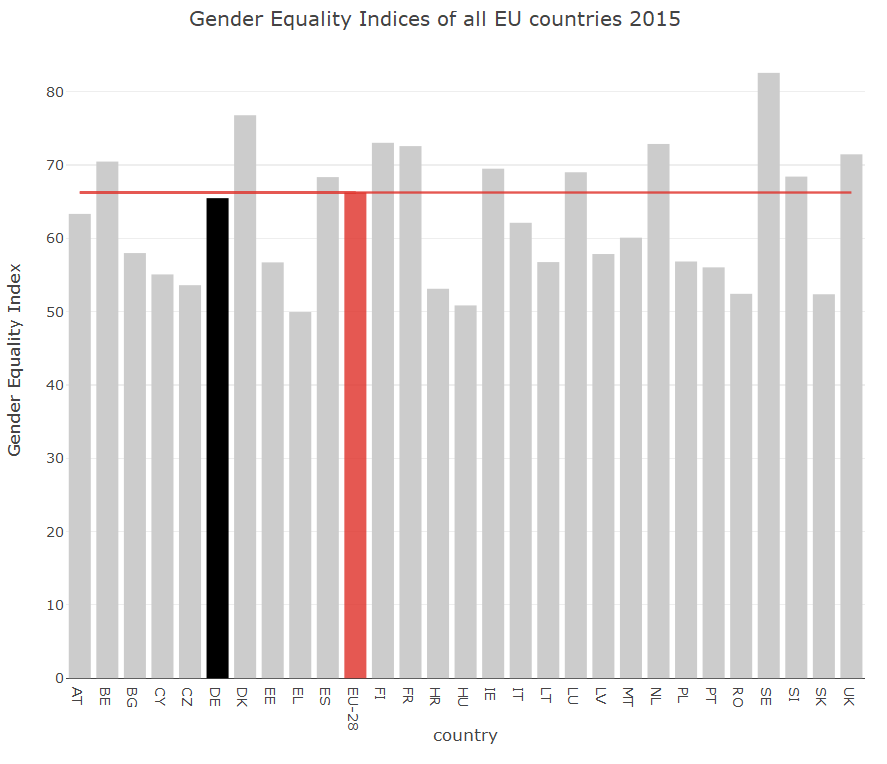

# Introduction
Germany is one of the most developed countries in the world according to the Human Development Index, which provides an assessment of a country's level of development, and its gross national product [@Nationmaster];[@Jahan]. Global corporations such as *Volkswagen* or *Daimler* have their headquarters within the country. As a democratic, social state under the rule of law, equal treatment of all citizens is also firmly anchored in the Basic TomuschatCurrie. 

> *"All persons shall be equal before the law."* [@TomuschatCurrie]

> *"Men and women shall have equal rights. The state shall promote the actual implementation of equal rights for women and men and take steps to eliminate disadvantages that now exist."* [@TomuschatCurrie]

With these excerpts from Article 3 of the German Basic Law, everyone within the country is in fact granted the same rights. The aim is to ensure that everyone has the same chances of success. The economic attractiveness as well as the striving for equal opportunities for all also contribute to the fact that a large number of international students decide to study in Germany.

With regard to the desired equal treatment of people, however, the country shows clear discrepancies when it comes to gender. 

Looking at the Gender Equality Index[^1] in Figure 1, it is noticeable that Germany does not live up to its advanced reputation for gender equality. The country even had below-average gender equality in 2015 compared to all EU countries. Other countries, such as Sweden, have a much stronger evaluation [@Eige]. A practical implementation of the equal treatment of all people aimed at in the law is therefore not yet given. 
The aim of this study is to examine the extent to which this unequal treatment is also reflected in the educational system and in professional life in Germany and to what extent different career opportunities arise, especially for young people (Chapter 2). Beyond that the explanation factors lying behind it for the unbalanced chances of the sexes for a successful career are to be analyzed (Chapter 3).

# Identification of gender inequalities
Based on intensive literature research, it can be seen that the role of women has developed significantly positively in recent decades. While the proportion of women among university graduates was still around 39% in 1993, it rose to just under 51% by 2012. The interest in a career of their own and in participation in education and professional life has thus risen significantly. Measured in terms of university degrees, there is currently no significant difference between men and women within Germany [@OttoNeuSchielerWydra]. 
The number of doctorates also shows a very balanced distribution between the sexes (around 45% of all doctorates are earned by women) [@RusconiKunze].

However, discrepancies arise in the subsequent career path. Once the academic career has ended, there is a significant difference between the sexes in the way they are employed. Although the female unemployment rate has declined significantly over the past few years, it is still not enough to say that the number of women unemployed has risen [@Botsch]. 
However, in the academic world, for example, it can be seen that today only about one fifth of all professorships are occupied by women and that these are often paid less than the positions occupied by men. It becomes clear that the entry hurdle for men in science seems to be much lower than for women [@RusconiKunze].
There are also clear differences between the sexes in terms of types of employment in the economy. For example, the proportion of women in increasingly responsible tasks in the private sector is declining significantly. Instead, in contrast to men, women are much more likely to find themselves in part-time employment at significantly lower salaries [@Botsch].
Particularly when considering the different salaries between men and women, it becomes clear that there is a large gap in this respect. In 2016, Women's income was on average 21% lower than that of men. Compared to the other EU countries, this is one of the highest differences, which means that Germany's performance in this respect is well below average [@Destatis]. A study by Saarland University, in which former university graduates were analysed with regard to their first full-time employment, confirms this wage gap.[^2] According to the study, an average gross wage of 111 euros was found for men, whereas this was only 90 euros for women. This gender-specific discrepancy in wage levels is referred to as the *unadjusted pay gap* [@OttoNeuSchielerWydra]. Since factors such as type of employment, company size or work experience are also included in the wage difference, the difference cannot be reduced exclusively to gender. Based on this, an analysis was carried out in which an attempt was made to create maximum comparability between the salaries of men and women. Graduates with, for example, very similar degrees (subject, duration of study, result) and similar characteristics of the first job were compared. The resulting *adjusted wage difference* was still nine per cent. This higher salary for men is very likely due to the gender of the graduates [@OttoNeuSchielerWydra].

# Root cause analysis of inequalities
The large discrepancy between the wages of men and women is due to various factors. "Horizontal segregation", which refers to differences within a hierarchy level, is a decisive explanatory factor. It should be noted that women and men differ significantly both in their choice of subject and in their subsequent choice of occupation. 
Women are more likely to pursue courses in education, linguistics and cultural studies, while men are more likely to choose subjects in the natural sciences or engineering. As a result, men automatically acquire more knowledge in the better paid occupations and later find themselves in these disciplines as well [@BuschHolst].
Since about 40% of the gender-specific wage differentials are explained by the choice of study subject, horizontal segregation has an enormous part to play in explaining the differences in pay between the sexes [@OttoNeuSchielerWydra]. The research into the causes of this gender-specific division of occupational fields requires a step-by-step, in-depth analysis. There is evidence that women are increasingly risk-averse in their choice of studies. In comparison to men, they are more likely to successfully complete their studies in their chosen field of study. Men, on the other hand, in many cases accept a greater risk in order to achieve an increased prospect of financial gain [@OttoNeuSchielerWydra]. In addition, it was found that women have lower self-confidence in salary negotiations than men and accept lower pay more quickly [@BollLeppin]. If you go one level lower, the main reason for this difference in behaviour between women and men becomes apparent. The attitudes anchored within society with regard to accepted gender behaviour are referred to as "gender roles". In a personal interview with a journalist from the field of gender studies (Marie Zafimehy, September 17, 2018), it became clear that gender roles would be the starting point for all discrepancies between men and women in career development. From birth, depending on the body in which they were born, people would be taught what behaviour they would have to adopt. Gender is a social construct of society and explains why men and women have different self-confidence and are assessed differently. The different attitude towards risk and the differentiated negotiating skills are based on the attitude anchored in society that women must act more cautiously. 

In my opinion, this explains the horizontal segregation between men and women, the increased proportion of women in part-time employment and the decreasing proportion of women in increasingly responsible jobs, and ultimately the large gender pay gap within Germany.

# Conclusion & discussion
Within the framework of the literature research, it became apparent that Germany has significant weaknesses in the area of gender equality in career development. When looking at the number of graduates, there are no major differences between the sexes. However, it is noticeable that women rather study in areas in which they are subsequently paid less in professional life. In addition, there are vertical differences between the sexes - as the hierarchy level increases, the proportion of women decreases. The combination of literature research and a qualitative expert interview has given me the insight that the main problem here is the attitude towards accepted gender behaviour anchored in German society. If the country wants to achieve the desired equal treatment of the sexes enshrined in the Basic Law, society must change its current gender view. Since this is a very fundamental change in people's thinking, I believe that it will not be possible in the near future, but only in the long term. But how do we tackle this problem? Politics certainly has a decisive role to play here. But it is also important for men to dare to take the step of working for more equality in order to create equal opportunities for a successful career for all people within the country.

# References

[^1]: The Gender Equality Index is an index published by the European Institute for Gender Equality which provides a quantitative assessment of gender equality with regard to various factors such as the distribution of power. This index is calculated for each EU country, which makes it possible to compare countries across Europe.

[^2]: The study examined the first full-time employment of 6,100 graduates of Saarland University who graduated between 1994 and 2010. 
