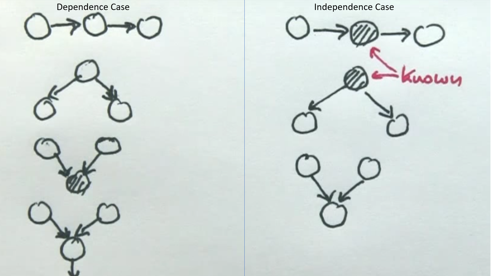
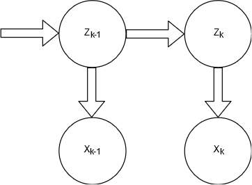
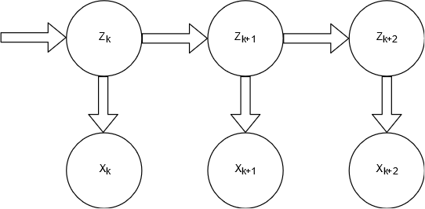

\newpage

# Libraries
```{r setup, include=TRUE, message=FALSE}
knitr::opts_chunk$set(echo = TRUE)
options(scipen=999)

library("tidyverse") #ggplot and dplyr 
library("gridExtra") # combine plots
library("knitr") # for pdf
library("bnlearn") # ADM
library("gRain") # ADM
library("entropy")
library("HMM") #Hidden Markov Models
library("kableExtra") # For table formating
library("kernlab") # Gaussian Regression
library("mvtnorm") # multi dimensional normal distribution
library("caret") # confusion matrix
library("e1071") # confusion matrix and accuracy

if (!requireNamespace("BiocManager", quietly = TRUE))
    install.packages("BiocManager")
#BiocManager::install("gRain")


# The palette with black:
cbbPalette <- c("#000000", "#E69F00", "#56B4E9", "#009E73", 
                "#F0E442", "#0072B2", "#D55E00", "#CC79A7")
set.seed(12345)
```

\newpage

# Graphical Models


### D-seperation 
```{r, echo=FALSE}

```


## 1)Show that multiple runs of the hill-climbing algorithm can return non-equivalent Bayesian network (BN) structures. Explain why this happens. Use the Asia dataset which is included in the bnlearn package. To load the data, run data("asia").

```{r}
set.seed(12345)
asia_data <- bnlearn::asia

bayes_net = random.graph(colnames(asia))

hill_climbing_asia_1 <- hc(x=asia_data, start = bayes_net, restart = 20, 
                           score = "bde")

hill_climbing_asia_1 = cpdag(hill_climbing_asia_1)
plot(hill_climbing_asia_1, main="Network Structure with 20 restart")


hill_climbing_asia_2 <- hc(x=asia_data, start = bayes_net, restart = 40, 
                           score = "bde")

hill_climbing_asia_2 = cpdag(hill_climbing_asia_2)
plot(hill_climbing_asia_2, main="Network Structure with 40 restart")

all.equal(hill_climbing_asia_1,hill_climbing_asia_2)


```

## 2) Learn a BN from 80 percent of the Asia dataset. The dataset is included in the bnlearn package. To load the data, run data("asia"). Learn both the structure and the parameters. Use any learning algorithm and settings that you consider appropriate. Use the BN learned to classify the remaining 20 percent of the Asia dataset in two classes: S = yes and S = no. In other words, compute the posterior probability distribution of S for each case and classify it in the most likely class. To do so, you have to use exact or approximate inference with the help of the bnlearn and gRain packages, i.e. you are not allowed to use functions such as predict. Report the confusion matrix, i.e. true/false positives/negatives. Compare your results with those of the true Asia BN, which can be obtained by running
dag = model2network("[A][S][T|A][L|S][B|S][D|B:E][E|T:L][X|E]").


```{r}

## Split the data into test and train

# number of rows
n <- nrow(asia)

# sample train 80%
id <- sample(1:n, floor(n*0.8))

asia_train <- asia[id, ]

asia_test <- asia[-id, ]

## structure learning on the train set (si.hiton.pc see bnlearn doc)
asia_st_learn <- mmhc(asia_train, whitelist = NULL, blacklist = NULL,
                      restrict.args = list(cluster = NULL)
                      )
asia_st_learn

```

```{r message=FALSE, warning=FALSE, paged.print=FALSE}
# plot the learned structure
graphviz.plot(asia_st_learn, layout = "dot", highlight = list("arcs"))
```

```{r}
# parameter learning
asia_parameter_learn <- bn.fit(asia_st_learn, data = asia_train, method = "mle")

asia_parameter_learn
```

```{r}
set.seed(12345)

pred <- matrix(ncol = 2, nrow = nrow(asia_test))

for (i in 1:nrow(asia_test)) {
  
  # excluding S column
  evidence <- as.factor(asia_test[i, -2])
  
  evA <- ifelse(evidence[1] == 1, "no", "yes")
  
  evT <- ifelse(evidence[2] == 1, "no", "yes")
  
  evL <- ifelse(evidence[3] == 1, "no", "yes")
  
  evB <- ifelse(evidence[4] == 1, "no", "yes")
  
  evE <- ifelse(evidence[5] == 1, "no", "yes")
  
  evX <- ifelse(evidence[6] == 1, "no", "yes")
  
  evD <- ifelse(evidence[7] == 1, "no", "yes")
 
# Approximate inference p(A|X = TRUE,B = TRUE)
# bayes_net <- bn.fit(bn_struct, data = data)  
# dist <- cpdist(bayes_net, nodes="A", evidence=(X=="yes") & (B=="yes"))
# prop.table(table(dist))

## Exact inference p(A|X = TRUE,B = TRUE) 
# junction_tree <- compile(as.grain(bayes_net))
# my_evid <-setEvidence(junction_tree, nodes=c("X","B"), states=c("yes","yes"))
# querygrain(my_evid, nodes=c("A"), type="joint")  
  
  cpd <- cpdist(
    fitted = asia_parameter_learn,
    nodes = "S",
    evidence = (A == evA) &
    (`T` == evT) & (L == evL) & (B == evB) &
    (E == evE) & (X == evX) & (D == evD)
    )
  
  pred[i, 1] <- prop.table(table(cpd))[1]
  
  pred[i, 2] <- prop.table(table(cpd))[2]
}

# classify using 0.5 as threshold

cls <- matrix(ncol = 1, nrow = nrow(asia_test))

for (i in 1:nrow(pred)) {
  cls[i,1] <- ifelse(pred[i, 1] > 0.5, "no", "yes")
}

## confusion matrix
cfm <- table(cls, asia_test$S)

cfm


## Accuracy
acc <- (cfm[1,1] + cfm[2,2])/sum(cfm)

acc

```


```{r}
## True model
dag <- model2network("[A][S][T|A][L|S][B|S][D|B:E][E|T:L][X|E]")

graphviz.plot(dag, layout = "dot", highlight = list("arcs"))
```

In learning the parameters maximum-likelihood estimation is used.
```{r}
## learning parametes from the true model

## parameter learning
asia_pl_true <- bn.fit(dag, data = asia_train, method = "mle")
```

```{r}
## Prediction using the true structure and learned parameters 

set.seed(12345)

pred_true <- matrix(ncol = 2, nrow = nrow(asia_test))

# lop throught the rows of test dataset
for (i in 1:nrow(asia_test)) {
  
  evidence <- as.factor(asia_test[i, -2])
  
  evA <- ifelse(evidence[1] == 1, "no", "yes")
  
  evT <- ifelse(evidence[2] == 1, "no", "yes")
  
  evL <- ifelse(evidence[3] == 1, "no", "yes")
  
  evB <- ifelse(evidence[4] == 1, "no", "yes")
  
  evE <- ifelse(evidence[5] == 1, "no", "yes")
  
  evX <- ifelse(evidence[6] == 1, "no", "yes")
  
  evD <- ifelse(evidence[7] == 1, "no", "yes")
  
  cpd <- cpdist(
    fitted = asia_pl_true, # learned parameters from dag
    nodes = "S",
    evidence = (A == evA) &
    (`T` == evT) & (L == evL) & (B == evB) &
    (E == evE) & (X == evX) & (D == evD)
    )
  
  pred_true[i, 1] <- prop.table(table(cpd))[1]
  
  pred_true[i, 2] <- prop.table(table(cpd))[2]
}

# classify using 0.5 as threshold

cls_true <- matrix(ncol = 1, nrow = nrow(asia_test))

for (i in 1:nrow(pred_true)) {
  cls_true[i,1] <- ifelse(pred_true[i, 1] > 0.5, "no", "yes")
}

## confusion matrix
cfm_true <- table(cls_true, asia_test$S)

cfm_true
```

```{r}
## accuracy
acc_true <- (cfm_true[1,1] + cfm_true[2,2])/sum(cfm_true)

acc_true
```


## 3) In the previous exercise, you classified the variable S given observations for all the rest of the variables. Now, you are asked to classify S given observations only for the so-called Markov blanket of S, i.e. its parents plus its children plus the parents of its children minus S itself. Report again the confusion matrix.

```{r}

markovblanket = mb(asia_parameter_learn, node = "S")

cat("The markov blanket is:")

print(markovblanket)

n <- markovblanket


#change to gRain object
bnToGrain = as.grain(asia_parameter_learn)

junctions = compile(bnToGrain)

test=asia_test
predictedS = c()

for(i in 1 :ncol(test)){
  
  test[,i] = as.character(test[,i])
}

for (i in 1: nrow(test)){
  
  st=test[i,markovblanket]

  evd = setEvidence(junctions,nodes=n,states=st)
  query = querygrain(evd,nodes = c("S"))
 
 if(query$S[1]>query$S[2])
 {
   predictedS[i]= 0
 }
 else
 {
   predictedS[i]= 1
 }
}

for(i in 1:length(predictedS) ){
predictedS[i] = ifelse(predictedS[i]== 0,"no","yes")
  
}


confusion_matrix = table("predicted"=predictedS,"True" =test$S)

cat("Confusion Matrix:","\n")
print(confusion_matrix)

accuracy = sum(diag(confusion_matrix))/ sum(confusion_matrix)

cat("\n")

cat("Accuracy of prediction of network","\n")
print(accuracy)

```

## 4) Repeat the exercise (2) using a naive Bayes classifier, i.e. the predictive variables are independent given the class variable. See p. 380 in Bishop’s book or Wikipedia for more information on the naive Bayes classifier. Model the naive Bayes classifier as a BN. You have to create the BN by hand, i.e. you are not allowed to use the function naive.bayes from the bnlearn package.

```{r}

predict_from_network <- function(junc_tree, data, obs_variables, pred_variable) {
  prediction_fit <- rep(0,NROW(data))
  for (i in 1:NROW(data)) {
    X <- NULL
    for (j in obs_variables) {
      X[j] <- if(data[i, j] == "yes") "yes" else "no"
    }
    
    # Set evidence in junction tree for observation i
    # We have observations of all variables except:
    # S: If a person smokes or not
    evidence <- setEvidence(object = junc_tree,
                            nodes = obs_variables,
                            states = X)
    
    # Do prediction of S from junction tree with the above evidence
    prob_dist_fit <- querygrain(object = evidence, nodes = pred_variable)$S
    
    prediction_fit[i] <- if(prob_dist_fit["yes"] >= 0.5) "yes" else "no"
  }
  return(prediction_fit)
}

# Convert fit to gRain-object
BN.fit_gRain <- as.grain(asia_parameter_learn)
BN.fit_true_gRain <- as.grain(asia_pl_true)

# Compile BN
# Creating a junction tree (Lauritzen-Spiegelhalter algorithm) and establishing clique potentials
junc_tree <- compile(BN.fit_gRain)
junc_tree_true <- compile(BN.fit_true_gRain)


naive_bayes_structure <- model2network("[S][A|S][T|S][L|S][B|S][E|S][X|S][D|S]")

# Fit parameters of network to train data
BN.fit_naive_bayes <- bn.fit(x = naive_bayes_structure, data = asia_test)
plot(naive_bayes_structure, main="Naives Bayes Network Structure")
score(naive_bayes_structure, asia_test)

# Convert fit to gRain-object
BN.fit_naive_bayes_grain <- as.grain(BN.fit_naive_bayes)

# Generate juncion tree and clique potentials
junc_tree_naive_bayes <- compile(BN.fit_naive_bayes_grain)


junc_tree_true <- compile(BN.fit_true_gRain)

prediction_fit_naive_bayes <- predict_from_network(junc_tree = junc_tree_naive_bayes, 
                                                   data = asia_test, 
                                                   obs_variables = c("A", "T", 
                                                                     "L", "B", 
                                                                     "E", "X", 
                                                                     "D"), 
                                                   pred_variable = c("S"))

prediction_fit_true <- predict_from_network(junc_tree = junc_tree_true, 
                                            data = asia_test,
                                            obs_variables = c("A", "T", "L",
                                                              "B", "E", "X", 
                                                              "D"), 
                                            pred_variable = c("S"))

# Calculate confusion matricies
confusion_matrix_naive_bayes <- table(prediction_fit_naive_bayes, asia_test$S)
confusion_matrix_naive_bayes

confusion_matrix_fit_true <- table(prediction_fit_true, asia_test$S)
confusion_matrix_fit_true


```

## 5) Explain why you obtain the same or different results in the exercises (2-4).

Answer:
We can see that results of 2 and 3 are the same from the confusion table, this is expected since essentially its the same model. 2 and 4 are different clearly because of the network structure.

# Hidden Markov Models

The purpose of the lab is to put in practice some of the concepts covered in the lectures. To do so, you are
asked to model the behavior of a robot that walks around a ring. The ring is divided into 10 sectors. At any
given time point, the robot is in one of the sectors and decides with equal probability to stay in that sector
or move to the next sector. You do not have direct observation of the robot.However, the robot is equipped
with a tracking device that you can access. The device is not very accurate though, If the robot is in the
sector ‘i’, then the device will report that the robot is in the sectors i-2 to i+2 with equal probability

## 1) Build a hidden Markov model (HMM) for the scenario described above.

```{r}
set.seed(12345)

transition_mat <- matrix(data = c(0.5, 0.5, 0, 0, 0, 0, 0, 0, 0, 0,
                                  0, 0.5, 0.5, 0, 0, 0, 0, 0, 0, 0,
                                  0, 0, 0.5, 0.5, 0, 0, 0, 0, 0, 0,
                                  0, 0, 0, 0.5, 0.5, 0, 0, 0, 0, 0,
                                  0, 0, 0, 0, 0.5, 0.5, 0, 0, 0, 0,
                                  0, 0, 0, 0, 0, 0.5, 0.5, 0, 0, 0,
                                  0, 0, 0, 0, 0, 0, 0.5, 0.5, 0, 0,
                                  0, 0, 0, 0, 0, 0, 0, 0.5, 0.5, 0,
                                  0, 0, 0, 0, 0, 0, 0, 0, 0.5, 0.5,
                                  0.5, 0, 0, 0, 0, 0, 0, 0, 0, 0.5),
                              nrow = 10,
                              ncol = 10)

sensor_mat <- matrix(data = c(0.2, 0.2, 0.2, 0, 0, 0, 0, 0, 0.2, 0.2,
                              0.2, 0.2, 0.2, 0.2, 0, 0, 0, 0, 0, 0.2,
                              0.2, 0.2, 0.2, 0.2, 0.2, 0, 0, 0, 0, 0,
                              0, 0.2, 0.2, 0.2, 0.2, 0.2, 0, 0, 0, 0,
                              0, 0, 0.2, 0.2, 0.2, 0.2, 0.2, 0, 0, 0,
                              0, 0, 0, 0.2, 0.2, 0.2, 0.2, 0.2, 0, 0,
                              0, 0, 0, 0, 0.2, 0.2, 0.2, 0.2, 0.2, 0,
                              0, 0, 0, 0, 0, 0.2, 0.2, 0.2, 0.2, 0.2,
                              0.2, 0, 0, 0, 0, 0, 0.2, 0.2, 0.2, 0.2,
                              0.2, 0.2, 0, 0, 0, 0, 0, 0.2, 0.2, 0.2),
                              nrow = 10,
                              ncol = 10)


#States<-1:100
#Symbols<-1:2 # 1=door
#transProbs<-matrix(rep(0,length(States)*length(States)), nrow=length(States), ncol=length(States), byrow = TRUE)
# for(i in 1:99){
#   transProbs[i,i]<-.1
#   transProbs[i,i+1]<-.9
# }
#emissionProbs<-matrix(rep(0,length(States)*length(Symbols)), nrow=length(States), ncol=length(Symbols), byrow = TRUE)

sector_10_model <- initHMM(States = c("1","2","3","4","5","6","7","8","9","10"), 
                           Symbols = c("1","2","3","4","5","6","7","8","9","10"), 
                           startProbs = rep(0.1, 10),
                           transProbs = transition_mat,
                           emissionProbs = sensor_mat)

```


## 2) Simulate the HMM for 100 time steps.

```{r}
set.seed(12345)

hmm_100 <- simHMM(sector_10_model, length=100)
hmm_100
```

## 3) Discard the hidden states from the sample obtained above. Use the remaining observations to compute the filtered and smoothed probability distributions for each of the 100 time points. Compute also the most probable path.

### Forward Algorithm

```{r, echo=FALSE}

```


Goal: to compute $p(z_k, x_{1:k})$

Let $$
\begin{split}
\alpha_k(z_k) = p(z_k, x_{1:k}) = \sum^M_{z_{k-1}=1} p(x_k| z_k, z_{k-1}, x_{1:k-1}) p(z_k|z_{k-1},x_{1:k-1}) p(z_{k-1},x_{1:k-1}) \\ 
= \sum^M_{z_{k-1}=1} p(x_k| z_k,  \cancel{z_{k-1}, x_{1:k-1}}) p(z_k|z_{k-1}, \cancel{x_{1:k-1}}) p(z_{k-1},x_{1:k-1}) ~~ Due~to~Markov~property \\
\alpha_k(z_k) = \sum^M_{z_{k-1}=1} p(x_k| z_k) p(z_k|z_{k-1}) p(z_{k-1},x_{1:k-1}) \\
\alpha_k(z_k) = \sum^M_{z_{k-1}=1} p(x_k| z_k) p(z_k|z_{k-1}) \alpha_{k-1}(z_{k-1}) \\
\alpha_k(z_k) = \sum^M_{z_{k-1}=1} (Emission~probability) (Transition~probability) \alpha_{k-1}(z_{k-1}) \\
\end{split}$$


### Backward Algorithm

```{r, echo=FALSE}

```

Goal: to compute $p(x_{k+1:n}|z_k)$

Let $$
\begin{split}
\beta_k(z_k) = p(x_{k+1:n}|z_k) = \sum^M_{z_{k+1}=1} p(x_{k+2:n}|z_{k+1},z_{k},x_{k+1}) p(x_{k+1}|z_{k+1},z_k) p(z_{k+1},z_{k}) \\ 
= \sum^M_{z_{k+1}=1} p(x_{k+2:n}|z_{k+1}, \cancel{z_{k},x_{k+1}}) p(x_{k+1}|z_{k+1}, \cancel{z_k}) p(z_{k+1},z_{k}) \\ ~~ Due~to~Markov~property \\
\beta_k(z_k) = \sum^M_{z_{k+1}=1} p(x_{k+2:n}|z_{k+1}) p(x_{k+1}|z_{k+1}) p(z_{k+1},z_{k}) \\ 
\beta_k(z_k) = \sum^M_{z_{k+1}=1} \beta_{k+1}(z_{k+1}) p(x_{k+1}|z_{k+1}) p(z_{k+1},z_{k}) \\ 
\beta_k(z_k) = \sum^M_{z_{k+1}=1} \beta_{k+1}(z_{k+1}) (Emission~probability) (Transition~probability)\\
\end{split}$$


```{r}
set.seed(12345)

# The library retruns the probabilities logged, we we have to de-log
alpha = exp(forward(sector_10_model, hmm_100$observation))
beta = exp(backward(sector_10_model, hmm_100$observation))

# Filtering which is defined as alpha column, divided by its col sum
filtered =  sweep(alpha, 2, colSums(alpha), FUN="/")

# Smoothing
smoothing = alpha * beta
smoothing =  sweep(smoothing, 2, colSums(smoothing), FUN="/")

# Path
hmm_viterbi = viterbi(sector_10_model, hmm_100$observation)
as.numeric(hmm_viterbi)
```


## 4) Compute the accuracy of the filtered and smoothed probability distributions, and of the most probable path. That is, compute the percentage of the true hidden states that are guessed by each method.

```{r}

set.seed(12345)

# finding the max of each column for 100 entries for filtered values
filtered_path <- t(filtered)
filtered_path <- max.col(filtered_path, "first")

# finding the max of each column for 100 entries for smoothened values
smoothing_path <- t(smoothing)
smoothing_path <- max.col(smoothing_path, "first")

# viterbi path
viterbi_path <- as.numeric(hmm_viterbi)

# actual path 
actual_state <- as.numeric(hmm_100$states)

# Accuracy of filtered path
acc_filered <- sum(actual_state == filtered_path)/length(filtered_path) * 100

# Accuracy of smoothened path
acc_smooth <- sum(actual_state == smoothing_path)/length(smoothing_path) * 100

# Accuracy of viterbi path
viterbi_smooth <- sum(actual_state == viterbi_path)/length(viterbi_path) * 100

cat("Accuracy of filtered, smoothing and viterbi are as follows:", 
    acc_filered, "%,", acc_smooth, "% and ", viterbi_smooth, "%")

```

## 5) Repeat the previous exercise with different simulated samples. In general, the smoothed distributions should be more accurate than the filtered distributions. Why? In general, the smoothed distributions should be more accurate than the most probable paths, too. Why?

```{r}
set.seed(12345) 

get_hmm_accuracy <- function(N, model)
{
hmm_N <- simHMM(model, length=N)
alpha = exp(forward(model, hmm_N$observation))
beta = exp(backward(model, hmm_N$observation))

filtered =  sweep(alpha, 2, colSums(alpha), FUN="/")

smoothing = alpha * beta
smoothing =  sweep(smoothing, 2, colSums(smoothing), FUN="/")

hmm_viterbi = viterbi(model, hmm_N$observation)

filtered_path <- t(filtered)
filtered_path <- max.col(filtered_path, "first")


smoothing_path <- t(smoothing)
smoothing_path <- max.col(smoothing_path, "first")

viterbi_path <- as.numeric(hmm_viterbi)
actual_state <- as.numeric(hmm_N$states)


acc_filered <- sum(actual_state == filtered_path)/length(filtered_path) * 100
acc_smooth <- sum(actual_state == smoothing_path)/length(smoothing_path) * 100
viterbi_smooth <- sum(actual_state == viterbi_path)/length(viterbi_path) * 100

df <- data.frame(N=N, accuracy_of_filtered = acc_filered, 
                 accuracy_of_smoothing = acc_smooth, 
                 accuracy_of_viterbi = viterbi_smooth)
return(df)
}

final <- NULL
for (i in seq(10, 300, 10)) {
temp <- get_hmm_accuracy(i, sector_10_model)
final <- rbind(temp, final)
}

ggplot(final, aes(x = N)) + 
    geom_line(aes(y=accuracy_of_smoothing, color="accuracy_of_smoothing")) + 
    geom_line(aes(y=accuracy_of_filtered, color="accuracy_of_filtered")) + 
  geom_line(aes(y=accuracy_of_viterbi, color="accuracy_of_viterbi")) + 
  ggtitle("Accuracy of Filtering, Smoothing and Viterbi vs. Simulation") +
  ylab("Accuracy in %") +
    scale_colour_manual(values = c("#CC79A7", "#000000", "#D55E00"))

```

## 6) Is it true that the more observations you have the better you know where the robot is?

```{r}

set.seed(12345)
empirical_entropy = apply(filtered, 2, entropy.empirical)
plot(empirical_entropy, type= 'l', main = "Entropy of filtered path")
```

## 7) Consider any of the samples above of length 100. Compute the probabilities of the hidden states for the time step 101.

```{r}
set.seed(12345)
position = transition_mat %*% filtered[,100]
rownames(position) = names(filtered[,100])
position
```

# State-space models

The purpose of the lab is to put in practice some of the concepts covered in the lectures. To do so, you are asked to implement the particle filter for robot localization. For the particle filter algorithm, please check Section 13.3.4 of Bishop’s book and/or the slides for the last lecture on state space models (SSMs). The robot moves along the horizontal axis according to the following SSM:

Transition model:
$$p(z_t|z_{t-1}) = (N(z_t|z_{t-1},1) + N(z_t|z_{t-1} + 1,1) + N(z_t|z_{t-1} + 2,1))/3$$ 
Emission model:
$$p(x_t|z_t) = (N(x_t|z_t,1) + N(x_t|z_t-1),1) + + N(x_t|z_t+1),1))/3$$ 
Initial model:
$$p(z_1) = Uniform(0,100)$$ 


## 1) Implement the SSM above. Simulate it for T = 100 time steps to obtain $z_{1:100}$ (i.e., states) and $x_{1:100}$ (i.e., observations). Use the observations (i.e., sensor readings) to identify the state (i.e., robot location) via particle filtering. Use 100 particles. Show the particles, the expected location and the true location for the first and last time steps, as well as for two intermediate time steps of your choice.

```{r}
set.seed(12345)

gen_data <- function(N, sd_emi){

x_t <- vector(length = N)
z_t = vector(length = N)
# Simulate initial state
z_t[1] = runif(1, min = 0, max = 100)

# Simulate remaining states
for(i in 2:N){
mean_z_t = sample(c(z_t[i-1], z_t[i-1]+1, z_t[i-1]+2), size = 1, 
                  prob = rep(1/3, 3))
z_t[i] = rnorm(1, mean_z_t, sd_emi)
}

# Simulate observations from states
for(i in 1:N){
mean_x_t = sample(c(z_t[i], z_t[i]+1, z_t[i]-1), size = 1, prob = rep(1/3, 3))
x_t[i] = rnorm(1, mean_x_t, sd_emi)
}

sample_data <- data.frame(observation = x_t, states = z_t, 
                          index=1:N)

# plot of samples
p1 <- ggplot(data=sample_data, aes(x=index)) + 
  geom_line(aes(y=observation, color="Observations")) + 
  geom_line(aes(y=states, color="True location")) +
        scale_colour_manual(values = c("#000000", "#E69F00", "#56B4E9", 
                                       "#009E73")) +
  xlab("Index") + 
  ylab("Location") +
  ggtitle("Observed and True location")

print(p1)

# density plots
p2 <- ggplot(data=sample_data) + 
  geom_density(aes(x=observation, color="Observations")) + 
  geom_density(aes(x=states, color="True location")) +
        scale_colour_manual("", breaks = c("Observations", "True location"),
                        values = c("#000000", "#E69F00", "#56B4E9", "#009E73")) +
    xlab("Index") + 
  ylab("Density") +
  ggtitle("Density of Observed and True location")

print(p2)

return(list(z_t=z_t, x_t=x_t))
}
```

```{r, eval=FALSE}

#method 1

#$p(x_t|x_{t-1}) = N(x_t|x_{t-1} + 1,1)$//transition distribution
#$p(z_t|x_t) = N(z_t|x_t,5)$//emission distribution
#$p(x_0) = N(x_0|50,100)$//inital distribution

T<-10000
n_par<-100
tra_sd<-1 #R
emi_sd<-5 #Q
mu_0<-50
Sigma_0<-10

ini_dis<-function(n){
  return (rnorm(n,mu_0,Sigma_0))
}

tra_dis<-function(zt){
  return (rnorm(1,mean=zt+1,sd=tra_sd))
}

emi_dis<-function(zt){
  return (rnorm(1,mean=zt,sd=emi_sd))
}

den_emi_dis<-function(xt,zt){
  return (dnorm(xt,mean=zt,sd=emi_sd))
}

z<-vector(length=T)
x<-vector(length=T)

for(t in 1:T){
  z[t]<-ifelse(t==1,ini_dis(1),tra_dis(z[t-1]))
  x[t]<-emi_dis(z[t])
}

err<-vector(length=T)

bel<-ini_dis(n_par)
w<-rep(1/n_par,n_par)
for(t in 2:T){
  com<-sample(1:n_par,n_par,replace=TRUE,prob=w)
  bel<-sapply(bel[com],tra_dis)
  
  for(i in 1:n_par){
    w[i]<-den_emi_dis(x[t],bel[i])
  }
  w<-w/sum(w)
  
  Ezt<-sum(w * bel)
  err[t]<-abs(z[t]-Ezt)
}

mean(err[2:T])
sd(err[2:T])


## didnt work

# x<-vector(length=T)
# z<-vector(length=T)
# err<-vector(length=T)
# 
# for(t in 1:T){
#   x[t]<-ifelse(t==1,rnorm(1,mu_0,Sigma_0),x[t-1]+1+rnorm(1,0,R))
#   z[t]<-x[t]+rnorm(1,0,Q)
# }
# 
# mu<-mu_0
# Sigma<-Sigma_0*Sigma_0 
# for(t in 2:T){
#   pre_mu<-mu+1
#   pre_Sigma<-Sigma+R*R
#   K<-pre_Sigma/(pre_Sigma+Q*Q)
#   mu<-pre_mu+K*(z[t]-pre_mu)
#   Sigma<-(1-K)*pre_Sigma
#   
#   err[t]<-abs(x[t]-mu)
# }
# 
# mean(err[2:T])
# sd(err[2:T])


```


```{r}

# method 2

my_particle_filter <- function(M, Times, obs, sd_tra, sd_emi, ignore_weight) {
  
  temp_particles <- NULL
  weights <- NULL
  # Create matrix that will contain all particles for each time step
  particles <- matrix(NA, nrow = Times, ncol = M)

  # Generate initial M particles, Uniform(0, 100)
  particles[1, ] <- runif(n = M, min = 0, max = 100)
  
  for (t in 2:Times) {
    for (m in 1:M) {
      
  # transiton matrix
    selection <- sample(1:3, prob = c(1 / 3, 1 / 3, 1 / 3), size = 1)
    mean_tra <- c(particles[t - 1, m], particles[t - 1, m] + 1, 
                  particles[t - 1, m] + 2)
    temp_particles[m] <- rnorm(n=1, mean = mean_tra[selection], sd = sd_tra)
  
  
  # emission matrix
    weights[m] <- mean(dnorm(x=obs[t], mean = temp_particles[m]-1, sd = sd_emi),
                       dnorm(x=obs[t], mean = temp_particles[m], sd = sd_emi),
                       dnorm(x=obs[t], mean = temp_particles[m]+1, sd = sd_emi))
      
    }
    weights = weights/sum(weights)
    
    if(ignore_weight == TRUE){
            particles[t, ] <- sample(x = temp_particles, size = M, 
                                     replace = TRUE)
    }else{
      particles[t, ] <- sample(x = temp_particles, size = M, replace = TRUE,
                           prob = weights)}

  }
    
  return(particles)
}
```


```{r}

set.seed(12345)
# generate data
sample_data <- gen_data(N=100, sd_emi=1)

# particle filter
particles <- my_particle_filter(M=100, Times = 100, obs=sample_data$x_t, 
                                sd_tra=1, sd_emi=1, ignore_weight = FALSE)


location <- data.frame(true_location=sample_data$z_t, 
                 observed_location=sample_data$x_t, 
                 estimated_location = rowMeans(particles, na.rm = TRUE),
                 index = 1:NROW(particles)) %>% as.data.frame()


# plot function
plot_location <- function(step, df){
plot1 <- ggplot(data=df, aes(x=index)) +
geom_line(aes(y=observed_location, color="Observed Location")) +
geom_line(aes(y=estimated_location, color="Estimated Location")) +
geom_vline(aes(xintercept=step, color="step")) +
  xlab("Index") + 
  ylab("Location") +
      scale_colour_manual(values = c("#000000", "#E69F00", "#56B4E9", "#009E73")) +
ggtitle(paste0("Observed and Estimated Location for its ", step, " step"))

df <- df[step,]
result <- data.frame(step = step,
  true_location = df$true_location,
  observed_location = df$observed_location,
  estimated_location = df$estimated_location)

print(plot1)
kable(result, "latex", booktabs = T) %>% kable_styling(latex_options = "striped")
}

plot_location(step=1, df=location)
plot_location(step=100, df=location)
plot_location(step=50, df=location)
plot_location(step=75, df=location)


```

## 2) Repeat the exercise above replacing the standard deviation of the emission model with 5 and then with 50. Comment on how this affects the results.

```{r}
set.seed(12345)
# generate data
sample_data <- gen_data(N=100, sd_emi=5)


# with standard deviation of the emission model of 5
particles_sd_emis_5 <- my_particle_filter(M=100, Times = 100, 
                                          obs=sample_data$x_t, 
                                sd_tra=1, sd_emi=5, ignore_weight = FALSE)

location_sd_5 <- data.frame(true_location=sample_data$z_t, 
                 observed_location=sample_data$x_t, 
                 estimated_location = rowMeans(particles_sd_emis_5, 
                                               na.rm = TRUE),
                 index = 1:NROW(particles_sd_emis_5)) %>% as.data.frame()

plot_location(step=100, df=location_sd_5)
plot_location(step=50, df=location_sd_5)
```


## 3) Finally, show and explain what happens when the weights in the particle filter are always equal to 1, i.e. there is no correction.

```{r}

set.seed(12345)
# generate data
sample_data <- gen_data(N=100, sd_emi=1)

# with standard deviation of the emission model of 50
particles_no_weight <- my_particle_filter(M=100, Times = 100, obs=sample_data$x_t, 
                                sd_tra=1, sd_emi=1, ignore_weight = TRUE)

df_no_weight <- data.frame(true_location=sample_data$z_t, 
                 observed_location=sample_data$x_t, 
                 estimated_location = rowMeans(particles_no_weight, na.rm = TRUE),
                 index = 1:NROW(particles_no_weight)) %>% as.data.frame()


plot_location(step=100, df=df_no_weight)
plot_location(step=50, df=df_no_weight)

```

# Gaussian Process Regression and Classification

$$y = f(x) + \epsilon~~~~ \epsilon \sim N(0,\sigma^2_n)~and~ f \sim GP(0,k(x,x')) $$

You must implement Algorithm 2.1 on page 19 of Rasmussen and Willams’ book. The algorithm uses the Cholesky decomposition (chol in R) to attain numerical stability. Note that L in the algorithm is a lower triangular matrix, whereas the R function returns an upper triangular matrix. So, you need to transpose the output of the R function. In the algorithm, the notation A slash b means the vector x that solves the equation Ax = b. This is implemented in R with the help of the function solve.

## 1) Write your own code for simulating from the posterior distribution of f using the squared exponential kernel.

The function (name it posteriorGP) should return a vector with the posterior mean and variance of $f$, both evaluated at a set of x-values X*. You can assume that the prior mean of f is zero for all x. The function should have the following inputs:

X: Vector of training inputs
y: Vector of training targets/outputs
XStar: Vector of inputs where the posterior distribution is evaluated
hyperParam: Vector with two elements, sigman and l
sigmaNoise: Noise standard deviation 

```{r}
# Name: squared_exponential
# Input:
#   x: Observations
#   x_star: Observations
#   sigma_f: Standard diviation of f
#   l: Smoothness factor
squared_exponential <- function(x, x_star, sigma_f, l) {
  n1 <- length(x)
  n2 <- length(x_star)
  K <- matrix(NA,n1,n2)
  for (i in 1:n2){
    K[,i] <- sigma_f^2*exp(-0.5*( (x-x_star[i])/l)^2 )
  }
  return(K)
}

# Name: nested_squared_exponential
# Input:
#   x: Observations
#   y: Observations
#   sigma_f: Standard diviation of f
#   l: Controls correlation between same day in different years
nested_squared_exponential <- function(sigma_f, l) {
  rval <- squared_exponential <- function(x, y = NULL) {
    n1 <- length(x)
    n2 <- length(y)
    K <- matrix(NA,n1,n2)
    for (i in 1:n2){
      K[,i] <- sigma_f^2*exp(-0.5*( (x-y[i])/l)^2 )
    }
    return(K)
  }
  
  class(rval) <- 'kernel'
  return (rval)
}

periodic_kernel = function(sigma_f = 1, l1 = 1, l2 = 1, d)
{
  periodickernel <- function(x, y) {
    K = sigma_f^2 * 
      exp(-2 * sin(pi * abs(y - x) / d)^2 / l1^2 ) * 
      exp(-0.5 * (y - x)^2 / l2^2 )
    return(K)
  }
  class(periodickernel) <- "kernel"
  return(periodickernel)
}


# Name: posterior_GP
# Input:
#   x: Observations
#   y: Observations
#   x_star: Values to predict posterior mean of f over
#   kernel: Covariance function
#   sigma_n: Standard diviation of the measured data
#   sigma_f: Standard diviation of f
#   l: Controls correlation between same day in different years
posterior_GP <- function(x, y, x_star, kernel, sigma_n, sigma_f, l) {
  
  # Number of observations
  n <- length(x)
  
  # Calculate the covariance matricies:
  # k(X, X), k(X, X*), k(X*, X*)
  K_x_x <- kernel(x = x, x_star = x,sigma_f = sigma_f, l = l)
  
  K_x_xstar <- kernel(x = x, x_star = x_star, sigma_f = sigma_f, l = l)
  
  K_xstar_xstar <- kernel(x = x_star, x_star = x_star, sigma_f = sigma_f, l = l)
  
  # Compute the Choleski factorization of 
  # k(X, X) + sigma_n^2
  # (covariance matrix of y)
  #
  # As chol returns the upper triangular part and
  # we need the lower, we transpose it
  L_upper <- chol(K_x_x + (sigma_n^2)*diag(n))
  L_lower <- t(L_upper)
  
  # Compute alpha, used to compute the
  # posterior mean of f
  alpha_b <- solve(a = L_lower,
                             b = y)
  alpha <- solve(a = t(L_lower),
                 b = alpha_b)
  
  # Compute posterior mean of f
  posterior_mean_f <- t(K_x_xstar) %*% alpha
  
  # Compute posterior covariance matrix of f
  v <- solve(a = L_lower,
             b = K_x_xstar)
  posterior_covariance_matrix_f <- K_xstar_xstar - t(v) %*% v
  
  # As we only want the variance of f, we extract the
  # diagonal in the covariance matrix of f
  posterior_variance_f <- diag(posterior_covariance_matrix_f)
  
  return (list(mean = posterior_mean_f, variance = posterior_variance_f))
}


plot_gaussian <- function(x,y,Xstar,res){
mu <- res$mean
sd <- sqrt(res$variance)
df <- data.frame(XStar=XStar,
                 mu = mu,
                 upper_band = mu + 1.96 * sd, 
                 lower_band = mu - 1.96 * sd)

df2 <- data.frame(x=x,y=y)

plot1 <- ggplot(data=df, aes(x=XStar)) + 
  geom_line(aes(y=mu, color="mean")) +
  geom_line(aes(y=upper_band, color="upper_band")) +
  geom_line(aes(y=lower_band, color="lower_band")) +
  geom_point(data=df2, aes(x=x, y=y, color="Observation")) +
  ggtitle("Posterior mean with bands and observations") +
  ylab("Posterior/Observation") + xlab("Xstar") +
        scale_colour_manual(values = c("#E69F00", "#56B4E9", "#000000", 
                                       "#E69F00"))

print(plot1)
  
}

```

## 2) Now, let the prior hyperparameters be $\sigma_f=1$ and $l=0.3$. Update this prior with a single observation: $(x,y)=(0.4,0.719)$. Assume that $\sigma_n=0.1$. Plot the posterior mean of $f$ over the interval $x \in [-1,1]$. Plot also 95 percent probability (pointwise) bands for $f$.

```{r}
set.seed(111)

XStar = seq(-1, 1, 0.05)

# Set hyperparameters
sigma_f <- 1
l <- 0.3

# Set standard deviation of measurement
sigma_n <- 0.1

# Measurements
observations <- data.frame(x = c(0.4),
                           y = c(0.719))


# Prior
nsim <- 6
func_val <- t(rmvnorm(nsim, rep(0, length(XStar)), squared_exponential(XStar,XStar,1,0.3)))
func_val <- as.data.frame(func_val)
func_val$x <- XStar
func_val <- reshape2::melt(func_val,id="x")
ggplot(func_val,aes(x=x,y=value)) + geom_line(aes(group=variable),
colour="#696969",alpha = 1) +
ylab("Function values") + xlab("Input vector") +
ggtitle("6 sample from GP prior")

# Get posterior mean and variance of f
res <- posterior_GP(x = observations$x, y = observations$y, x_star = XStar,
                    sigma_f = sigma_f, l = l, kernel = squared_exponential, 
                    sigma_n = sigma_n)

plot_gaussian(x=observations$x, y=observations$y, XStar, res)

```


## 3) Compute the posterior distribution of $f$ using all the five data points in the table below (note that the two previous observations are included in the table). Plot the posterior mean of $f$ over the interval $x \in [-1,1]$. Plot also 95 % probability (pointwise) bands for $f$.

```{r, echo=FALSE}
x <- c(-1,-0.6,-0.2,0.4,0.8)
y <- c(0.768, -0.044, -0.940, 0.719, -0.664)
kable(data.frame(x=x,y=y))
```


```{r}
set.seed(111)
x4 = c(-1,-0.6,-0.2,0.4,0.8)
y4 = c(0.768, -0.044, -0.940, 0.719, -0.664)

# Measurements
observations <- data.frame(x = x4, y = y4)

# Set hyperparameters
sigma_f <- 1
l <- 0.3
# Set standard deviation of measurement
sigma_n <- 0.1


# Get posterior mean and variance of f
res <- posterior_GP(x = observations$x, y = observations$y, x_star = XStar,
                    sigma_f = sigma_f, l = l, kernel = squared_exponential, 
                    sigma_n = sigma_n)

plot_gaussian(x=observations$x, y=observations$y, XStar, res)

```


## 4) Repeat (3), this time with hyperparameters $\sigma_f = 1$ and  $l=1$. Compare the results.

```{r}
set.seed(111)

# Set hyperparameters
sigma_f <- 1
l <- 1
# Set standard deviation of measurement
sigma_n <- 0.1


# Get posterior mean and variance of f
res <- posterior_GP(x = observations$x, y = observations$y, x_star = XStar,
                    sigma_f = sigma_f, l = l, kernel = squared_exponential, 
                    sigma_n = sigma_n)

plot_gaussian(x=observations$x, y=observations$y, XStar, res)
```

# GP Regression with kernlab

In this exercise, you will work with the daily mean temperature in Stockholm (Tullinge) during the period January 1, 2010 - December 31, 2015. We have removed the leap year day February 29, 2012 to make things simpler.

Create the variable $time$ which records the day number since the start of the dataset (i.e., time= 1, 2,...., 365 × 6 = 2190). Also, create the variable $day$ that records the day number since the start of each year (i.e., day= 1, 2,.....,365, 1, 2,.....,365). Estimating a GP on 2190 observations can take some time on slower computers, so let us subsample the data and use only every fifth observation. This means that your time and day variables are now $time$= 1, 6,11,...., 2186 and $day$= 1, 6, 11,....., 361, 1, 6, 11,...., 361.

## 1) Familiarize yourself with the functions gausspr and kernelMatrix in kernlab. Do gausspr and read the input arguments and the output. Also, go through the file KernLabDemo.R available on the course website. You will need to understand it. Now, define your own square exponential kernel function (with parameters $l$ and $\sigma_f$), evaluate it in the point x = 1, x' = 2, and use the kernelMatrix function to compute the covariance matrix $K(X,X_*)$ for the input vectors $X = (1,3,4)^T$ and $X_*= (2,3,4)^T$.


```{r}
set.seed(111)

tulling_data = read.csv("TempTullinge.csv", header=TRUE, sep=";")
tulling_data$date <- as.Date(tulling_data$date, format = "%d/%m/%y")
tulling_data$time = seq(1, 2190, 1)
tulling_data$time2 = tulling_data$time^2
tulling_data$day = rep(seq(1, 365, 1), 6)

#sample
tulling_sample_data = tulling_data[seq(1, NROW(tulling_data), 5),]


# Create data variables
x <- 1
x_star <- 2

# Instantiate kernel
kernel <- nested_squared_exponential(sigma_f = 1, l = 0.3)

# Evaluate kernel on x = 1, x_star = 2
variance <- kernel(x = x, y = x_star)

# Create data variables
x <- c(1, 3, 4)
x_star <- c(2, 3, 4)

covariance_matrix <- kernelMatrix(x = x, y = x_star, kernel = kernel)
kable(covariance_matrix)

```


## 2) Consider first the following model: 

$$temp = f(time) + \epsilon$$ 
$$\epsilon \sim N(0,\sigma^2_n)$$
$$f \sim GP(0,k(time,time'))$$

Let $\sigma^2_n$ be the residual variance from a simple quadratic regression fit (using the lm function in R). Estimate the above Gaussian process regression model using the squared exponential function from (1) with $\sigma_f = 20$ and $l= 0.2$. Use the predict function in R to compute the posterior mean at every data point in the training dataset. Make a scatterplot of the data and superimpose the posterior mean of f as a curve (use type="l" in the plot function). Play around with different values on $f$ and $l$ (no need to write this in the report though).

```{r}
set.seed(111)

lm_model = lm(temp ~ time + time2, data = tulling_sample_data)
sigma_n = sd(lm_model$residuals)

# Estimate Gaussian Process
GP_time = gausspr(temp ~ time, data = tulling_sample_data, 
                  kernel = nested_squared_exponential(sigma_f = 20, l = 0.2), 
                  var = sigma_n^2)

posterior_mean = predict(GP_time, tulling_sample_data)

df <- data.frame(posterior_mean=posterior_mean, tulling_sample_data)

ggplot(data=df, aes(x=time)) +
  geom_point(aes(y=temp, color="temperature")) +
  geom_line(aes(y=posterior_mean, color="posterior mean")) +
  ggtitle("Plot of data and posterior mean using lm(temp~time)")  +
  ylab("Posterior/Observation") + xlab("Time") +
        scale_colour_manual(values = c("#E69F00", "#56B4E9", 
                                       "#000000", "#E69F00"))

```


## 3) kernlab can compute the posterior variance of $f$, but it seems to be a bug in the code. So, do your own computations for the posterior variance of $f$ and plot the $95\%$ probability (pointwise) bands for $f$. Superimpose these bands on the figure with the posterior mean that you obtained in (2).

```{r}
set.seed(111)
X = scale(tulling_sample_data$time)
y = scale(tulling_sample_data$temp)
XStar = X

KStarStar = kernelMatrix(kernel = nested_squared_exponential(sigma_f = 20, 
                                                             l = 0.2), x = XStar, 
                         y = XStar)

KStar = kernelMatrix(kernel = nested_squared_exponential(sigma_f = 20, l = 0.2), 
                     x = X, y = XStar)

K = kernelMatrix(kernel = nested_squared_exponential(sigma_f = 20, l = 0.2), 
                 x = X, y = XStar)

V = diag(KStarStar - t(KStar) %*% solve(K + sigma_n^2 * diag(length(X)), KStar))

df$upper_band <- df$posterior_mean + 1.96 * sqrt(V)
df$lower_band <- df$posterior_mean - 1.96 * sqrt(V)

ggplot(data=df, aes(x=time)) +
  geom_point(aes(y=temp, color="temperature")) +
  geom_line(aes(y=posterior_mean, color="posterior mean")) +
    geom_line(aes(y=upper_band, color="upper band")) +
    geom_line(aes(y=lower_band, color="lower band")) +
  ggtitle("Plot of data and posterior mean")  +
  ylab("Posterior/Observation") + xlab("Time") +
        scale_colour_manual(values = c("#E69F00", "#56B4E9", 
                                       "#000000", "#E69F00"))


## find the best parameters using grid search and optim
LM <- function(param, x, y, k, sigmaNoise){
sigma_f <- param[1]
l <- param[2]
n <- length(y)
L <- t(chol(k(x,x,sigma_f,l)+((sigmaNoise^2)*diag(n))))
a <- solve(t(L), solve(L,y))
logmar <- -0.5*(t(y)%*%a)-sum(diag(L))-n*0.5*log(2*pi)
return(logmar)
}

bestLM <- LM(param=c(20,0.2), x=X, y=y, k=squared_exponential, 
             sigmaNoise = sigma_n)
besti <- 20
bestj <- 0.2

for(l in seq(1,5,1)){
  for(sigma_n in seq(0.1,2,0.1)){
    aux <- LM(param=c(l,sigma_n), x=X, y=y, k=squared_exponential, 
              sigmaNoise = sigma_n)
    if(bestLM < aux){
      bestLM <- aux
      besti <- l
      bestj <- sigma_n
    }
  }
}
bestLM
besti
bestj

result <- optim(par = c(20, 0.2), fn=LM, x=X, y=y, k=squared_exponential,
      sigmaNoise = sigma_n, method=c("L-BFGS-B"), control = list(fnscale=-1),
      lower = c(-Inf,-Inf))

LM(param=c(result$par[1],result$par[2]), x=X, y=y, k=squared_exponential,
   sigmaNoise = sigma_n)

```


## 4) Consider now the following model: 
$$ temp = f(day)+ \epsilon~~with~\epsilon \sim N(0,\sigma^2_n)~and~f \sim GP(0,k(day,day'))$$

Estimate the model using the squared exponential function with $\sigma_f = 20$ and $l= 0.2$. Superimpose the posterior mean from this model on the posterior mean from the model in (2). Note that this plot should also have the time variable on the horizontal axis. Compare the results of both models. What are the pros and cons of each model?

```{r}
set.seed(111)
# Set hyperparameters
sigma_f <- 20
l <- 0.2

# Fit Gaussian Process regression to day variable
# Day variable treats same day of the year as the
# same variable.
GP.fit <- gausspr(x = df$day, y = df$temp,
                  kernel = nested_squared_exponential,
                  kpar = list(sigma_f = sigma_f, l = l),
                  var = sigma_n^2)

# Predict via fitted Gaussian Process regression
posterior_mean_day = predict(GP.fit, df$day)

df2 <- cbind(df,posterior_mean_day=posterior_mean_day)

ggplot(data=df2, aes(x=time)) +
  geom_point(aes(y=temp, color="temperature")) +
  geom_line(aes(y=posterior_mean, color="posterior mean using time")) +
  geom_line(aes(y=posterior_mean_day, color="posterior mean using day")) +
  ggtitle("Plot of data and posterior means")  +
  ylab("Posterior/Observation") + xlab("Time") +
        scale_colour_manual(values = c("#E69F00", "#56B4E9", 
                                       "#000000", "#E69F00"))

```

## 5) Consider now the following model:

$$ k(x,x') = \sigma^2_f exp(( - \frac{2sin^2(\pi\frac{|x - x'|}{d}))}{l^2_1} exp(- \frac{1}{2} \frac{|x-x'|^2}{l^2_2})$$

Note that we have two different length scales here, and $l_2$ controls the correlation between the same day in different years. Estimate the GP model using the time variable with this kernel and hyperparameters $\sigma_f = 20$, $l_1 = 1$, $l_2 = 10$ and $d = 365/sd(time)$. The reason for the rather strange period here is that kernlab standardizes the inputs to have standard deviation of 1. Compare the fit to the previous two models (with $\sigma_f=20$ and $l=0.2$). Discuss the results.

```{r}
set.seed(111)


GP_periodic = gausspr(temp ~ time, data = tulling_sample_data, 
                     kernel = periodic_kernel(sigma_f = 20, l1 = 1, l2 = 10, 
                                      d=365/sd(tulling_sample_data$time)), 
                     var = sigma_n^2)

posterior_mean_periodic = predict(GP_periodic, tulling_sample_data)

df3 <- cbind(df2,posterior_mean_periodic=posterior_mean_periodic)

ggplot(data=df3, aes(x=time)) +
  geom_point(aes(y=temp, color="temperature")) +
  geom_line(aes(y=posterior_mean, color="posterior mean using time")) +
  geom_line(aes(y=posterior_mean_day, color="posterior mean using day")) +
  geom_line(aes(y=posterior_mean_periodic, 
                color="posterior mean using periodic kernel")) +
  ggtitle("Plot of data and posterior means")  +
  ylab("Posterior/Observation") + xlab("Time") +
        scale_colour_manual(values = c("#E69F00", "#56B4E9", 
                                       "#CC79A7", "#000000"))

```

# GP Classification with kernlab

## 1) Use the R package kernlab to fit a Gaussian process classification model for fraud on the training data. Use the default kernel and hyperparameters. Start using only the covariates varWave and skewWave in the model. Plot contours of the prediction probabilities over a suitable grid of values for varWave and skewWave. Overlay the training data for fraud = 1 (as blue points) and fraud = 0 (as red points). You can reuse code from the file KernLabDemo.R available on the course website. Compute the confusion matrix for the classifier and its accuracy.

```{r}
set.seed(111)
fraud_data <- read.csv("BankFraud.csv")
names(fraud_data) <- c("varWave","skewWave","kurtWave","entropyWave","fraud")

SelectTraining <- sample(1:NROW(fraud_data), size = 1000, replace = FALSE)
train = fraud_data[SelectTraining,]
test = fraud_data[-SelectTraining,]
train$fraud <- as.factor(train$fraud)
test$fraud <- as.factor(test$fraud)

fit_model = gausspr(fraud ~ varWave + skewWave, data = train)

#create a copy
train2 <- train

# Class predictions on train data
train2$probability_train = predict(fit_model, train2, type="probabilities")[,2]
train2$predictions_class = ifelse(train2$probability_train > 0.5, 1, 0)

# Class predictions on test data
probability_test = predict(fit_model, test, type="probabilities")
test$predictions_class = ifelse(probability_test[,2] > 0.5, 1, 0)

train2$predictions_class <- as.factor(train2$predictions_class)
confusionMatrix(train2$fraud, train2$predictions_class)

# contour plot
ggplot(data=train2, aes(x=skewWave, y=varWave, z=probability_train)) +
  geom_density_2d(aes(color=fraud)) +
  geom_point(aes(color=fraud)) +
  ggtitle("Contour Plot of probabilities of posterior vs. fraud")

```

## 2) Using the estimated model from (1), make predictions for the test set. Compute the accuracy.

```{r}
test$predictions_class <- as.factor(test$predictions_class)
confusionMatrix(test$fraud, test$predictions_class)
```

### 3) Train a model using all four covariates. Make predictions on the test set and compare the accuracy to the model with only two covariates.

```{r}

fit_model_four_var = gausspr(fraud ~., data = train)

# Class predictions on test data
probability_test_four_cov = predict(fit_model_four_var, test, 
                                    type="probabilities")
test$predictions_class_four_cov = ifelse(probability_test_four_cov[,2] > 0.5, 
                                         1, 0)

test$predictions_class_four_cov <- as.factor(test$predictions_class_four_cov)
confusionMatrix(test$fraud, test$predictions_class_four_cov)

```
