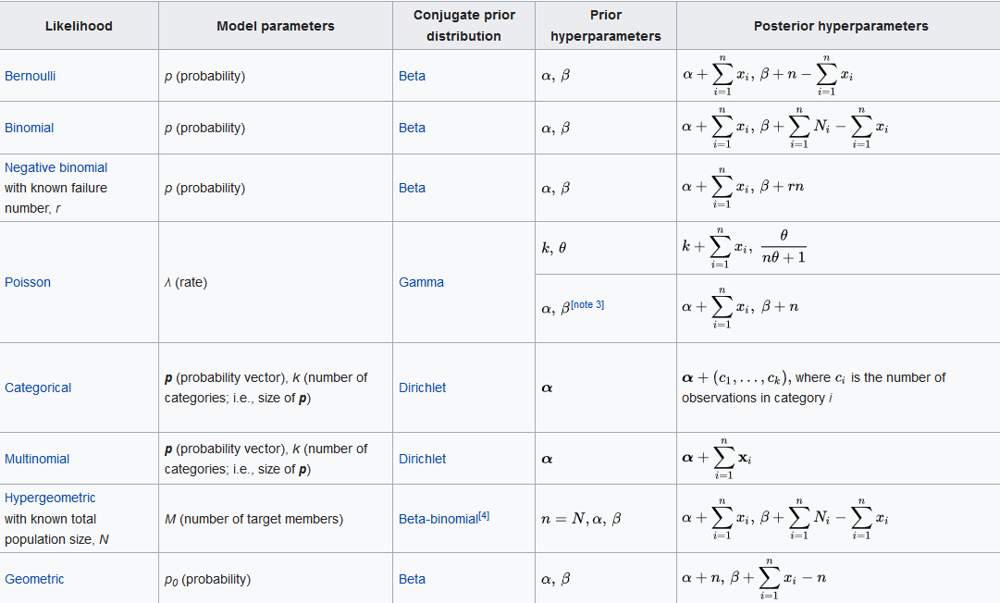
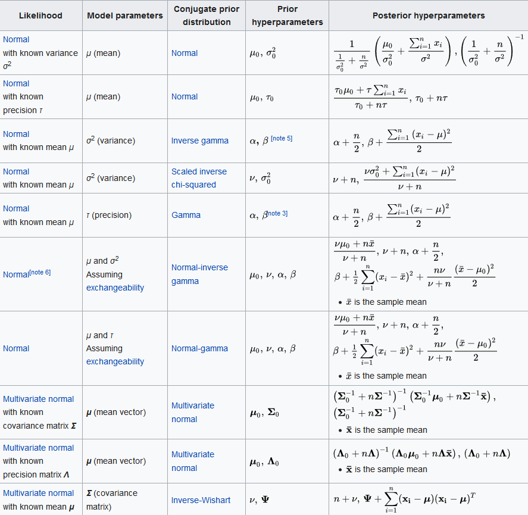
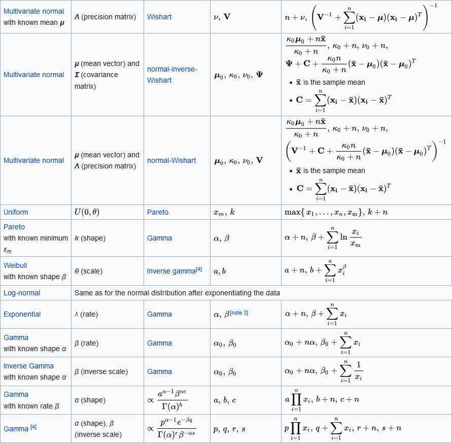

```{r setup, include=FALSE}
knitr::opts_chunk$set(echo = TRUE)
options(scipen=999)

Sys.setenv(USE_CXX14 = 1)

library("LaplacesDemon")
library("tidyverse")
library("mvtnorm")
library("Hmisc")
library("gridExtra")
library("rstan") #stan
library("xtable") # model summary as table
library("knitr")


options(mc.cores = parallel::detectCores())
rstan_options(auto_write = TRUE)
Sys.setenv(LOCAL_CPPFLAGS = '-march=native')
  


# The palette with black:
cbbPalette <- c("#000000", "#E69F00", "#56B4E9", "#009E73", 
                "#F0E442", "#0072B2", "#D55E00", "#CC79A7")
```

\newpage

# Lab1 Question 1: Bernoulli ... again.

Let y1,y2,y3|$\theta$ ~ Bern($\theta$), and assume that you have obtained a sample with s = 14
successes in n = 20 trials. Assume a Beta($\alpha_0$,$\beta_0$) prior for $\theta$ and let $\alpha_0$ = $\beta_0$ = 2

## a) Draw random numbers from the posterior $$\theta|y \sim \beta(\alpha_0 + s; \beta_0 + f), y = (y_1,y_2,y_3....y_n)$$ and verify graphically that the posterior mean and standard deviation converges to the true values as the number of random draws grows large.

Let us verify the result for better understanding

* PDF of Bernoulli distribution (unordered) is given by:

$$ p(s|\theta) = \binom{N}{s} \theta^{s} \cdot (1-\theta)^{n-s} ~~~where~s~is~the~number~of~success$$

* PDF of Beta distribution is given by:

$$ f(\theta|\alpha, \beta) = \frac{\Gamma(\alpha+\beta)}{\Gamma(\alpha) \cdot\Gamma(\beta)} \theta^{\alpha-1} \cdot (1-\theta)^{\beta-1}$$
$$ Where~\Gamma(n+1)=(n)!$$

$$Mean: \frac{\alpha}{\alpha+\beta}$$
$$Standard~Deviation: \sqrt{\frac{\alpha \cdot \beta}{(\alpha+\beta)^2(\alpha+\beta+1)}}$$
* Verification:

$$
\begin{split}
 Likelihood = \binom{N}{s} \theta^{s} \cdot (1-\theta)^{n-s} \\
 Prior = \frac{\Gamma(\alpha+\beta)}{\Gamma(\alpha) \cdot\Gamma(\beta)} \theta^{\alpha-1} \cdot (1-\theta)^{\beta-1} \\
Prior \propto \theta^{\alpha-1} \cdot (1-\theta)^{\beta-1} \\\\
Posterior \propto Likelihood \times Prior \\
Posterior \propto  Beta(\alpha_0 + s, \beta_0 + f) \\
\end{split}
$$


```{r}

#' Title A beta distribution generator to generate N values
#'
#' @param N Number of iterations
#' @param alpha Alpha value for beta distribution
#' @param beta  Beta value for beta distribution
#'
#' @return a list containing the mean and std dev of the generated vector
#' @export
#'
#' @examples
gen_beta_sample <- function(N, alpha, beta){
  temp <- rbeta(N, shape1=alpha, shape2=beta)
  mean_value <- mean(temp)
  std_dev <- sd(temp)
  answer <- list(mean_value=mean_value, std_dev=std_dev)
  return(answer)
}

# required input
N = 3000
alpha = 16
beta = 8

# Running the loop inside a function to get the values for varying N
final <- NULL
for(i in 2:N){
  temp <- gen_beta_sample(N=i, alpha = alpha, beta=beta)
  df <- cbind(N = i, Mean = temp$mean_value, stand_dev = temp$std_dev)
  final <- rbind(df, final)
}

# Making final as a dataframe to make it easy to plot
final <- final %>% data.frame()
final$true_mean <- ((alpha)/(alpha+beta))
final$true_std_dev <- sqrt((alpha*beta)/((alpha+beta)^2 *(alpha+beta+1)))

#plots
ggplot(data=final, aes(x=N, y=Mean)) + 
  geom_point(color= "#E69F00") + 
  geom_line(aes(y=true_mean), color = "#000000") + 
  ggtitle("Predicted(line) and Actual Mean(dots) vs. Iterations") 


ggplot(data=final, aes(x=N, y=stand_dev)) + 
  geom_point(color= "#E69F00") + 
  geom_line(aes(y=true_std_dev), color = "#000000") + 
  ggtitle("Predicted(line) and Actual Standard Deviation(dots) vs. Iterations") 


```


## b) Use simulation (nDraws = 10000) to compute the posterior probability Pr($\theta$ < 0.4|y) and compare with the exact value [Hint: pbeta()].


```{r}

#' Title A beta distribution generator to generate N values without mean
#'
#' @param N Number of iterations
#' @param alpha Alpha value for beta distribution
#' @param beta  Beta value for beta distribution
#'
#' @return a list containing the mean and std dev of the generated vector
#' @export
#'
#' @examples
gen_beta_sample_2 <- function(N, alpha, beta){
  answer <- rbeta(N, shape1=alpha, shape2=beta)
  return(answer)
}

# required input
N = 10000

# Running the loop inside a function to get the values for varying N
beta_values <- gen_beta_sample_2(N=N, alpha = alpha, beta = beta)
actual_prop <- sum(beta_values < 0.4)/N
true_prop <- pbeta(q=0.4, shape1=alpha, shape2=beta, lower.tail = TRUE)

cat("The true value of the probability is: ", true_prop, ", 
    while the calculated value is: ", actual_prop)

```


## c) Compute the posterior distribution of the log-odds, $/phi = log\frac{\theta}{1-\theta}$ by simulation (nDraws = 10000).


```{r}
log_odds = log(beta_values/(1-beta_values))
log_odds <- as.data.frame(log_odds)

ggplot(data=log_odds, aes(x=log_odds)) + 
  geom_histogram(bins = 30) +
  ggtitle("Histogram of log-odds")

```

# Lab1 Question 2: Log-normal distribution and the Gini coefficient

Assume that you have asked 10 randomly selected persons about their monthly income (in thousands Swedish Krona) and obtained the following ten observations: 14, 25, 45, 25, 30, 33, 19, 50, 34 and 67. A common model for non-negative continuous variables is the log-normal distribution. The log-normal distribution logN($\mu, \sigma^{2}$) has density function

$$ p(y|\mu,\sigma^2) = \frac{1}{y \cdot \sqrt{2\pi\sigma^2}} e{[- \frac{(logy-\mu)^2}{2\sigma^2}]}$$

for y > 0, $\mu$ > 0 and $\sigma^2$ > 0. The log-normal distribution is related to the normal distribution as follows: if y ~ logN($\mu$, $\sigma^2$) then log y ~ N($\mu$; $\sigma^2$). Let y1, y2, y3....yn |$\mu$, $\sigma^2$ iid ~ logN($\mu$, $\sigma^2$), where $\mu$ = 3.5 is assumed to be known but $\sigma^2$ is unknown with non-informative prior p($\sigma^2$) / 1=$\sigma^2$. The posterior for $\sigma^2$ is the Inv $\chi^2$ (n, $\tau^2$) distribution, where

$$ \tau^2 = \frac{\sum_{i=1}^{n} (logy_{i} - \mu)^2}{n}$$


## a) Simulate 10,000 draws from the posterior of $\sigma^2$ (assuming $\mu$ = 3.5) and compare with the theoretical Inv - $\chi^2 (n, \tau^2)$ posterior distribution.


In the following, $\tau^2$ can be used to simulate from the posterior $\sigma^2|(y_1, ..., y_n); \mu \sim Inv-\chi^2(n,\tau^2)$. This will be done by first drawing $X \sim \chi^2(n)$. This drawed value will then be used within the formula $\sigma^2 = \frac{n\tau^2}{X}$ which is a draw from $Inv-\chi^2(n,\tau^2)$. This process will be repeated 10000 times. The obtained values for $\sigma^2$ will be stored.

```{r}
y = c(14, 25, 45, 25, 30, 33, 19, 50, 34, 67)
n = length(y)
mu = 3.5
tau_sq = sum((log(y)-mu)^2)/n

sigma_sq = c()
for (i in 1:10000) {
  # Drawing x.
  x = rchisq(n = 1, df = n)
  # Calculating and storing sigma_sq.
  sigma_sq[i] = (n*tau_sq)/x
}
# Plotting simulated posterior distribution.
ggplot() +
  geom_density(aes(x = sigma_sq)) +
  labs(title = "Posterior distribution for sigma_sq") +
  theme_bw()
```

After the simulated posterior distribution has been plotted, it will be compared to the theoretical distribution. This will be done by a comparison of the mean and the standard deviation. 
The theoretical mean and standard deviation are obtained with $\frac{n\tau^2}{n-2}\text{for }n>2$ and $\sqrt{\frac{2n^2\tau^4}{(n-2)^2(n-4)}}\text{for }n>4$, respectively. 

```{r}
# Printing statistics of simulated distribution compared to theoretical values.
knitr::kable(
  as.data.frame(
    rbind(
      cbind(Posterior = "Simulation", Mean = mean(sigma_sq), Sd = sd(sigma_sq)),
      cbind(Posterior = "Theory", Mean = n*tau_sq/(n-2), Sd = sqrt((2*n^2*tau_sq^2)/(((n-2)^2)*(n-4))))
    )
  )
)
```

It can be seen that the statistics obtained with the simulation are very close to the theoretical values. Thus, we assume that the simulation of the posterior distribution for $\sigma^2$ has been successful.


## b) The most common measure of income inequality is the Gini coefficient, G, where 0 $\leq$ G $\leq$ 1. G = 0 means a completely equal income distribution, whereas G = 1 means complete income inequality. See Wikipedia for more information. It can be shown that G = 2$\phi (\frac{\sigma}{\sqrt{2}})$ when incomes follow a logN($\mu, \sigma^2$) distribution. $\phi$(z) is the cumulative distribution function (CDF) for the standard normal distribution with mean zero and unit variance. Use the posterior draws in a) to compute the posterior distribution of the Gini coefficient G for the current data set.


In *2a)*, we simulated the posterior distribution for $\sigma^2$ using the current data set. These obtained values for $\sigma^2$ now can be used within $G=2\phi(\sigma/\sqrt{2})-1$ to compute the posterior distribution of the Gini coefficient G. Since $\phi(z)$ refers to the CDF of the standard normal distribution, we can make use of the `pnorm(q, mean = 0, sd = 1)`-function where `q` equals to the different values of $\sigma/\sqrt{2}$. The computed distribution will be plotted.

```{r}
# Computing g values. 
g = 2 * pnorm(q = sqrt(sigma_sq)/sqrt(2), mean = 0, sd = 1) - 1
# Plotting distribution.
ggplot() +
  geom_density(aes(x = g)) +
  ggtitle("Posterior distribution for G")
```


##c)Use the posterior draws from b) to compute a 95% equal tail credible interval for G. An 95% equal tail interval (a,b) cuts off 2.5% percent of the posterior probability mass to the left of a, and 97.5% to the right of b. Also, do a kernel density estimate of the posterior of G using the density function in R with default settings, and use that kernel density estimate to compute a 95% Highest Posterior Density interval for G. Compare the two intervals.


```{r}

temp <- density(g)
values_df <- data.frame(x = temp$x, Density = temp$y)
total <- sum(values_df$Density)

values_df_unsorted <- values_df %>% 
  arrange(x) %>% 
  mutate(running_per_unsort = 100 * cumsum(Density)/total) %>%  
  mutate(flag_unsort = ifelse(running_per_unsort < 2.50, "Drop",
                       (ifelse(running_per_unsort < 97.50, "Accept", "Drop"))))

values_df_sorted <- values_df %>%  
  arrange(desc(Density)) %>% 
  mutate(running_per_sort = 100 * cumsum(Density)/total) %>%  
  mutate(flag_sort = ifelse(running_per_sort < 95.00, "Accept", "Drop"))

ggplot(data=values_df_unsorted, aes(x=x, y=Density)) +
  geom_line() +
  geom_point(aes(x=x,y=0,color=flag_unsort)) +
  ggtitle("Posterior distribution for G using tail method")

ggplot(data=values_df_sorted, aes(x=x, y=Density)) +
  geom_line() +
  geom_point(aes(x=x,y=0,color=flag_sort)) +
  ggtitle("Posterior distribution for G using Highest Posterior Density")

```
Analysis: We see that Highest Posterior Density works better and covers the points where the density is higher, while the usuall symmetric tail method clips even high density regions.


# Lab1 Question 3: Bayesian Inference

Bayesian inference for the concentration parameter in the von Mises distribution. This exercise is concerned with directional data. The point is to show you that the posterior distribution for somewhat weird models can be obtained by plotting it over a grid of values. The data points are observed wind directions at a given location on ten different days. The data are recorded in degrees and converted into radians: (2.44, 2.14, 2.54, 1.83, 2.02, 2.33, 2.79, 2.23, 2.07, 2.02)

Assume that these data points are independent observations following the von Mises distribution:

$$ p(y|\mu,\kappa) = \frac{e[\kappa \cdot cos(y-\mu)]}{2\pi I_{0}(\kappa)},~~~-\pi\leq y\leq \pi$$

where I0(k) is the modified Bessel function of the first kind of order zero [see ?besselI in R]. The parameter $\mu$ ($-\pi\leq y\leq \pi$) is the mean direction and k > 0 is called the concentration parameter. Large k gives a small variance around $\mu$, and vice versa. Assume that $\mu$ is known to be 2:39. Let k ~ Exponential($\lambda$ = 1) a priori, where $\lambda$ is the rate parameter of the exponential distribution (so that the mean is 1/$\lambda$).

## a)Plot the posterior distribution of $\kappa$ for the wind direction data over a fine grid of $\kappa$ values.

```{r}
y <- c(-2.44, 2.14, 2.54, 1.83, 2.02, 2.33, -2.79, 2.23, 2.07, 2.02)
mean_y <- 2.39
k <- seq(0,10,0.001)

calc_prob = function(k, y){
  prob = exp(k * cos(y - mean_y)) / (2*pi*besselI(k, 0))
  return (prob)
}

calc_post = function(k){
  probabilities = sapply(y, calc_prob, k=k)
  prior = dexp(k)
  posterior = prod(probabilities) * prior
  return (posterior)
}

posterior = sapply(k, calc_post)

result_df <- data.frame(k = k, posterior = posterior)

ggplot(data=result_df, aes(x=k, y=posterior)) +
  geom_point() +
  ggtitle("Posterior over varying k")


         
```


## b)Find the (approximate) posterior mode of $\kappa$ from the information in a).


```{r}
# Find the k value which maximizes posterior
mode = result_df$k[which.max(result_df$posterior)]

ggplot(data=result_df, aes(x=k, y=posterior)) +
  geom_point() +
  geom_vline(aes(xintercept = mode, color = "red")) +
  ggtitle(paste0("Posterior over varying k with max value shown as redline = ",mode))


```

Analysis: The max value of posterior is termed as the mode of kappa


\newpage

# Lab2 Question 1: Linear and polynomial regression

The dataset TempLinkoping.txt contains daily temperatures (in Celcius degrees) at Malmslatt, Linkoping over the course of the year 2016 (366 days since 2016 was a leap year). The response variable is temp and the covariate is

time = the number of days since beginning of year/366

The task is to perform a Bayesian analysis of a quadratic regression

$$ temp = \beta_0 + \beta_1 \cdot time + \beta_2 \cdot time^2 + \epsilon, epsilon \sim N(0,\sigma^2)  $$

## a) Determining the prior distribution of the model parameters

\fbox{\begin{minipage}{46.7em}
Use the conjugate prior for the linear regression model. Your task is to set the prior hyperparameters
$\mu_0$, $\Omega_0$, $\nu_0$ and $\sigma^2_0$ to sensible values. Start with $\mu_0 = (-10, 100, -100)^T$, $\Omega_0 = 0.01 \cdot I_3$, $\nu_0 = 4$ and $\sigma^2_0 = 1.$ Check if this prior agrees with your prior opinions by simulating draws from the joint prior of all parameters and for every draw compute the regression curve. This gives a collection of regression curves, one for each draw from the prior. Do the collection of curves look reasonable? If not, change the prior hyperparameters until the collection of prior regression curves do agree with your prior beliefs about the regression curve.
[Hint: the R package mvtnorm will be handy. And use your $Inv-\chi^2$ simulator from Lab 1.]
\end{minipage}}

Joint Prior are given by the following:
$$
\begin{split}
\beta|\sigma^2 \sim N(\mu_0, \sigma^2 \cdot \Omega_0^{-1})  \\
\sigma^2 \sim Inv-\chi^2(\nu_o, \sigma^2_0)
\end{split}
$$

Posterior

$$
\begin{split}
\beta|\sigma^2,y \sim N(\mu_n, \sigma^2 \Omega_n^{-1})  \\
\sigma^2|y \sim Inv-\chi^2(\nu_n, \sigma^2_n) \\\\
\Omega_0 = \lambda I_n \\
\mu_n = (X^T X+\Omega_0)^{-1} (X^T X \hat{B} + \Omega_0 \mu_0) \\
\Omega_n = X^T X + \Omega_0 \\
\hat{\beta} =  (X^TX)^{-1} X^T Y \\ 
\nu_0 = \nu_0 + n \\
\sigma^2_n = \frac{\nu_0 \sigma^2_0 + (YY^T + \mu_0^T \Omega_0 \mu_0 - \mu_n^T \Omega_n \mu_n)}{\nu_n}
\end{split}
$$
Finally

$$
\begin{split}
Y = X \beta + \epsilon \\
\epsilon  = N(0,\sigma^2)
\end{split}
$$


```{r, warning=FALSE}
set.seed(12345)

temp_data = read.delim("TempLinkoping2016.txt")
temp_data$time_square = (temp_data$time)^2
temp_data$intercept = 1

# Initialzing hyper-parameters
mu_0 = t(c(-10,100,-100))
omega_0 = diag(x=0.01,nrow=3,ncol=3)
nu_0 = 4
sigma_sq_0 = 1 

# calculating X and other vectors
X = temp_data[,c("intercept", "time", "time_square")] %>% as.matrix()
X_T = t(X)
Y = temp_data[,c("temp")] %>% as.matrix()
Y_T = t(Y)

# defining a function to sample and predict temperature
quad_regression <- function(mu_0, omega_0, nu_0, sigma_sq_0,X,Y){
# sampling sigma squares using inverse chi-square  
x = rchisq(n = 1, df = nu_0)
# Calculating sigma_sq.
sigma_sq = (nu_0*sigma_sq_0)/x
beta <- mvtnorm::rmvnorm(n = 1 , mean=mu_0, sigma=sigma_sq * solve(omega_0))
final <-  X %*% t(beta) + rnorm(n=1,mean = 0, sd=sqrt(sigma_sq))
colnames(final) <- c("Predicted_temperature")
return(final)
}

# Define a named list of parameter values
gs = list(nu_0 = seq(1,10,1),
           sigma_sq_0 = seq(0,5,0.5)) %>% 
  cross_df() # Convert to data frame grid

final = gs %>% mutate(predicted_temperature = pmap(gs, mu_0 = mu_0, 
                                                   omega_0 = omega_0, X=X, Y=Y, quad_regression),
                      actual_temperature = list(temp_data$temp),
                      time = list(temp_data$time)) %>% as_tibble()

final = unnest(final, predicted_temperature, actual_temperature, time)

# Using cut
final$sigma_sq_0_cut <- cut2(final$sigma_sq_0, m=5)
final$nu_0_cut <- cut2(final$nu_0, m=5)

# plotting
final %>% filter(predicted_temperature <30 & predicted_temperature >-25)  %>%  
  ggplot(aes(x=time, y = predicted_temperature, color=nu_0)) +
  geom_point() +
  geom_line(aes(y=actual_temperature), color="red") +
  facet_wrap(~nu_0_cut) +
  ggtitle("redicted Temperature vs. Time By Varying Nu_0, with true curve in red")


final %>% filter(predicted_temperature <50 & predicted_temperature >-50)  %>%  
  ggplot(aes(x=time, y = predicted_temperature, color=sigma_sq_0)) +
  geom_point() +
  geom_line(aes(y=actual_temperature), color="red") +
    facet_wrap(~sigma_sq_0_cut) +
  ggtitle("Predicted Temperature vs. Time By Varying Sigma square, with true curve in red")

```

Analysis: Its aparent that low values of sigma work well (0-0.5), thus we will set it to ~0.5 and nu_0 will be ~10, this leads to have the following curve. The impact of omega and mu_0 was not much, so we keep them same.

### Best fit
```{r}
set.seed(12345)

# Initialzing final hyper-parameters
mu_0 = t(c(-10,100,-100))
omega_0 = diag(x=50,nrow=3,ncol=3)
nu_0 = 10
sigma_sq_0 = 0.25 

best_fit <- NULL
for(i in 1:100){
temp <- quad_regression(mu_0=mu_0, omega_0=omega_0, nu_0=nu_0, sigma_sq_0=sigma_sq_0,X=X,Y=Y)
temp <- temp %>% as.data.frame() %>% mutate(Actual_temperature = temp_data$temp, Time = temp_data$time) 
best_fit <- rbind(temp, best_fit)
}

# plotting
best_fit %>% 
  ggplot(aes(x=Time, y = Predicted_temperature)) +
  geom_point() +
  geom_line(aes(y=Actual_temperature), color="red") +
  ggtitle("Predicted and Actual Temperature(shown in red) vs. Time")
```

## b) Simulating from the joint posterior distribution

\fbox{\begin{minipage}{46.7em}
Write a program that simulates from the joint posterior distribution of $\beta_0$, $\beta_1$, $\beta_2$ and $\sigma^2$. Plot the marginal posteriors for each parameter as a histogram. Also produce another figure with a scatter plot of the temperature data and overlay a curve for the posterior median of the regression function $f(time) = \beta_0 + \beta_1 \cdot time + \beta_2 \cdot time^2$, computed for every value of time. Also overlay curves for the lower 2.5 percent and upper 97.5 percent posterior credible interval for f(time). That is, compute the 95 percent equal tail posterior probability intervals for every value of time and then connect the lower and upper limits of the interval by curves. Does the interval bands contain most of the data points? Should they?
\end{minipage}}

```{r}
set.seed(12345)
# initialized values from above
mu_0 = c(-10,100,-100)
mu_0_T = t(mu_0)
omega_0 = diag(x=50,nrow=3,ncol=3)
nu_0 = 10
sigma_sq_0 = 0.25 

# calculate beta hat given by beta_hat =  (X^{T} X)^{-1} X^T Y
beta_hat = solve(X_T %*% X) %*% X_T %*% Y

# calculate mu_n
mu_n = solve(X_T %*% X + omega_0) %*% (X_T %*% X %*% beta_hat + omega_0 %*% mu_0)

# calculate omega_n given by Omega_n = X^T X + \Omega_0 
omega_n = X_T %*% X + omega_0

# calculate nu_n given by nu_0 + n
nu_n = NROW(X) + nu_0

# calculate sigma_sq_n given by (nu_0 * sigma_sq_0 + (Y %*% Y_T + mu_0^T %*% omega_0 %*% mu_0 - mu_n^T %*% omega_n %*% mu_n))/nu_n
sigma_sq_n = (nu_0 * sigma_sq_0 + Y_T %*% Y + mu_0_T %*% omega_0 %*% mu_0 - t(mu_n) %*% omega_n %*% mu_n)/nu_n

# posterior distribution given by Beta = N(\mu_n, \sigma^2 \Omega_n^{-1}) 

final <- NULL
temp <- NULL
temp2 <- NULL
predicted_data <- NULL
for(i in 1:1000){
#\sigma^2 =  Inv-\chi^2(nu_n, \sigma^2_n)
x = rchisq(n = 1, df = nu_n)
# Calculating sigma_sq.
sigma_sq = as.vector((nu_n*sigma_sq_n)/x) 
betas <- mvtnorm::rmvnorm(n = 1 , mean=mu_n, sigma=sigma_sq * solve(omega_n))
temp2 <-  X %*% t(betas) + rnorm(n=1,mean = 0, sd=sqrt(sigma_sq)) # add the error term you get prediction band
temp2 <- cbind(temp2, X, Y)
predicted_data <- rbind(temp2, predicted_data)
temp <- cbind(betas,sigma_sq)
final <- rbind(temp,final)
}

colnames(final) <- c("Beta_0", "Beta_1", "Beta_2", "Sigma_squared")
colnames(predicted_data) <- c("Predicted_Temperature", "Intercept", "Time", "Time_square", "Actual_Temperature")
final = final %>% as.data.frame()

# calculation of the 95% confidence interval
predicted_data = predicted_data %>% as.data.frame() %>% 
group_by(Actual_Temperature, Time) %>%
summarise(temp_hat_median = median(Predicted_Temperature),
temp_hat_l_limit = quantile(x = Predicted_Temperature, probs = 0.025),
temp_hat_u_limit = quantile(x = Predicted_Temperature, probs = 0.975))

ggplot(data=final,aes(Beta_0)) + 
  geom_histogram(bins=50) + 
  ggtitle("Histogram of Beta_0")

ggplot(data=final,aes(Beta_1)) + 
  geom_histogram(bins=50) + 
  ggtitle("Histogram of Beta_1")

ggplot(data=final,aes(Beta_2)) + 
  geom_histogram(bins=50) + 
  ggtitle("Histogram of Beta_2")

ggplot(data=final,aes(Sigma_squared)) + 
  geom_histogram(bins=50) + 
  ggtitle("Histogram of Sigma_squared")

ggplot(data= predicted_data, aes(x = Time)) + geom_point(aes(y = Actual_Temperature)) +
geom_line(aes(y = temp_hat_median, color = "Posterior median")) +
geom_line(aes(y = temp_hat_l_limit, color = "Posterior credible interval")) +
geom_line(aes(y = temp_hat_u_limit, color = "Posterior credible interval")) +
ggtitle("Plot of regression with confidence intervals")

```
Analysis: No we dont expect 95% of the data inside the confidence band because this is not the prediction band(does not contain the error term)

##c) Simulating from posterior distribution of $\widetilde{x}$

\fbox{\begin{minipage}{46.7em}
It is of interest to locate the time with the highest expected temperature (that is, the $time$ where $f(time)$ is maximal). Let's call this value $\widetilde{x}$. Use the simulations in b) to simulate from the posterior distribution of $\widetilde{x}$. [Hint: the regression curve is a quadratic. You can find a simple formula for $\widetilde{x}$ given $\beta_0$, $\beta_1$ and $\beta_2$.]
\end{minipage}}


Since the given expression is quadratic the first derivate will be zero that is:
$$
\begin{split} 
y = \beta_0 + \beta_1 time + \beta_2 time^2 \\
0 = \beta_1 + 2 \beta_2 time \\
time = -0.5 \cdot  \frac{\beta_1}{\beta_2} \\
\end{split}
$$

### As evident from the graph this will be close to ~0.50, calculating using the median values we get.
```{r}
cat("The highest expected temperature is:", - 0.5 * mean(final$Beta_1/final$Beta_2))
```

##d) Suggesting prior to estimate a high-order polynomial model

\fbox{\begin{minipage}{46.7em}
Say now that you want to estimate a polynomial model of order 7, but you suspect that higher order terms may not be needed, and you worry about overfitting. Suggest a suitable prior that mitigates this potential problem. You do not need to compute the posterior, just write down your prior. [Hint: the task is to specify $\mu_0$ and $\Omega_0$ in a smart way.]
\end{minipage}}

This is equivalent of using regularisation, the posterior where Beta are given by

Lasso:
$$\beta_i|\sigma^2 \sim Laplace(0,\frac{\sigma^2}{\lambda})$$
or simple ridge given by:
$$\beta_i|\sigma^2 \sim N(0,\frac{\sigma^2}{\lambda})$$

# Lab2 Question 2: Posterior approximation for classification with logistic regression

##a) Implementing logistic regression model

\fbox{\begin{minipage}{46.7em}
Consider the logistic regression 
$$Pr(y=1|x) = \frac{exp(x^T\beta)}{1+exp(x^T\beta)}$$
where y is the binary variable with y = 1 if the woman works and y = 0 if she does not. x is a 8-dimensional vector containing the eight features (including a one for the constant term that models the intercept). Fit the logistic regression using maximum likelihood estimation by the command: *glmModel <- glm(Work ~ 0 + ., data = WomenWork, family = binomial).* Note how I added a zero in the model formula so that R doesn't add an extra intercept (we already have an intercept term from the Constant feature). Note also that a dot (.) in the model formula means to add all other variables in the dataset as features. family = binomial tells R that we want to fit a logistic regression.
\end{minipage}}

```{r}
set.seed(12345)
data <- read.csv("WomenWork.csv")
model <- glm(Work~0 +., data = data, family = binomial)
summary(model)
```

## b) Approximating the posterior distribution of $\beta$ with a multivariate normal distribution

\fbox{\begin{minipage}{46.7em}
Now the fun begins. Our goal is to approximate the posterior distribution of the 8-dim parameter vector $\beta$ with a multivariate normal distribution
$$\beta|y,X\sim N \bigg(\widetilde{\beta},J^{-1}_y(\widetilde{\beta})\bigg)$$
where $\widetilde{\beta}$ is the posterior mode and $J(\widetilde{\beta}) = - \frac{\partial^2lnp(\beta|y)}{\partial\beta\partial\beta^T}|_{\beta=\widetilde{\beta}}$ is the observed Hessian evaluated at the posterior mode. Note that 
$\frac{\partial^2lnp(\beta|y)}{\partial\beta\partial\beta^T}$ is an 8x8 matrix with
second derivatives on the diagonal and cross-derivatives $\frac{\partial^2lnp(\beta|y)}{\partial\beta_i\partial\beta_j}$ on the offdiagonal.
It is actually not hard to compute this derivative by hand, but don't worry, we will let the computer do it numerically for you. Now, both $\widetilde{\beta}$ and $J(\widetilde{\beta})$ are computed by the optim function in R. See my code 
https://github.com/mattiasvillani/BayesLearnCourse/raw/master/Code/MainOptimizeSpam.zip where I have coded everything up for the spam prediction example (it also does probit regression, but that is not needed here). I want you to implement you own version of this. You can use my code as a template, but I want you to write your own file so that you understand every line of your code. Don't just copy my code. Use the prior $\beta \sim N(0, \tau^2I)$, with $\tau = 10$. Your report should include your code as well as numerical values for $\widetilde{\beta}$ and $J^{-1}_y(\widetilde{\beta})$ for the WomenWork data. Compute an approximate 95 percent credible interval for the variable NSmallChild. Would you say that this feature is an important determinant of the probability that a women works?
\end{minipage}}


Lets derive the formula for the log-likelihood

In our data 'Work' is a binary function thus

$$
\begin{split}
P(Work=1|x_i) = \frac{exp(X^T \cdot \beta)}{1+exp(X^T \cdot \beta)} \\
P(Work=0|x_i) = \frac{1}{1+exp(X^T \cdot \beta)} \\\\
Since~ P(Work=1|x_i) + P(Work=0|x_i) = 1 \\\\
Loss~function~is~cross~entropy~loss~function~~~~~~~~~~~~~~~~~~~~~~~~~~~~~~~~~~~~~~~~~~ \\
Loss = y_i \cdot\log P(Work=1|x_i) + (1-y_i) \cdot \log P(Work=0|x_i)
\end{split}
$$


Likelihood:

$$
\begin{split}
p(Y|x,\beta) = \sum_{i=1}^{n=N} y_i \cdot\log(P(Work=1|x_i)) + (1-y_i) \cdot \log(P(Work=0|x_i))\\
p(Y|x,\beta) = \sum_{i=1}^{n=N}  y_i  \cdot  \log(\frac{exp(X^T \cdot \beta)}{1+exp(X^T \cdot \beta)})+ (1-y_i) \cdot \log(\frac{1}{1+exp(X^T \cdot \beta)}) \\
p(Y|x,\beta) = \sum_{i=1}^{n=N}  y_i  \cdot  \log(\frac{1}{1+exp(- X^T \cdot \beta)})+ (1-y_i) \cdot \log(\frac{1}{1+exp(X^T \cdot \beta)}) \\
p(Y|x,\beta) = \sum_{i=1}^{n=N}  y_i \cdot [\log(\frac{1}{1+exp(- X^T \cdot \beta)}) - \log(\frac{1}{1+exp(X^T \cdot \beta)})] + \log(\frac{1}{1+exp(X^T \cdot \beta)} \\
p(Y|x,\beta) = \sum_{i=1}^{n=N}  y_i \cdot [\log(\frac{\frac{1}{1+exp(- X^T \cdot \beta)})}{(\frac{1}{1+exp(X^T \cdot \beta)})}] + \log(\frac{1}{1+exp(X^T \cdot \beta)} \\
p(Y|x,\beta) = \sum_{i=1}^{n=N}  y_i \cdot log(exp(-X^T \cdot \beta)) + \log(1) - \log({1+exp(X^T \cdot \beta)}) \\
p(Y|x,\beta) = \sum_{i=1}^{n=N}  y_i \cdot X^T \cdot \beta - \log({1+exp(X^T \cdot \beta)}) \\
\end{split}
$$

Further more

In the next step, the goal is to approximate the posterior distribution of $\beta$ with a multivariate normal distribution 
$$\beta|y,X\sim N \bigg(\widetilde{\beta},J^{-1}_y(\widetilde{\beta})\bigg)$$
where $\widetilde{\beta}$ is the posterior mode and 
$J(\widetilde{\beta}) = - \frac{\partial^2lnp(\beta|y)}{\partial\beta\partial\beta^T}|_{\beta=\widetilde{\beta}}$ is the observed Hessian evaluated at the posterior mode.
Both $\widetilde{\beta}$ and $J(\widetilde{\beta})$ are computed by the `optim`-function in R. We use the prior $\beta \sim N(0, \tau^2I)$ with $\tau = 10$.

```{r}

set.seed(12345)
# creating matrix for calculation
X <- data[,c("Constant", "HusbandInc", "EducYears", "ExpYears", 
             "ExpYears2", "Age", "NSmallChild", "NBigChild" )] %>% as.matrix()
Y <- data[,c("Work")] %>% as.matrix()

# Prior.
tau = 10
mu_0 = rep(0, ncol(X))
sigma_0 = tau^2*diag(ncol(X))
beta_init = rep(0, ncol(X))

log_posterior <- function(betaVect,Y,X,mu,sigma){
  
  nPara <- length(betaVect);
  linPred <- X %*% betaVect;
  
  # evaluating the log-likelihood                                    
  logLik <- sum( linPred*Y -log(1 + exp(linPred)));
  if (abs(logLik) == Inf) logLik = -20000; # Likelihood is not finite, stear the optimizer away from here!
  
  # evaluating the prior
  logPrior <- dmvnorm(betaVect, matrix(0,nPara,1), sigma, log=TRUE);
  
  # add the log prior and log-likelihood together to get log posterior
  return(logLik + logPrior)
}

results_optim = optim(par = beta_init,
                      fn = log_posterior,
                      Y = Y,
                      X = X,
                      mu = mu_0,
                      sigma = sigma_0,
                      method=c("BFGS"),
                      # Multiplying objective function by -1 to find maximum instead of minimum.
                      control=list(fnscale=-1), 
                      hessian=TRUE)


```

The `optim`-function returns the mode for every $\beta$, $\widetilde{\beta}$. Since the function returns $-J_y(\widetilde{\beta})$, we still need to transform this matrix to get the desired $J^{-1}_y(\widetilde{\beta})$ before printing.
```{r}
# Printing results.
  # Beta_mode.
  knitr::kable(
    data.frame(
      beta_ = seq(from = 0,to = length(results_optim$par)-1), 
      posterior_mode = results_optim$par), 
    caption = "Numerical values for beta_mode")
  

# Adjusted hessian. # Posterior covariance (J^-1(beta hat))
print("Adjusted hessian:")
hessian =  -solve(results_optim$hessian)
hessian
approx_post_std_dev = sqrt(diag(hessian))

  knitr::kable(approx_post_std_dev, caption="Observed hessian evaluated at the posterior mode")
  
```

To compute an approximate 95% credible interval for the coefficients of the variable *NSmallChild*, we first need to simulate from the posterior. We do this by simulating from the posterior 
$$\beta|y,X\sim N \bigg(\widetilde{\beta},J^{-1}_y(\widetilde{\beta})\bigg)$$

by usage of our obtained parameters $\widetilde{\beta}$ and $J^{-1}_y(\widetilde{\beta})$.
```{r}
set.seed(12345)
# Simulating 1000 times from approximated posterior.
posterior_sim_beta_all = rmvnorm(n = 1000,
                                 mean = results_optim$par,
                                 sigma = -solve(results_optim$hessian))

# Extracting simulated posterior beta values for variable NSmallChild.
posterior_sim_beta_nsc = posterior_sim_beta_all[, 7]

# Computing 95% credible interval bounds.
interval_bounds = quantile(x = posterior_sim_beta_nsc,
                           probs = c(0.025, 0.975))

# Plotting simulated beta values with 95% credible interval for variable NSmallChild.
ggplot() +
  geom_histogram(aes(x = posterior_sim_beta_nsc),
                 binwidth = 0.1) +
  geom_vline(xintercept = interval_bounds[1],
             color = "red") +
  geom_vline(xintercept = interval_bounds[2],
             color = "red") +
  ggtitle("Histogram of simulated posterior distribution of beta for Nsmallchild")


# Printing interval bounds.
knitr::kable(as.data.frame(interval_bounds), caption = "Computed credible interval bounds")
```


##c) Simulating from the predictive distribution of the response variable in a logistic regression 

\fbox{\begin{minipage}{46.7em}
Write a function that simulates from the predictive distribution of the response variable in a logistic regression. Use your normal approximation from 2(b). Use that function to simulate and plot the predictive distribution for the Work variable for a 40 year old woman, with two children (3 and 9 years old), 8 years of education, 10 years of experience. and a husband with an income of 10. [Hint: the R package mvtnorm will again be handy. And remember my discussion on how Bayesian prediction can be done by simulation.]
\end{minipage}}


To perform a simulation from the predictive distribution of the response variable in a logistic regression, we use the drawn posterior $\beta$-coefficiencts (`posterior_sim_beta_all`) from *2b)* to predict the *Work*-value. For every drawn $\beta$-vector, we calculate $Pr(y=1|x) = \frac{exp(x^T\beta)}{1+exp(x^T\beta)}$. Since the goal is to predict the *Work*-value for 40-year-old woman with two children (3 and 9 years old), 8 years of education, 10 years of experience and a husband with an income of 10, we use this data for every different drawn $\beta$-vector.

```{r}
set.seed(12345)
# Implementing specified data.
X = matrix(c(Constant = 1, 
             HusbandInc = 10, 
             EducYears = 8, 
             ExpYears = 10, 
             ExpYears2 = 1.00,
             Age = 40, 
             NSmallChild = 1, 
             NBigChild = 1),
           nrow = 1)

X_T <- t(X)

colnames(posterior_sim_beta_all) <- c("Constant", "HusbandInc", "EducYears", 
                                      "ExpYears", "ExpYears2", "Age", "NSmallChild", "NBigChild")

# Using all drawn posterior beta coeffiecients and specified data vector 
# to compute distribution for Pr(y=1|x).
predictive_sim_work = c()
for(sim in 1:nrow(posterior_sim_beta_all)) {
    num <- exp(posterior_sim_beta_all[sim,] %*% X_T)
  predictive_sim_work[sim] <- num/(1+num)
}

predictive_sim_work = predictive_sim_work %>% as.data.frame()
colnames(predictive_sim_work) <- c("Probability_of_Work")

# Plotting histogram of predictive distribution.
ggplot(data=predictive_sim_work, aes(Probability_of_Work)) +
geom_histogram(bins = 30) +
ggtitle("Histogram of the Porbability of Women Working given the parameters")  
```


\newpage

# Lab3 Assignment 1: Normal model, mixture of normal model with semi-conjugate prior

\fbox{\begin{minipage}{46.7em}
The data rainfall.dat consist of daily records, from the beginning of 1948 to the
end of 1983, of precipitation (rain or snow in units of $\frac{1}{100}$ inch, and records of zero precipitation are excluded) at Snoqualmie Falls, Washington. Analyze the data using the following two models.
\end{minipage}}

First, the provided data *rainfall.dat* will be read into the R environment.
```{r}
# Storing provided data in R environment as a numeric vector.
data = read.table("rainfall.dat", header = FALSE, sep = "", dec = ".")[,1]
```

## 1a. Normal model

\fbox{\begin{minipage}{46.7em}
Assume the daily precipitation ${y_1,y_2,y_3....,y_n}$ are independent normally distributed, $y_1,y_2,....,y_n|\mu,\sigma^2 \sim N(\mu,\sigma^2)$ where both $\mu$ and $\sigma^2$ are unknown. Let $\mu \sim N(\mu_0, \tau^2_0)$ independently of $\sigma^2 \sim Inv-\chi^2(\nu_0,\sigma_0^2)$ \\

i) Implement a Gibbs Sampler code that simulates from the joint posterior $p(\mu,\sigma^2|y_1,y_2,....y_n).$ The full conditional posteriors are given on the slides from Lecture 7.

ii) Analyze the daily precipitation using your Gibbs sampler in (a)-i. Evaluate the convergence of the Gibbs sampler by suitable graphical methods, for example by plotting the trajectories of the sampled Markov chains. 
\end{minipage}}

### Given information

For the specified Normal model with the semi-conjugate prior
$$\mu \sim N(\mu_0, \tau_0^2)$$
and $$\sigma^2 \sim Inv-\chi^2(\nu_0, \sigma^2_0),$$
we know the full-conditional posteriors from lecture 7: 
$$\mu|\sigma^2,x \sim N(\mu_n, \tau^2_n)$$ 
and
$$\sigma^2|\mu,x\sim Inv-\chi^2\bigg(\nu_n, \frac{\nu_0 \tau^2_0 + \sum_{i=1}^n(x_i-\mu)^2}{n+\nu_0}\bigg).$$
Also, from lecture 2, we know that
$$w = \frac{\frac{n}{\sigma^2}}{\frac{n}{\sigma^2}+\frac{1}{\tau^2_0}},$$
$$\mu_n = w\bar{x}+(1-w)\mu_0$$
and
$$\frac{1}{\tau^2_n} = \frac{n}{\sigma^2} + \frac{1}{\tau^2_0} \Rightarrow \tau^2_n = \frac{1}{\frac{n}{\sigma^2}+\frac{1}{\tau^2_0}}.$$

### Setup

To be able to sample from the full conditional posteriors, we have to set up the prior parameters $\mu_0$, $\tau^2_0$, $\nu_0$ and $\sigma^2_0$. For $\mu_0$, our best guess is the mean of the provided data. For the other parameters, we do not have any information. Thus, we use initial values of 1 for each of these parameters.

```{r}
# Initializing prior parameters.
mu_0 = mean(data)
tau_0_sq = 1
nu_0 = 1
sigma_0_sq = 1
```

Furthermore, we have to implement $n$, $\bar{x}$ by usage of the provided data. $\nu_n$ is given by $\nu_0 + n$.
```{r}
# Implementing further variables.
n = length(data)
x_bar = mean(data)
nu_n = nu_0 + n
```

In the following, functions which are used to sample from the full conditional posteriors will be implemented following the presented formulas.
To draw from the full conditional posterior for $\sigma^2$, we need to draw from the scalded inverse-chi-squared distribution. We obtain this by usage of the same principle of our simulators from the previous labs. Precisely, we first draw from $X\sim\chi^2(\nu_n)$ and then compute $\sigma^2 = \frac{\nu_n\bigg(\frac{\nu_0\sigma^2_0+\sum_{i=1}^n(x_i-\mu)^2}{n+\nu_0}\bigg)}{X}$

```{r}
# Implementing functions to enable sampling from full conditional posteriors.
  # mu.
  posterior_mu = function(sigma_sq) {
    # Calculating w.
    w = (n/sigma_sq)/((n/sigma_sq) + (1/tau_0_sq))
    # Calculating mu_n.
    mu_n = w*x_bar+(1-w)*mu_0
    # Calculating tau_n_sq.
    tau_n_sq = 1/((n/sigma_sq)+(1/tau_0_sq))
    # Drawing mu from N(mu_n, tau_n_sq).
    mu = rnorm(n = 1, mean = mu_n, sd = tau_n_sq)
    # Returning draw.
    return(mu)
  }
  # sigma_sq.
  posterior_sigma_sq = function(mu) {
    # Drawing X.
    X = rchisq(n = 1, df = nu_n)
    # Computing sigma_sq.
    sigma_sq = nu_n*((nu_0*sigma_0_sq+sum((data-mu)^2))/(n+nu_0))/X
    # Returning sigma_sq.
    return(sigma_sq)
  }
```

To perform Gibbs sampling, we first need to initialize the $\theta_2, ..., \theta_k$ parameters. Since we only have two parameters in this case, we only need to initialize our $\theta_2$ which is $\sigma^2$. To do so, it would be possible to simply select a random value for $\sigma^2$. However, we just draw from our prior distribution for $\sigma^2$. Again, to sample from the scalded inverse-chi-squared distribution, we follow the same principle as described. 
```{r}
# Initializing sigma_sq.
  # Drawing X.
  X = rchisq(n = 1, df = nu_0)
  # Computing sigma_sq.
  sigma_sq = (nu_0*sigma_0_sq)/X
```

### Run

Using both posterior functions and the initialized $\sigma^2$, we are now able to perform Gibbs sampling.
```{r}
# Defining number of iterations.
niter = 5000
# Creating objects to store results.
mu_draws = c()
sigma_sq_draws = c()
# Performing gibbs sampling.
for (i in 1:niter) {
  # Sampling and storing mu.
  mu = posterior_mu(sigma_sq)
  mu_draws[i] = mu
  # Sampling and storing sigma_sq.
  sigma_sq = posterior_sigma_sq(mu)
  sigma_sq_draws[i] = sigma_sq
}
```

### Results

The sampling procedure leads to the following results. For each drawn parameter ($\mu$ and $\sigma^2$), both the chain and the histogram of the samples are plotted.
```{r}
# Plotting results of Gibbs sampling.
  # mu.
    # chain.
    ggplot() +
    geom_line(aes(x = seq(from = 1, to = niter), y = mu_draws)) +
    theme_bw() +
    labs(title = "Chain of sampled mu",
         x = "iteration",
         y = "mu")
    # histogram.
    ggplot() +
    geom_histogram(aes(x = mu_draws),
                   fill = "black",
                   colour = "white",
                   bins = 30) +
    theme_bw() +
    labs(title = "Histogram of sampled mu",
         x = "mu")
  # sigma_sq.
    # chain.
    ggplot() +
    geom_line(aes(x = seq(from = 1, to = niter), y = sigma_sq_draws)) +
    theme_bw() +
    labs(title = "Chain of sampled sigma_sq",
         x = "iteration",
         y = "sigma_sq_draws")
    # histogram.
    ggplot() +
    geom_histogram(aes(x = sigma_sq_draws),
                   fill = "black",
                   colour = "white",
                   bins = 30) +
    theme_bw() +
    labs(title = "Histogram of sampled sigma_sq",
         x = "sigma_sq_draws")
```

The results show that for both parameters $\mu$ and $\sigma^2$, there is no Burn-in. 

\newpage

## 1b. Mixture normal model.

\fbox{\begin{minipage}{46.7em}
Let us now instead assume that the daily precipitation ${y_1,y_2,.....,y_n}$ follow an iid two-component mixture of normals model:
$$ p(y_i|\mu,\sigma^2,\pi) = \pi N(y_i|\mu_1,\sigma^2_1) + (1-\pi) N(y_i|\mu_2,\sigma^2_2)$$
where
$$\mu = (\mu_1,\mu_2)~~~~~and~~~~\sigma^2 = (\sigma_1^2,\sigma^2_2)$$
Use the Gibbs sampling data augmentation algorithm in NormalMixtureGibbs.R (available under Lecture 7 on the course page) to analyze the daily precipitation data. Set the prior hyperparameters suitably. Evaluate the convergence of the sampler.
\end{minipage}}

### Given information

The specified mixture normal model is
$$p(y_i|\mu,\sigma^2,\pi)=\pi N(y_i|\mu_1,\sigma^2_1)+(1-\pi)N(y_i|\mu_2,\sigma^2_2),$$
where 
$$\mu = (\mu_1,\mu_2) \text{ and } \sigma^2=(\sigma^2_1, \sigma^2_2).$$
Instead of using the provided code in the file *NormalMixtureGibbs.R*, we create our own programme to perform Gibbs sampling. Within the provided file, another prior is assumed (the prior from lecture 2 where $\mu_j$ does not depend on $\sigma^2_j$). Therefore, also the full-condtional posteriors differ from the ones provided in lecture 7.

Here, we use the prior 
$$\pi \sim Beta(\alpha_1, \alpha_2)$$ 
and the conjugate prior
$$\mu_j|\sigma^2_j \sim N\big(\mu_{0j}, \frac{\sigma^2_j}{\kappa_{0j}}\big).$$
$$\sigma^2_j \sim Inv-\chi^2\big(\nu_{0j}, \sigma^2_{0j}\big)$$

We also define $n_1 = \sum_{i=1}^n(I_i=1)$ and $n_2 = n - n_1.$

According to lecture 7, usage of this prior leads to the following full conditional posteriors:

- $(\pi_1, ..., \pi_k)|I, x\sim Dirichlet(\alpha_1 + n_1, ..., \alpha_k + n_k)$
- $\mu_j|I, \sigma^2_j \sim N(\mu_{nj}, \frac{\sigma^2_j}{\kappa_{nj}})$
- $\sigma^2_j|I, x \sim Inv-\chi^2(\nu_{nj}, \sigma^2_{nj})$ 

where
$$\mu_{nj} = \frac{\kappa_{0j}}{\kappa_{0j}+n_j}\mu_{0j}+\frac{n_j}{\kappa_{0j}+n_j}\bar{x},$$
$$\kappa_{nj} = \kappa_{0j} + n_j,$$
$$\nu_{nj} = \nu_{0j} + n_j$$
and 
$$\sigma^2_{nj} = \frac{ \nu_{0j}\sigma^2_{0j}+(n_j-1)s^2+\frac{\kappa_{0j}n_j}{\kappa_{0j}+n_j}(\bar{x}-\mu_{0j})^2}{\nu_n}$$ 
(see lecture 5).

Furthermore, for our case k = 2 (since we have two components in our model), we can sample $I_i$ as follows:

$$I_i |\pi, \mu_1, \sigma^2_1, \mu_2, \sigma^2_2, x \sim Bern(\theta_i), i = 1, ..., n$$
where 
$$\theta_{ij} = \frac{\pi_j\phi(x_i; \mu_j, \sigma^2_j)}{\sum_{r=1}^k \pi_r \phi(x_i; \mu_r, \sigma^2_r)}$$ 

and $\phi(x_i; \mu_j, \sigma^2_j)$ denotes the probability of $x_i$ given $X \sim N(\mu_j, \sigma^2_j).$

### Setup

First, we need to implement our prior beliefs. 
```{r}
# Implementing number of components.
n_comp = 2
# Implementing prior parameters.
alpha_j = 10*rep(1, n_comp)
mu_0_j = rep(0, n_comp)
kappa_0_j = rep(3500, n_comp)
nu_0_j = rep(4, n_comp) # degrees of freedom for prior on sigma2
sigma_sq_0_j = rep(var(data), n_comp) # best guess of sigma2
```

Furthermore, functions to use within the sampling process will be implemented.
```{r}
# Implementing function that simulates from Dirichlet distribution
rDirichlet = function(alpha_j) {
  n_alpha = length(alpha_j)
  pi_draws = matrix(NA, n_alpha, 1)
  for (j in 1:n_alpha){
    pi_draws[j] = rgamma(1, alpha_j[j], 1)
  }
  # Dividing every column of pi_draws by the sum of the elements in that column.
  pi_draws = pi_draws/sum(pi_draws)
  return(pi_draws)
}
# Implementing function that simulates from Scaled Inverse Chi Sqaured distribution.
rScaledInvChi2 <- function(n, df, scale){
  return((df*scale)/rchisq(n,df=df))
}
```

To be able to draw from all full conditional posteriors, we need to initialize the paramters $I_i$ (i from observation $i$), $\mu_j$ and $\sigma^2_j$. 
```{r}
# Initializing parameters for the MCMC.
  # I_i. Random allocation of observations with same probability.
  I = c()
  for (i in 1:length(data)) {
    prob_j = c()
    # Reallocating observation.
    I[i] = which(t(rmultinom(1, size = 1 , prob = rep(1/n_comp, n_comp))) == 1)
  }
  # mu_j.
  mu_j = quantile(data, probs = seq(0,1,length = n_comp))
  # sigma_sq_j.
  sigma_sq_j = rep(var(data), n_comp)
```

Also, at the end, a plot will be created. The plot has to be set up before as well.
```{r, fig.show = "hide"}
# Setting up the plot.
x = as.matrix(data)
xGrid <- seq(min(x)-1*apply(x,2,sd),max(x)+1*apply(x,2,sd),length = 100)
xGridMin <- min(xGrid)
xGridMax <- max(xGrid)
mixDensMean <- rep(0,length(xGrid))
effIterCount <- 0
ylim <- c(0,2*max(hist(x)$density))
plotFit <- TRUE
lineColors <- c("blue", "green", "magenta", 'yellow')
sleepTime <- 0.1 # Adding sleep time between iterations for plotting
```

Lastly we still have to setup the number of iterations and we have to initialize the matrices to store the results.
```{r}
# Defining number of iterations.
niter = 200
# Initializing matrices to store results for every iteration.
mu_all = matrix(0, niter, n_comp)
sigma_sq_all = matrix(0, niter, n_comp)
```

### Run

With the implemented prior parameters, sampling functions and the initialized parameter values, we are able to perfrom Gibbs sampling. 
```{r}
# Performing gibbs sampling.
for (i in 1:niter) {
  
  # Printing iteration number.
  # message(paste('Iteration number:', i))
  
  # Calculating and printing n_j.
  n_j = c()
  for (j in 1:n_comp) {
    n_j[j] = sum(I == j)
  }
  # print(n_j)
  
  # Updating parameters.
    # pi.
    pi_j = rDirichlet(alpha_j + n_j)
    # mu.
    for (j in 1:n_comp) {
      # Calculating mu_n_j.
      mu_n_j = (kappa_0_j/(kappa_0_j + n_j))*mu_0_j + n_j/(kappa_0_j + n_j)*mean(data[I == j])
      # Calculating kappa_n_j.
      kappa_n_j = kappa_0_j + n_j
      # Sampling from N(mu_n_j, sigma_sq_j)
      mu_j[j] = rnorm(n = 1, mean = mu_n_j, sd = sigma_sq_j[j] / kappa_n_j)
    }
    mu_all[i, ] = mu_j
    # sigma_sq.
    for (j in 1:n_comp) {
      # Calculating nu_n_j.
      nu_n_j = nu_0_j[j] + n_j[j]
      # Calculating sigma_sq_n_j.
      sigma_sq_n_j = 
        (nu_0_j[j] * sigma_sq_0_j[j] +
        (n_j[j]-1) * sd(data[I == j]) + 
        (kappa_0_j[j] * n_j[j]) / (kappa_0_j[j] + n_j[j]) * (mean(data[I == j]) - mu_0_j[j])^2) /
        nu_n_j
      # Sampling from Scaled-Inv-Chi-Sq(nu_n_j, sigma_sq_n_j).
      sigma_sq_j[j] = rScaledInvChi2(n = 1, df = nu_n_j, scale = sigma_sq_n_j)
    }
    sigma_sq_all[i, ] = sigma_sq_j
    
  # Updating allocation.
  for (obs in 1:length(data)) {
    prob_j = c()
    for (j in 1:n_comp) {
      # Extracting value of current observation.
      x = data[obs]
      # Calculating probability of x belonging to component j.
      prob_j[j] = pi_j[j]*dnorm(x, mean = mu_j[j], sd = sqrt(sigma_sq_j[j]))
    }
    # Reallocating observation.
    I[obs] = which(t(rmultinom(1, size = 1 , prob = prob_j/sum(prob_j))) == 1)
  }
  
  # Storing data for fitted density against data histogram.
  # Plotting every iteration is uncommented.
  if (plotFit && (i%%1 == 0)){
    effIterCount <- effIterCount + 1
    # hist(data, breaks = 20, freq = FALSE, xlim = c(xGridMin,xGridMax), 
    #     main = paste("Iteration number", i), ylim = ylim)
    mixDens <- rep(0,length(xGrid))
    components <- c()
    for (j in 1:n_comp){
      compDens <- dnorm(xGrid,mu_j[j],sd = sqrt(sigma_sq_j[j]))
      mixDens <- mixDens + pi_j[j]*compDens
    #  lines(xGrid, compDens, type = "l", lwd = 2, col = lineColors[j])
      components[j] <- paste("Component ",j)
    }
    mixDensMean <- ((effIterCount-1)*mixDensMean + mixDens)/effIterCount
    
    #lines(xGrid, mixDens, type = "l", lty = 2, lwd = 3, col = 'red')
    #legend("topleft", box.lty = 1, legend = c("Data histogram",components, 'Mixture'), 
    #       col = c("black",lineColors[1:n_comp], 'red'), lwd = 2)
    #Sys.sleep(sleepTime)
  }
}
```

### Results

```{r}
# Mu.
ggplot() +
  geom_line(aes(x = seq(1:nrow(mu_all)),
                y = mu_all[,1],
                color = "Component 1")) +
  geom_line(aes(x = seq(1:nrow(mu_all)),
                y = mu_all[,2],
                color = "Component 2")) +
  scale_color_manual(values = c("Component 1" = "black",
                                "Component 2" = "red")) +
  theme_bw() +
  labs(title = "Convergence of the sampler for mu",
       subtitle = paste0("Last sample: ", 
                         "Comp. 1: ",
                         round(mu_all[niter, 1], 2),
                         " ; ",
                         "Comp. 2: ",
                         round(mu_all[niter, 2], 2)),
       x = "sample",
       y = "mu",
       colour = NULL)
# Sigma_sq.
ggplot() +
  geom_line(aes(x = seq(1:nrow(sigma_sq_all)),
                y = sigma_sq_all[,1],
                color = "Component 1")) +
  geom_line(aes(x = seq(1:nrow(sigma_sq_all)),
                y = sigma_sq_all[,2],
                color = "Component 2")) +
  scale_color_manual(values = c("Component 1" = "black",
                                "Component 2" = "red")) +
  theme_bw() +
  labs(title = "Convergence of the sampler for sigma_sq",
       subtitle = paste0("Last sample: ", 
                         "Comp. 1: ",
                         round(sigma_sq_all[niter, 1], 2),
                         " ; ",
                         "Comp. 2: ",
                         round(sigma_sq_all[niter, 2], 2)),
       x = "sample",
       y = "sigma_sq",
       colour = NULL)
```

### Alternative solution

```{r}
set.seed(12345)
data = read.table("rainfall.txt", header=FALSE)[,1]
x = as.matrix(data)

# Model options
nComp <- 2 # Number of mixture components
# Prior options
alpha <- 10*rep(1,nComp) # Dirichlet(alpha)
muPrior <- rep(0,nComp) # Prior mean of theta
tau2Prior <- rep(10,nComp) # Prior std theta
sigma2_0 <- rep(var(x),nComp) # s20 (best guess of sigma2)
nu0 <- rep(4,nComp) # degrees of freedom for prior on sigma2
# MCMC options
nIter <- 100 # Number of Gibbs sampling draws

# Plotting options
plotFit <- FALSE
lineColors <- c("blue", "green", "magenta", 'yellow')
sleepTime <- 0.1 # Adding sleep time between iterations for plotting

################ END USER INPUT ###############
###### Defining a function that simulates from the
rScaledInvChi2 <- function(n, df, scale){
return((df*scale)/rchisq(n,df=df))
}

####### Defining a function that simulates from a Dirichlet distribution
rDirichlet <- function(param){
nCat <- length(param)
thetaDraws <- matrix(NA,nCat,1)
for (j in 1:nCat){
thetaDraws[j] <- rgamma(1,param[j],1)
}#Diving every column of ThetaDraws by the sum of the elements in that column.
thetaDraws = thetaDraws/sum(thetaDraws)
return(thetaDraws)
}

# Simple function that converts between two different
# representations of the mixture allocation
S2alloc <- function(S){
n <- dim(S)[1]
alloc <- rep(0,n)
for (i in 1:n){
alloc[i] <- which(S[i,] == 1)
}
return(alloc)
}

# Initial value for the MCMC
nObs <- length(x)
# nObs-by-nComp matrix with component allocations.
S <- t(rmultinom(nObs, size = 1 , prob = rep(1/nComp,nComp)))
theta <- quantile(x, probs = seq(0,1,length = nComp))
sigma2 <- rep(var(x),nComp)
probObsInComp <- rep(NA, nComp)
# Setting up the plot
xGrid <- seq(min(x)-1*apply(x,2,sd),max(x)+1*apply(x,2,sd),length = 100)
xGridMin <- min(xGrid)
xGridMax <- max(xGrid)
mixDensMean <- rep(0,length(xGrid))
effIterCount <- 0
ylim <- c(0,2*max(hist(x)$density))
gibbs_thetas = matrix(0,nIter,2)
gibbs_sigmas = matrix(0,nIter,2)

for (k in 1:nIter){
# Just a function that converts between different representations
# of the group allocations
alloc <- S2alloc(S)
nAlloc <- colSums(S)
if(k == nIter){
message(paste('Iteration number:',k))
print(nAlloc)
}

# Update components probabilities
w <- rDirichlet(alpha + nAlloc)

# Update theta's
for (j in 1:nComp){
precPrior <- 1/tau2Prior[j]
precData <- nAlloc[j]/sigma2[j]
precPost <- precPrior + precData
wPrior <- precPrior/precPost
muPost <- wPrior*muPrior + (1-wPrior)*mean(x[alloc == j])
tau2Post <- 1/precPost
theta[j] <- rnorm(1, mean = muPost, sd = sqrt(tau2Post))
}

gibbs_thetas[k, ] = theta
# Update sigma2's
for (j in 1:nComp){
sigma2[j] <- rScaledInvChi2(1, df = nu0[j] + nAlloc[j],
scale = (nu0[j]*sigma2_0[j] +
sum((x[alloc == j] - theta[j])^2))/(nu0[j] + nAlloc[j]))
}

gibbs_sigmas[k,] = sigma2
# Update allocation
for (i in 1:nObs){
for (j in 1:nComp){
probObsInComp[j] <- w[j]*dnorm(x[i], mean = theta[j], sd = sqrt(sigma2[j]))
}
S[i,] <- t(rmultinom(1, size = 1 , prob = probObsInComp/sum(probObsInComp)))
}

# Printing the fitted density against data histogram
if ((k==nIter) && (k%%1 ==0)){
effIterCount <- effIterCount + 1
hist(x, breaks = 20, freq = FALSE, xlim = c(xGridMin,xGridMax),
main = paste("Iteration number",k), ylim = ylim)
mixDens <- rep(0,length(xGrid))
components <- c()

for (j in 1:nComp){
compDens <- dnorm(xGrid,theta[j],sd = sqrt(sigma2[j]))
mixDens <- mixDens + w[j]*compDens
lines(xGrid, compDens, type = "l", lwd = 2, col = lineColors[j])
components[j] <- paste("Component ",j)
}

mixDensMean <- ((effIterCount-1)*mixDensMean + mixDens)/effIterCount
lines(xGrid, mixDens, type = "l", lty = 2, lwd = 3, col = 'red')
legend("topleft", box.lty = 1, legend = c("Data histogram",components, 'Mixture'),
col = c("black",lineColors[1:nComp], 'red'), lwd = 2)
Sys.sleep(sleepTime)
}
}

# Calculate mean of batches of 2 draws to visualize the
# auto correlation between sequential draws
t1 = c()
t2 = c()
s1 = c()
s2 = c()
for (i in 1:nIter){
if(i%%2 == 0){
t1 = c(t1, mean(gibbs_thetas[,1][i-1:i]))
t2 = c(t2, mean(gibbs_thetas[,2][i-1:i]))
s1 = c(s1, mean(gibbs_sigmas[,1][i-1:i]))
s2 = c(s2, mean(gibbs_sigmas[,2][i-1:i]))
}
}

# Plots displaying convergence of the Normal hyper
# parameters during sampling
pdf("3_1_2_gibbs_mixt.pdf")
par(mfrow=c(3,1))

# Plot comparison between kernel density, mixture of normals and a normal
# approximation
hist(x, breaks = 20,
cex=.1,
border="lightgray",
freq = FALSE,
xlim = c(xGridMin,xGridMax),
xlab="Precipitation",
ylab="Density",
main = "Rainfall: Mixture of Normals")
lines(xGrid,
mixDensMean,
type = "l",
lwd = 2,
lty = 4,
col = "black")
lines(xGrid,dnorm(xGrid, mean = mean(x), sd = apply(x,2,sd)),type = "l",lwd = 2,col = "gray")
legend("topright",box.lty = 1,legend = c("Data histogram","Mixture density","Normal density"),col=c("lightgray","black","gray"),lwd = 2)
# Plot the auto correlation (convergence) between draws of mu
min_t = min(c(min(t1), min(t2)))
max_t = max(c(max(t1), max(t2)))

plot(t1,type="l",ylim=c(min_t, max_t),cex=.1,lwd=2,
     main=expression(paste("Convergence of Gibbs Sampling ", "(", theta, ")", sep=" ")),
xlab="Batches of sequential draws",
ylab=expression(paste("Mean of seq. draws of ", theta, sep=" ")))
lines(t2, lwd=2, col="gray")
legend("topright",box.lty = 1,legend = c(expression(paste(theta, " (1)", sep=" ")),
                                         expression(paste(theta, " (2)", sep=" "))),col=c("black","gray"),lwd = 2)
# Plot the auto correlation (convergence) between draws of sigma
min_s = min(c(min(s1), min(s2)))
max_s = max(c(max(s1), max(s2)))

plot(s1,type="l",ylim=c(min_s, max_s),cex=.1,lwd=2,main=expression(
paste("Convergence of Gibbs Sampling ", "(", sigma^2, ")", sep=" ")),
xlab="Batches of sequential draws",
ylab=expression(paste("Mean of seq. draws of ", sigma^2, sep=" ")))
lines(s2, lwd=2, col="gray")
legend("topright",box.lty = 1,legend = c(expression(paste(sigma^2, " (1)", sep=" ")),expression(paste(sigma^2, " (2)", sep=" "))),col=c("black","gray"),lwd = 2)

dev.off()

```


## 1c. Graphical comparison.

\fbox{\begin{minipage}{46.7em}
Let $\hat{\mu}$ denote the posterior mean of the parameter $\mu$ and correspondingly for the other parameters. Plot the following densities in one figure:\\

1) a histogram or kernel density estimate of the data. \\
2) Normal density $N(\hat{\mu}, \hat{\sigma^2})$ in a) \\
3) Mixture of normals density $p(y_i|\hat{\mu},\hat{\sigma^2},\hat{\pi})$ in b)
\end{minipage}}

```{r}
par(mfrow = c(1, 1))
hist(data, freq=FALSE, breaks=20)
lines(xGrid, mixDensMean, type = "l", lwd = 2, lty = 4, col = "red")
mu = mean(mu_draws)
sigma2 = mean(sigma_sq_draws)
lines(xGrid, dnorm(xGrid, mean = mu, sd=sqrt(sigma2)), type = "l", lwd = 2, col = "blue")
legend("topright", box.lty = 1, legend = c("Data histogram", "Mixture density", "Normal density with mean parameters obtained in a)"), col = c("black", "red", "blue"), lwd = 2)
```

It becomes obvious that the mixture model fits the data much better.

\newpage

# Lab3 Assignment 2: Metropolis Random Walk for Poisson regression.

\fbox{\begin{minipage}{46.7em}

Consider the following Poisson regression model

$$ y_i,\beta \sim Poission[\exp(x_i^T,\beta)],i=1,2,...,n$$

where $y_i$ is the count for the ith observation in the sample and $x_i$ is the p-dimensional vector with covariate observations for the ith observation. Use the data set eBayNumberOfBidderData.dat. This dataset contains observations from 1000 eBay auctions of coins. The response variable is nBids and records the number of bids in each auction. The remaining variables are features/covariates (x):

Const (for the intercept)

PowerSeller (is the seller selling large volumes on eBay?)

VerifyID (is the seller verified by eBay?)

Sealed (was the coin sold sealed in never opened envelope?)

MinBlem (did the coin have a minor defect?)

MajBlem (a major defect?)

LargNeg (did the seller get a lot of negative feedback from customers?)

LogBook (logarithm of the coins book value according to expert sellers. Standardized)

MinBidShare (a variable that measures ratio of the minimum selling price (starting price) to the book value. Standardized).
\end{minipage}}

First, the provided data *eBayNumberOfBidderData.dat* will be read into the R environment.
```{r}
# Storing provided data in R environment as a numeric vector.
data = read.table("eBayNumberOfBidderData.dat", header = TRUE, sep = "", dec = ".")
```

## 2a. Obtaining the maximum likelihood estimator of beta.

\fbox{\begin{minipage}{46.7em}
Obtain the maximum likelihood estimator of $\beta$ in the Poisson regression model for the eBay data [Hint: glm.R, don't forget that glm() adds its own intercept so don't input the covariate Const]. Which covariates are significant?
\end{minipage}}

To obtain the maximum likelihood estimator of $\beta$ in the Poisson regression model, we use the `glm()`-function and specify the family as `poisson`.

```{r}
# Fitting poisson regression using maximum likelihood estimation.
glm_model = glm(nBids ~ ., data = data[, -which(colnames(data) == "Const")], family = poisson)
```

Afterwards, we can identify the significance of the covariates using the `summary()`-function. We assume $\alpha = 0.05$.
```{r, echo = FALSE}
# Printing significant covariates.
cat("Covariate significant?")
```

```{r}
summary(glm_model)$coeff[, 4] < 0.05
```

The information about the significant covariates are printed.
```{r}
# Printing beta-coefficients for significant covariates.
knitr::kable(summary(glm_model)$coeff[which(summary(glm_model)$coeff[, 4] < 0.05), ])
```

\newpage

## 2b. Bayesian analysis using approxiamted multivariate normal posterior.

\fbox{\begin{minipage}{46.7em}
Let's now do a Bayesian analysis of the Poisson regression. Let the prior be $\beta \sim N[0,100 \cdot (X^TX)^{-1}]$ where X is the nxp covariate matrix. This is a commonly used prior which is called Zellner's g-prior. Assume first that the posterior density is approximately multivariate normal:


In the next step, the goal is to approximate the posterior distribution of $\beta$ with a multivariate normal distribution 
$$\beta|y,X\sim N \bigg(\widetilde{\beta},J^{-1}_y(\widetilde{\beta})\bigg)$$

where $\widetilde{\beta}$ is the posterior mode and 
$J(\widetilde{\beta}) = - \frac{\partial^2lnp(\beta|y)}{\partial\beta\partial\beta^T}|_{\beta=\widetilde{\beta}}$ is the observed Hessian evaluated at the posterior mode.
Both $\widetilde{\beta}$ and $J(\widetilde{\beta})$ are computed by the `optim`-function in R. We use the prior $\beta \sim N[0,100 \cdot(X^TX)^{-1}]$
$$\beta|y \sim N(\widetilde{\beta}, J_y^{-1}(\widetilde{\beta}))$$ 
where $\widetilde{\beta}$ is the posterior mode and $J_y(\widetilde{\beta})$ is the negative Hessian at the posterior mode. $\widetilde{\beta}$ and $J_y(\widetilde{\beta})$ can be obtained by numerical optimization (optim.R)exactly like you already did for the logistic regression in Lab 2 (but with the log posterior function replaced by the corresponding one for the Poisson model, which you have to code up)
\end{minipage}}

The goal is to implement the approximated posterior multivariate normal. To do so, we need to implement a way to obtain the posterior mode $\widetilde{\beta}$ and the negative Hessian at the posterior mode $J_y(\widetilde{\beta})$ by numerical optimization.

The optim-function can be used to return the mode $\widetilde{\beta}$ for every $\beta$. Also, it returns $-J_y(\widetilde{\beta})$ which means that finally we still need to transform this matrix to get the desired $J_y^{-1}(\widetilde{\beta})$ at the end.

```{r}

# Defining function to optimize on (log-posterior of poisson).
log_posterior_poi = function(beta_vector, y, X, mu, sigma) {
  # Evaluating log of likelihood for poisson.
  log_likelihood = sum(y * X %*% beta_vector - exp(X %*% beta_vector))
  if (abs(log_likelihood) == Inf) log_likelihood = -20000
  # Evaluating log of prior.
  log_prior = dmvnorm(x = beta_vector, 
                      mean = mu, 
                      sigma = sigma, 
                      log = TRUE)
  # Returning log posterior.
  return(log_likelihood + log_prior)
}
# Setting up parameters.
  # Response.
  y = data$nBids
  # Features.
  X = as.matrix(data[, -which(colnames(data) == "nBids")])
  # Prior.
  mu_0 = rep(0, ncol(X))
  sigma_0 = 100*solve(t(X)%*%X)
  # Initial beta_vector.
  beta_init = rep(0, ncol(X))
# Computing beta_mode and hessian.
results_optim = optim(par = beta_init,
                      fn = log_posterior_poi,
                      y = y,
                      X = X,
                      mu = mu_0,
                      sigma = sigma_0,
                      method=c("BFGS"),
                      # Multiplying objective function by -1 to find maximum instead of minimum.
                      control=list(fnscale=-1),
                      hessian=TRUE)
# Storing results.
beta_mode = results_optim$par
beta_inv_hessian= -solve(results_optim$hessian)
# Printing results.
  # Beta_mode.
  knitr::kable(data.frame(beta_ = seq(from = 0,to = length(results_optim$par)-1),
                          posterior_mode = results_optim$par),
               caption = "Numerical values for beta_mode")
# Adjusted hessian.
print("Adjusted hessian:")
beta_inv_hessian
```

\newpage

## 2c. Bayesian analysis with using actual posterior using Metropolis algorithm.

\fbox{\begin{minipage}{46.7em}
Now, let's simulate from the actual posterior of $\beta$ using the Metropolis algorithm and compare with the approximate results in b). Program a general function that uses the Metropolis algorithm to generate random draws from an arbitrary posterior density. In order to show that it is a general function for any model, I will denote the vector of model parameters by $\theta$. Let the proposal density be the multivariate normal density mentioned in Lecture 8 (random walk Metropolis): $$\theta_p|\theta^{(i-1)} \sim N(\theta^{(i-1)}, c \cdot \sum)$$ where $$\sum = J_y^{-1} (\widetilde\beta)$$ obtained in b). The value c is a tuning parameter and should be an input to your Metropolis function. The user of your Metropolis function should be able to supply her own posterior density function, not necessarily for the Poisson regression, and still be able to use your Metropolis function. This is not so straightforward, unless you have come across function objects in R and the triple dot (...) wildcard argument. I have posted a note (HowToCodeRWM.pdf) on the course web page that describes how to do this in R. Now, use your new Metropolis function to sample from the posterior of $\beta$ in the Poisson regression for the eBay dataset. Assess MCMC convergence by graphical methods.
\end{minipage}}

First we implement the function `metropolis_sampler()` which will be used to perform the sampling procedure.

Within the implementing procedure, $\alpha$ will calculated as 
$$ \alpha = min\bigg(1, \frac{p(\theta_p|y)}{p(^{(i-1)}|y)}\bigg) = min\bigg(1,exp\bigg[log \text{ }p(\theta_p|y)-log \text{ }p(\theta^{(i-1)}|y) \big]\bigg).$$
Also, instead of using the posterior density values, we make use of the log posterior density, since logs are more stable and avoids problems with too small or large numbers (overflow).

As an input of the function, the user has to specify any posterior density function `logPostFunc` and its parameters, a starting value/vector `theta`, the number of iterations `n` and the tuning parameter `c` related to the variance of the fixed multivariate normal proposal density function.

```{r}
# Implementing metropolis function.

  #metropolis_sampler = function(nBurnIn, n, theta, c, logPostFunc, ...) {
metropolis_sampler = function(logPostFunc, theta, n, c, ...) {
  
  # Setup.
  theta_prev = theta
  n_accepted = 0
  p = length(theta)
  theta_samples = matrix(NA, n, p)
  
  # Run.
  #for(i in -nBurnIn : n) {
  for (i in 1:n) {
    # Sample from proposal distribution
    theta_cand = as.vector(rmvnorm(n = 1, 
                                   mean = theta_prev, 
                                   sigma = c * beta_inv_hessian))
    # Calculate log posteriors
    log_post_cand = logPostFunc(theta_cand, ...)
    log_post_prev = logPostFunc(theta_prev, ...)
    
    # Calculate alpha
    alpha = min(1, exp(log_post_cand - log_post_prev))
    
    # Select sample with probability alpha
    u = runif(1)
    if (u <= alpha){
      theta_samples[i,] = theta_cand
      theta_prev = theta_cand
      n_accepted = n_accepted + 1
    } else {
      theta_samples[i,] = theta_prev
    }
    # Save sample if not burnin
    #if (i>0) theta.samples[i,] = theta.c
  }
  cat("Sampled", n, "samples with an acceptance rate of", n_accepted/n)
  return(theta_samples)
}

# Sampling from posterior using metropolis function.
res = metropolis_sampler(logPostFunc = log_posterior_poi, 
                         theta = beta_mode,
                         n = 1000,
                         c = 0.6,
                         mu = mu_0,
                         sigma = sigma_0,
                         X = X,
                         y = y)
```

Using a value of 0.6 for `c`, an acceptance rate between 25 and 30 percent is obtained.

The convergence of each beta can be shown as follows:
```{r}

# Plotting convergence of beta.
  # Const.
  conv_Const = ggplot() +
    geom_line(aes(x = seq(1:nrow(res)),
                  y = res[,1])) +
    geom_hline(yintercept = mean(res[,1]),
               color = "red") +
    labs(x = "sample",
         y = colnames(data)[1]) +
    theme_bw()
  # PowerSeller
  conv_PowerSeller = ggplot() +
    geom_line(aes(x = seq(1:nrow(res)),
                  y = res[,2])) +
    geom_hline(yintercept = mean(res[,2]),
               color = "red") +
    labs(x = "sample",
         y = colnames(data)[2]) +
    theme_bw()
  # VerifyID
  conv_VerifyID = ggplot() +
    geom_line(aes(x = seq(1:nrow(res)),
                  y = res[,3])) +
    geom_hline(yintercept = mean(res[,3]),
               color = "red") +
    labs(x = "sample",
         y = colnames(data)[3]) +
    theme_bw()
  # Sealed
  conv_Sealed = ggplot() +
    geom_line(aes(x = seq(1:nrow(res)),
                  y = res[,4])) +
    geom_hline(yintercept = mean(res[,4]),
               color = "red") +
    labs(x = "sample",
         y = colnames(data)[4]) +
    theme_bw()
  # Minblem
  conv_Minblem = ggplot() +
    geom_line(aes(x = seq(1:nrow(res)),
                  y = res[,5])) +
    geom_hline(yintercept = mean(res[,5]),
               color = "red") +
    labs(x = "sample",
         y = colnames(data)[5]) +
    theme_bw()
  # MajBlem
  conv_MajBlem = ggplot() +
    geom_line(aes(x = seq(1:nrow(res)),
                  y = res[,6])) +
    geom_hline(yintercept = mean(res[,6]),
               color = "red") +
    labs(x = "sample",
         y = colnames(data)[6]) +
    theme_bw()
  # LargNeg
  conv_LargNeg = ggplot() +
    geom_line(aes(x = seq(1:nrow(res)),
                  y = res[,7])) +
    geom_hline(yintercept = mean(res[,7]),
               color = "red") +
    labs(x = "sample",
         y = colnames(data)[7]) +
    theme_bw()
  # LogBook
  conv_LogBook = ggplot() +
    geom_line(aes(x = seq(1:nrow(res)),
                  y = res[,8])) +
    geom_hline(yintercept = mean(res[,8]),
               color = "red") +
    labs(x = "sample",
         y = colnames(data)[8]) +
    theme_bw()
  # MinBidShare
  conv_MinBidShare = ggplot() +
    geom_line(aes(x = seq(1:nrow(res)),
                  y = res[,9])) +
    geom_hline(yintercept = mean(res[,9]),
               color = "red") +
    labs(x = "sample",
         y = colnames(data)[9]) +
    theme_bw()
  
grid.arrange(conv_Const, conv_PowerSeller, conv_VerifyID, conv_Sealed, 
             conv_Minblem, conv_MajBlem, conv_LargNeg, conv_LogBook, 
             conv_MinBidShare, nrow = 3)
```


\newpage

# Lab4 Question 1: Time series models in Stan


\fbox{\begin{minipage}{46.7em}
a) Write a function in R that simulates data from the AR(1)-process\\
$$x_t = \mu + \phi(x_{t-1}-\mu) + \epsilon_t,\epsilon_t \sim N(0,\sigma^2)$$
for given values of $\mu$, $\phi$ and $\sigma^2$. Start the process at $x_1=\mu$ and then simulate values for $x_t$ for t=2,3,...T and return the vector $x_{1:T}$ containing all time points. Use $\mu$=10, $\sigma^2$=2 and T=200 and look at some different realizations (simulations) of $x_{1:T}$ for values of $\phi$ between -1 and 1 (this is the interval of $\phi$ where the AR(1)-process is stable). Include a plot of at least one realization in the report. What effect does the value of $\phi$ have on $x_{1:T}$?
\end{minipage}}

```{r}
set.seed(12345)
time_series_function <- function(mu,phi,sigma_sq, T){
x <-rep(0, T)
x[0] <- mu
for(i in 1:T){
x[i+1] <- mu + phi * (x[i]-mu) + rnorm(n=1,mean=0, sd= sqrt(sigma_sq)) 
}
x <- as.matrix(x)
temp <- cbind(x, index=1:length(x))
return(temp)
}

final <- NULL
phi <- seq(-1,1,0.5)
for(i in 1:length(phi)){
temp <- time_series_function(mu=10, phi=phi[i], sigma_sq=2, T=200)
temp <- cbind(temp, phi=phi[i])
final <- rbind(final,temp)
}
final <- final %>% as.data.frame()
colnames(final) <- c("x_t", "index", "phi")

ggplot(data=final, aes(x=index, y=x_t)) + 
  geom_line(aes(color=as.factor(phi))) +
  facet_wrap(~phi) +
  ggtitle("X_t vs. phi")


```
Analysis: Varying phi acts as the trend for the time series, if phi is close to 1 the series is increasing time series, while if the phi close to -1 its a decreasing time series, phi values close to 0 makes the series a very constant one.


\fbox{\begin{minipage}{46.7em}
Use your function from a) to simulate two AR(1)-processes, $x_{1:T}$ with $\phi$ = 0.3 and $y_{1:T}$ with $\phi$ = 0.95. Now, treat the values of $\mu$, $\phi$ and $\sigma^2$ as unknown and estimate them using MCMC. Implement Stan-code that samples from the posterior of the three parameters, using suitable non-informative priors of your choice. [Hint: Look at the time-series models examples in the Stan reference manual, and note the different parameterization used here.] \\\\

i. Report the posterior mean of 95 percentage credible intervals and the number of effective posterior samples for the three inferred parameters for each of the simulated AR(1)-process. Are you able to estimate the true values? \\

ii. For each of the two data sets, evaluate the convergence of the samplers and plot the joint posterior of $\mu$ and $\phi$. Comments?
\end{minipage}}

```{r, warning=FALSE}

set.seed(12345)
T = 201
burnin = 1000
niter = 2000


x_t <- time_series_function(mu=10, phi=0.3, sigma_sq=2, T=200)
x_t <- as.vector(x_t[,1])
y_t <- time_series_function(mu=10, phi=0.95, sigma_sq=2, T=200)
y_t <- y_t[,1]

ARStanModel = 'data {
  int<lower=1> N;
  real x[N];
}
parameters {
  real mu;
  real<lower=0> sigma_sq;
  real<lower=-1,upper=1> phi;
}
transformed parameters {
  real sigma;
  sigma = sqrt(sigma_sq);
}
model {
 for (n in 2:N)
   x[n] ~ normal(mu + phi * (x[n-1] - mu), sigma);
}'

# perform MCMC
x_t_fit = stan(model_code=ARStanModel, data=list(x=x_t, N=T), 
               control = list(adapt_delta = 0.99), warmup=burnin,iter=niter,chains=5)
y_t_fit = stan(model_code=ARStanModel, data=list(x=y_t, N=T), 
               control = list(adapt_delta = 0.99), warmup=burnin,iter=niter,chains=5)

posterior_mean_x_t <- get_posterior_mean(x_t_fit)
posterior_mean_y_t <- get_posterior_mean(y_t_fit)

# view the series
posterior_mean_x_t %>% xtable() %>% kable()
posterior_mean_y_t %>% xtable() %>% kable()

# mu_x_t_post <- posterior_mean_x_t[1, 5]
# sigma_x_t_post <- posterior_mean_x_t[2, 5]
# phi_x_t_post <- posterior_mean_x_t[3, 5]

x_t_params <- extract(x_t_fit, pars = c("mu", "phi")) %>% as.data.frame()
y_t_params <- extract(y_t_fit, pars = c("mu", "phi")) %>% as.data.frame()


ggplot(data=x_t_params, aes(x=mu, y=phi)) +
  geom_point() +
  ggtitle("Joint posterior of Mu and Phi for X_t with phi = 0.3")

ggplot(data=y_t_params, aes(x=mu, y=phi)) +
  geom_point() +
  ggtitle("Joint posterior of Mu and Phi for Y_t with phi = 0.95")


```

Analysis: For the 1st series(phi=0.35) the estimates of mu and sigma_sq are very close to the true values while for the second series(phi=0.95) the estimates mu and sigma_sq are way off from the true values. For the case of estimation of phi, the second's series(phi=0.95) estimation from stan model are closer to true value when compared to the 1st series(phi=0.35)


\fbox{\begin{minipage}{46.7em}
c) The data campy.dat contain the number of cases of campylobacter infections in the north of the province Quebec (Canada) in four week intervals from January 1990 to the end of October 2000. It has 13 observations per year and 140 observations in total. Assume that the number of infections ct at each time point follows an independent Poisson distribution when conditioned on a latent AR(1)-process xt, that is

$$ c_t|x_t \sim Poisson(\exp(x_t)) $$

where $x_t$ is an AR(1)-process as in a). Implement and estimate the model in Stan, using suitable priors of your choice. Produce a plot that contains both the data and the posterior mean and 95% credible intervals for the latent intensity $\theta$ = $\exp(x_t)$ over time. [Hint: Should xt be seen as data or parameters?]
\end{minipage}}

```{r}
campy_data <- read.csv("campy.txt", sep="")

x_campy <- as.vector(campy_data$c)
N <- length(x_campy)


Stanpoisson = 'data {
  int<lower=0> N;
  int c[N];
}
parameters {
  real mu;
  real<lower=0> sigma2;
  real phi;
  vector[N] x;
}
transformed parameters {
  real sigma;
  sigma = sqrt(sigma2);
}
model {
  for (n in 2:N)
    x[n] ~ normal(mu + phi * (x[n-1] - mu), sigma);
  for (n in 1:N)
    c[n] ~ poisson(exp(x[n]));
}'

c.fit <- stan(model_code = Stanpoisson, data = list (c = x_campy, N = N))

params <- extract(c.fit, pars = c("mu", "sigma"))
x <- extract(c.fit, pars = "x")

theta_t <- exp(x$x)
x_mean <- apply(theta_t, 2, mean)
x_quant <- apply(theta_t, 2, quantile, probs=c(0.025, 0.975))

x_quant_transpose <- t(x_quant) %>% as.matrix()
x_mean <- x_mean %>% as.matrix()

data_frame_plot <- cbind(x_quant_transpose, x_mean) %>% as.data.frame()
colnames(data_frame_plot) <- c("lower_2.5_bound", "upper_97.5_bound", "mean_posterior")
data_frame_plot$index <- seq(1:NROW(data_frame_plot))
  
ggplot(data=data_frame_plot, aes(x=index)) +
  geom_line(aes(y=lower_2.5_bound, color = "lower_2.5_bound")) +
  geom_line(aes(y=upper_97.5_bound, color = "upper_97.5_bound"))  +
  geom_line(aes(y=mean_posterior, color = "mean_posterior"))  +
  ggtitle("The upper and lower bounds and posterior mean") +
  ylab("Value")


```

\fbox{\begin{minipage}{46.7em}
d) Now, assume that we have a prior belief that the true underlying intensity $\theta$ varies more smoothly than the data suggests. Change the prior for $\sigma^2$ so that it becomes informative about that the AR(1)-process increments $\epsilon$ should be small. Re-estimate the model using Stan with the new prior and produce the same plot as in c). Has the posterior for $\theta$ changed?
\end{minipage}}

```{r}

Stanpoisson = 'data {
  int<lower=0> N;
  int c[N];
}
parameters {
  real mu;
  real<lower=0> sigma2;
  real phi;
  vector[N] x;
}
transformed parameters {
  real sigma;
  sigma = sqrt(sigma2);
}
model {
  sigma  ~ normal(0, 0.02);
  phi    ~ normal(0, 0.6);
  for (n in 2:N)
    x[n] ~ normal(mu + phi * (x[n-1] - mu), sigma);
  for (n in 1:N)
    c[n] ~ poisson(exp(x[n]));
}'

c.fit <- stan(model_code = Stanpoisson, data = list (c = x_campy, N = N))

params <- extract(c.fit, pars = c("mu", "sigma"))
x <- extract(c.fit, pars = "x")

theta_t <- exp(x$x)
x_mean <- apply(theta_t, 2, mean)
x_quant <- apply(theta_t, 2, quantile, probs=c(0.025, 0.975))

x_quant_transpose <- t(x_quant) %>% as.matrix()
x_mean <- x_mean %>% as.matrix()

data_frame_plot <- cbind(x_quant_transpose, x_mean) %>% as.data.frame()
colnames(data_frame_plot) <- c("lower_2.5_bound", "upper_97.5_bound", "mean_posterior")
data_frame_plot$index <- seq(1:NROW(data_frame_plot))
  
ggplot(data=data_frame_plot, aes(x=index)) +
  geom_line(aes(y=lower_2.5_bound, color = "lower_2.5_bound")) +
  geom_line(aes(y=upper_97.5_bound, color = "upper_97.5_bound"))  +
  geom_line(aes(y=mean_posterior, color = "mean_posterior"))  +
  ggtitle("The upper and lower bounds and posterior mean") +
  ylab("Value")

```

Analysis: The posterior does appear to have changed, its a lot more smoother than the one with no prior set.

\newpage

# Appendix

## Conjugate priors

```{r echo=FALSE, out.width='100%'}

```

```{r echo=FALSE, out.width='100%'}

```


```{r echo=FALSE, out.width='100%'}

```


Mattias Code for *1b)*
```{r, eval = FALSE}
# Estimating a simple mixture of normals
# Author: Mattias Villani, IDA, Linkoping University. http://mattiasvillani.com

##########    BEGIN USER INPUT #################
# Data options
data = read.table("rainfall.dat", header = FALSE, sep = "", dec = ".")[,1]
x = as.matrix(data)
# Model options
nComp <- 2    # Number of mixture components

# Prior options
alpha <- 10*rep(1,nComp) # Dirichlet(alpha)
muPrior <- rep(0,nComp) # Prior mean of mu
tau2Prior <- rep(10,nComp) # Prior std of mu
sigma2_0 <- rep(var(x),nComp) # s20 (best guess of sigma2)
nu0 <- rep(4,nComp) # degrees of freedom for prior on sigma2

# MCMC options
nIter <- 100 # Number of Gibbs sampling draws

# Plotting options
plotFit <- TRUE
lineColors <- c("blue", "green", "magenta", 'yellow')
sleepTime <- 0.1 # Adding sleep time between iterations for plotting
################   END USER INPUT ###############

###### Defining a function that simulates from the 
rScaledInvChi2 <- function(n, df, scale){
  return((df*scale)/rchisq(n,df=df))
}

####### Defining a function that simulates from a Dirichlet distribution
rDirichlet <- function(param){
  nCat <- length(param)
  piDraws <- matrix(NA,nCat,1)
  for (j in 1:nCat){
    piDraws[j] <- rgamma(1,param[j],1)
  }
  piDraws = piDraws/sum(piDraws) # Diving every column of piDraws by the sum of the elements in that column.
  return(piDraws)
}

# Simple function that converts between two different representations of the mixture allocation
S2alloc <- function(S){
  n <- dim(S)[1]
  alloc <- rep(0,n)
  for (i in 1:n){
    alloc[i] <- which(S[i,] == 1)
  }
  return(alloc)
}

# Initial value for the MCMC
nObs <- length(x)
S <- t(rmultinom(nObs, size = 1 , prob = rep(1/nComp,nComp))) # nObs-by-nComp matrix with component allocations.
mu <- quantile(x, probs = seq(0,1,length = nComp))
sigma2 <- rep(var(x),nComp)
probObsInComp <- rep(NA, nComp)

# Setting up the plot
xGrid <- seq(min(x)-1*apply(x,2,sd),max(x)+1*apply(x,2,sd),length = 100)
xGridMin <- min(xGrid)
xGridMax <- max(xGrid)
mixDensMean <- rep(0,length(xGrid))
effIterCount <- 0
ylim <- c(0,2*max(hist(x)$density))


for (k in 1:nIter){
  message(paste('Iteration number:',k))
  alloc <- S2alloc(S) # Just a function that converts between different representations of the group allocations
  nAlloc <- colSums(S)
  print(nAlloc)
  # Update components probabilities
  pi <- rDirichlet(alpha + nAlloc)
  
  # Update mu's
  for (j in 1:nComp){
    precPrior <- 1/tau2Prior[j]
    precData <- nAlloc[j]/sigma2[j]
    precPost <- precPrior + precData
    wPrior <- precPrior/precPost
    muPost <- wPrior*muPrior + (1-wPrior)*mean(x[alloc == j])
    tau2Post <- 1/precPost
    mu[j] <- rnorm(1, mean = muPost, sd = sqrt(tau2Post))
  }
  
  # Update sigma2's
  for (j in 1:nComp){
    sigma2[j] <- rScaledInvChi2(1, df = nu0[j] + nAlloc[j], scale = (nu0[j]*sigma2_0[j] + sum((x[alloc == j] - mu[j])^2))/(nu0[j] + nAlloc[j]))
  }
  
  # Update allocation
  for (i in 1:nObs){
    for (j in 1:nComp){
      probObsInComp[j] <- pi[j]*dnorm(x[i], mean = mu[j], sd = sqrt(sigma2[j]))
    }
    S[i,] <- t(rmultinom(1, size = 1 , prob = probObsInComp/sum(probObsInComp)))
  }
  
  # Printing the fitted density against data histogram
  if (plotFit && (k%%1 ==0)){
    effIterCount <- effIterCount + 1
    hist(x, breaks = 20, freq = FALSE, xlim = c(xGridMin,xGridMax), main = paste("Iteration number",k), ylim = ylim)
    mixDens <- rep(0,length(xGrid))
    components <- c()
    for (j in 1:nComp){
      compDens <- dnorm(xGrid,mu[j],sd = sqrt(sigma2[j]))
      mixDens <- mixDens + pi[j]*compDens
      lines(xGrid, compDens, type = "l", lwd = 2, col = lineColors[j])
      components[j] <- paste("Component ",j)
    }
    mixDensMean <- ((effIterCount-1)*mixDensMean + mixDens)/effIterCount
    
    lines(xGrid, mixDens, type = "l", lty = 2, lwd = 3, col = 'red')
    legend("topleft", box.lty = 1, legend = c("Data histogram",components, 'Mixture'), 
           col = c("black",lineColors[1:nComp], 'red'), lwd = 2)
    Sys.sleep(sleepTime)
  }
  
}

hist(x, breaks = 20, freq = FALSE, xlim = c(xGridMin,xGridMax), main = "Final fitted density")
lines(xGrid, mixDensMean, type = "l", lwd = 2, lty = 4, col = "red")
lines(xGrid, dnorm(xGrid, mean = mean(x), sd = apply(x,2,sd)), type = "l", lwd = 2, col = "blue")
legend("topright", box.lty = 1, legend = c("Data histogram","Mixture density","Normal density"), col=c("black","red","blue"), lwd = 2)

#########################    Helper functions    ##############################################
```

