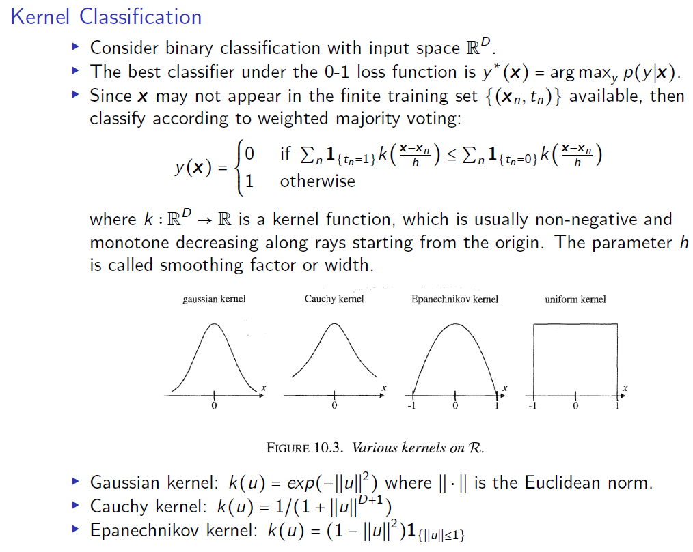
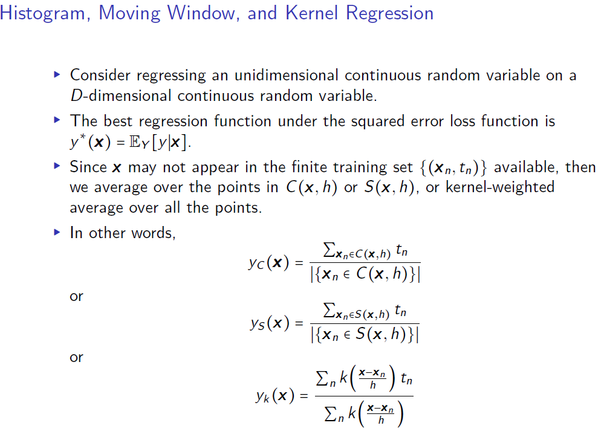
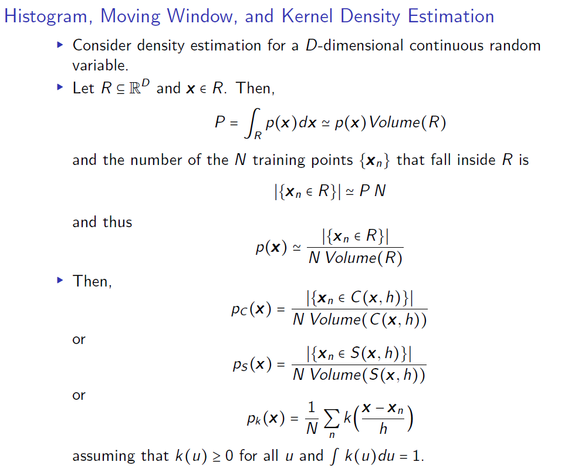
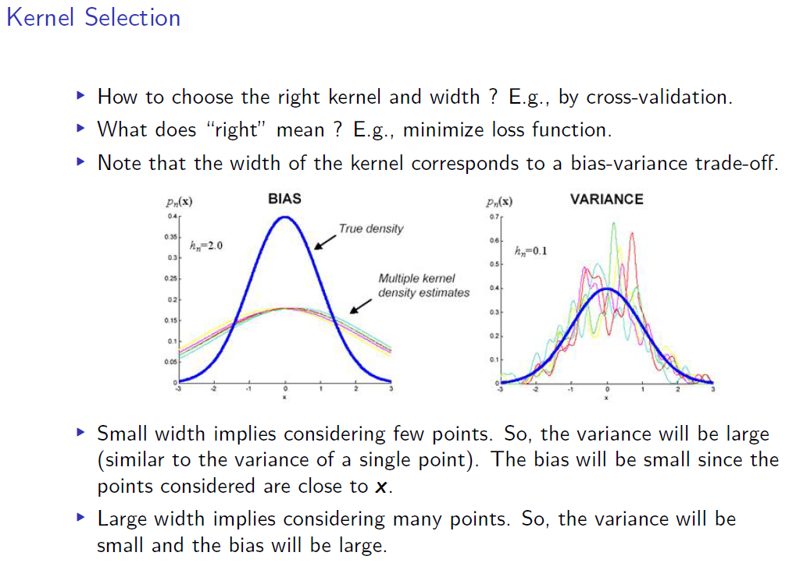
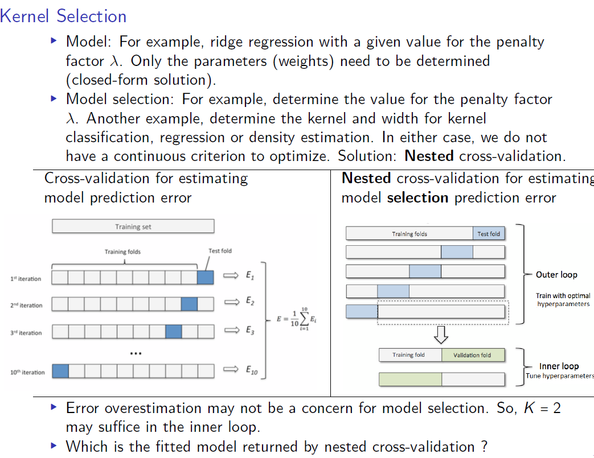
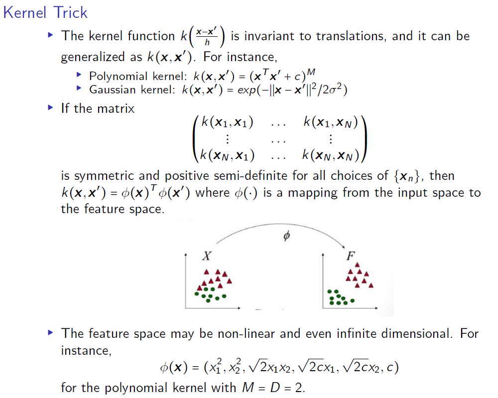
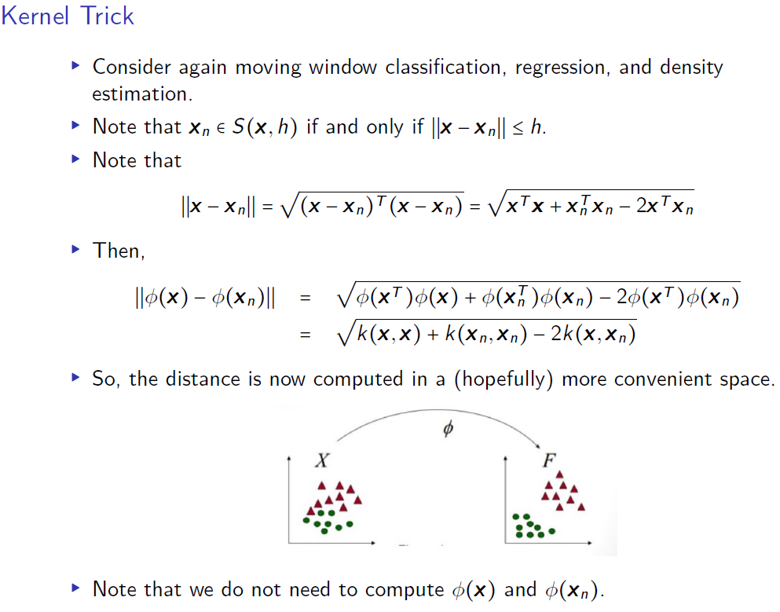

```{r setup, include=FALSE}
knitr::opts_chunk$set(echo = TRUE)
```

# Simple Tasks

## Library
```{r, message=FALSE}

library("ggplot2") # plots
library("tree") # decision tree
library("caret") # summary and confusion table
library("kknn") # kknn
library("xlsx") # reading excel
library("MASS") # Step AIC
library("jtools") # summ function
library("dplyr") # pipelining
library("glmnet") # lasso and ridge
library("mgcv") # spline
library("kernlab") # SVM
library("mboost") # ensemble ADA boost
library("randomForest") # randomforest
library("pamr") # Nearest shrunken
library("boot") # bootstrap
library("fastICA") # fastICA
library("MASS") # LDA
library("neuralnet") # Neural Network
library("e1071") # Naive Bayes

# colours (colour blind friendly)
cbPalette <- c("#999999", "#E69F00", "#56B4E9", "#009E73", "#F0E442", "#0072B2", 
               "#D55E00", "#CC79A7")
```

## Reading Excel
```{r}
data <- xlsx::read.xlsx("spambase.xlsx", sheetName= "spambase_data")
data$Spam <- as.factor(data$Spam)
```


## Spliting the Datasets

### Divide into train/test

```{r}
data <- xlsx::read.xlsx("spambase.xlsx", sheetName= "spambase_data")
data$Spam <- as.factor(data$Spam)
# 50-50 split
n=nrow(data)
set.seed(12345)
id=sample(1:n, floor(n*0.5))
train=data[id,]
test=data[-id,]
```

### Train/test/validation
```{r}
data <- xlsx::read.xlsx("spambase.xlsx", sheetName= "spambase_data")
data$Spam <- as.factor(data$Spam)
# 50-25-25 split
n=nrow(data)
set.seed(12345) 
id=sample(1:n, floor(n*0.5)) 
train=data[id,] 

id1=setdiff(1:n, id)
set.seed(12345) 
id2=sample(id1, floor(n*0.25)) 
valid=data[id2,]

id3=setdiff(id1,id2)
test=data[id3,] 
```

## Custom code for Cross-Validation
```{r, warning=FALSE}
#Randomly shuffle the data
new_data <- data[sample(nrow(data)),]

#Create N equally size folds
new_data$folds <- sample(rep(1:10, each = nrow(new_data)/10))

result <- NULL
#Perform N fold cross validation
for(i in 1:length(unique(new_data$folds))){
  testData <- new_data[new_data$folds != i,]
  trainData <- new_data[new_data$folds == i,]
  
  #Use the test and train data partitions however you desire, run model code here

  best_model <- glm(formula = Spam ~., family = binomial, data = trainData)
  predicted_value <- predict(best_model, testData, type = "response") 
  pred_class <- ifelse(predicted_value > 0.50, 1, 0)
  temp <- 1 - (sum(ifelse(pred_class == testData$Spam,1,0))/nrow(testData))
  temp <- cbind(temp, i)
  colnames(temp) <- c("test_error", "fold")
  result <- rbind(result, temp)
  }


```

## Misclassification error calculation
```{r}
missclass=function(X,X1){
  n=length(X)
  return(1-sum(diag(table(X,X1)))/n)
}

#missclass(data2$class, predict(m3, type="class")$class)

```

# Regression
## Logistic Regression

```{r, warning=FALSE}
best_model <- glm(formula = Spam ~., family = binomial, data = train)
#summary(best_model)

train$prediction_prob <- predict(best_model, newdata = train, type = "response")
train$prediction_class_50 <- ifelse(train$prediction_prob > 0.50, 1, 0)

test$prediction_prob <- predict(best_model, newdata = test, type = "response")
test$prediction_class_50 <- ifelse(test$prediction_prob > 0.50, 1, 0)

conf_train <- table(train$Spam, train$prediction_class_50)
names(dimnames(conf_train)) <- c("Actual Train", "Predicted Train")
caret::confusionMatrix(conf_train)
```

### Choosing the best cutoff for test
```{r}
cutoffs <- seq(from = 0.05, to = 0.95, by = 0.05)
accuracy <- NULL

for (i in seq_along(cutoffs)){
    prediction <- ifelse(test$prediction_prob >= cutoffs[i], 1, 0) #Predicting for cut-off

    accuracy <- c(accuracy,length(which(test$Spam == prediction))/length(prediction)*100)}

cutoff_data <- as.data.frame(cbind(cutoffs, accuracy))

ggplot(data = cutoff_data, aes(x = cutoffs, y = accuracy)) + 
  geom_line() + 
  ggtitle("Cutoff vs. Accuracy for Test Dataset")

```

## KKNN
```{r}
knn_model30 <- train.kknn(Spam ~., data = train, kmax = 30)

test$knn_prediction_class <- predict(knn_model30, test)

conf_test2 <- table(test$Spam, test$knn_prediction_class)
names(dimnames(conf_test2)) <- c("Actual Test", "Predicted Test")
confusionMatrix(conf_test2)
```

## Step AIC
```{r warning=FALSE}
tecator_data <- read.xlsx("tecator.xlsx", sheetName = "data")
tecator_data <- tecator_data[,2:NCOL(tecator_data)] # removing sample column


min.model1 = lm(Fat ~ 1, data=tecator_data[,-1])
biggest1 <- formula(lm(Fat ~.,  data=tecator_data[,-1]))

step.model1 <- stepAIC(min.model1, direction ='forward', scope=biggest1, trace = FALSE)
summ(step.model1)
```

## Ridge Regression
```{r}
y <- tecator_data %>% select(Fat) %>% data.matrix()
x <- tecator_data %>% select(-c(Fat)) %>% data.matrix()

lambda <- 10^seq(10, -2, length = 100)

ridge_fit <- glmnet(x, y, alpha = 0, family = "gaussian", lambda = lambda)
plot(ridge_fit, xvar = "lambda", label = TRUE, 
     main = "Plot showing shrinkage of coefficents with rise in log of lambda")


## Change of coefficent with respect to lambda
result <- NULL
for(i in lambda){
temp <- t(coef(ridge_fit, i)) %>% as.matrix()
temp <- cbind(temp, lambda = i)
result <- rbind(temp, result)
}
result <- result %>% as.data.frame() %>% arrange(lambda)

```

## Lasso Regression
```{r}
lambda <- 10^seq(10, -2, length = 100)

lasso_fit <- glmnet(x, y, alpha = 1, family = "gaussian", lambda = lambda)
plot(lasso_fit, xvar = "lambda", label = TRUE, 
     main = "Plot showing shrinkage of coefficents with rise in log of lambda")

```

## Lasso Regression using Cross Validation
```{r}
#find the best lambda from our list via cross-validation

lambda_lasso <- 10^seq(10, -2, length = 100)
lambda_lasso[101] <- 0
lasso_cv <- cv.glmnet(x,y, alpha=1, lambda = lambda_lasso, type.measure="mse")

#coef(lasso_cv, lambda = lasso_cv$lambda.min)

lasso_cv$lambda.min
  
## Change of coefficent with respect to lambda
result_lasso <- NULL
for(i in 1:length(lambda_lasso)){
temp <- lasso_cv$cvm[i] %>% as.matrix()
temp <- cbind(CVM_error = temp, lambda = lasso_cv$lambda[i])
result_lasso <- rbind(temp, result_lasso)
}
```

## Neural Network
```{r}
#Generating data
set.seed(1234567890)
Var = runif(50, 0, 10)
trva = data.frame(Var, Sin = sin(Var))

# Training and validation split
tr = trva[1:25, ] # Training
va = trva[26:50, ] # Validation
nn_val_res_df = data.frame()

# Random initialization of the weights in the interval [-1, 1]
w_init = runif(31, -1, 1)


for(i in 1:10) {
print(paste("Running NN: ", i))
set.seed(1234567890)

# Training neural network
nn = neuralnet(Sin ~ Var, data = tr, hidden = 10,
startweights = w_init, threshold = i / 1000)

# Predicting values for train and validation
va_res = neuralnet::compute(nn, va$Var)$net.result
tr_res = neuralnet::compute(nn, tr$Var)$net.result

# Computing train and validation MSE
tr_mse = mean((tr_res - tr$Sin)^2)
va_mse = mean((va_res - va$Sin)^2)

# Storing data in data frame
nn_val_res_df = rbind(nn_val_res_df,
data.frame(thres_num = i, thres_val = i / 1000,
val_mse = va_mse, trn_mse = tr_mse))
}


# Plot of MSE vs threshold for train and validation
ggplot(nn_val_res_df) +
geom_point(aes(x = thres_val, y = val_mse, color = "Validation")) +
geom_line(aes(x = thres_val, y = val_mse, color = "Validation")) +
geom_point(aes(x = thres_val, y = trn_mse, color = "Train")) +
geom_line(aes(x = thres_val, y = trn_mse, color = "Train")) +
xlab("Threshold") + ylab("MSE") + labs(color = "Data") +
scale_x_continuous(breaks = (1:10)/1000) +
ggtitle("Neural Network - MSE vs Threshold for Train and Validation")
# Final neural network
# Best threshold = 0.001
opt_nn = neuralnet(Sin ~ Var, data = tr, hidden = 10,
startweights = w_init, threshold = 0.001)
plot(x = opt_nn, rep = "best", information = F)
# Plot of the predictions and the data
nn_pred_df = tr
nn_pred_df$Type = "Training Data"
nn_pred_df = rbind(nn_pred_df,
data.frame(Var = va$Var,
Sin = neuralnet::compute(opt_nn, va$Var)$net.result,
Type = "NN Prediction \nfor validation"))
ggplot(nn_pred_df, aes(x = Var, y = Sin, color = Type)) + geom_point() +
ggtitle("Comparison of neural network prediction with training data") +
labs(color = "Legend")

```


# Classification

## LASSO

```{r}

n=dim(iris)[1]
set.seed(12345)
id=sample(1:n, floor(n*1/3))
train=iris[id,]
id1=setdiff(1:n, id)
set.seed(12345)
id2=sample(id1, floor(n*1/3))
valid=iris[id2,]
id3=setdiff(id1,id2)
test=iris[id3,]

y <- train %>% select(Species) %>% data.matrix()
x <- train %>% select(-c(Species)) %>% data.matrix()

y_valid <- valid %>% select(Species) %>% data.matrix()
x_valid <- valid %>% select(-c(Species)) %>% data.matrix()

lambda <- seq(from=0, to=1, by=0.1)
lasso_fit <- glmnet(x, y, alpha = 1, family = "multinomial", lambda = lambda)
plot(lasso_fit, xvar = "lambda", label = TRUE,
main = "Plot showing shrinkage of coefficents with rise in log of lambda")

predicted <- predict(lasso_fit, newx = x_valid, type=c("class"))
new_predicted <- cbind(predicted, y_valid) %>% as.data.frame()

out <- NULL
for(i in 0:10){
  error <- ifelse(new_predicted[,i] == as.character(new_predicted$Species), 1, 0)
temp <- cbind(i, NROW(new_predicted) - sum(error))
out <- rbind(out, temp)
}

```

## Naive Bayes, using default threshold
```{r}
set.seed(12345)
credit_data <- xlsx::read.xlsx("creditscoring.xls", sheetName = "credit")
credit_data$good_bad <- as.factor(credit_data$good_bad)

n=NROW(credit_data)
set.seed(12345) 
id=sample(1:n, floor(n*0.5)) 
train=credit_data[id,] 

id1=setdiff(1:n, id)
set.seed(12345) 
id2=sample(id1, floor(n*0.25)) 
valid=credit_data[id2,]

id3=setdiff(id1,id2)
test=credit_data[id3,]

#Fitting the Naive Bayes model
credit_naive_model = e1071::naiveBayes(good_bad ~., data=train)

#Prediction on the dataset
predict_naive_train = predict(credit_naive_model, newdata=train, type = "class")
predict_naive_test = predict(credit_naive_model, newdata=test, type = "class")

conf_naive_train <- table(train$good_bad, predict_naive_train)
names(dimnames(conf_naive_train)) <- c("Actual Train", "Predicted Train")
caret::confusionMatrix(conf_naive_train)
```

## Naive Bayes varying threshold and ROC curve
```{r}

# model
credit_naive_model = e1071::naiveBayes(good_bad ~., data=train)

# predicting class, getting probability
predict_naive_test_prob <- predict(credit_naive_model, newdata=test, type = "raw")

# data mugging
probability_data_naive <- as.data.frame(cbind(predict_naive_test_prob, 
                                              as.character(test$good_bad), "naivebayes"))

colnames(probability_data_naive) <- c("prob_bad", "prob_good", 
                                         "actual_test_class", "model")

# final dataset
probability_data_naive$prob_good <- as.numeric(as.character(probability_data_naive$prob_good))


naive_list <- NULL
final <- NULL

for(threshold in seq(from = 0.05, to = 0.95, by = 0.05)){
 probability_data_naive$predicted_class <- ifelse(probability_data_naive$prob_good > threshold, 
                                                  "good", "bad")
  
  df2 <- probability_data_naive[,c("model", "actual_test_class", "predicted_class")]
  df2$threshold <- threshold
  df2$match <- ifelse(df2$actual_test_class == df2$predicted_class, 1, 0)
  
  final <- rbind(df2, final)
}

# Creating the FRP and TRP for each model and threshold  
final$temp <- 1

final_summary <- final %>% 
group_by(model, threshold) %>% 
summarise(total_positive = sum(temp[actual_test_class == "good"]),
          total_negative = sum(temp[actual_test_class == "bad"]),
          correct_positive = sum(temp[actual_test_class == "good" & predicted_class == "good"]),
          false_positive = sum(temp[actual_test_class == "bad" & predicted_class == "good"])) %>% 
  mutate(TPR = correct_positive/total_positive, FPR = false_positive/total_negative)

ggplot(data = final_summary, aes(x = FPR, y=TPR)) + geom_line(aes(colour = model)) + 
  geom_abline(intercept = 0.0, slope = 1) +
  ggtitle("ROC curve for the Naive Bayes")

```


## Decision trees (tree lib)

```{r}
set.seed(12345)

data <- read.csv("crx.csv", header = TRUE)
data$Class <- as.factor(data$Class)

# 50-50 split
n=nrow(data)
id=sample(1:n, floor(n*0.8))
train=data[id,]
test=data[-id,]

tree_deviance <- tree::tree(Class~., data=train, split = c("deviance"))
tree_gini <- tree::tree(Class~., data=train, split = c("gini"))

# Visualize the decision tree with rpart.plot
summary(tree_deviance)

# predicting on the test dataset to get the misclassification rate.
predict_tree_deviance <- predict(tree_deviance, newdata = test, type = "class")
predict_tree_gini <- predict(tree_deviance, newdata = test, type = "class")

conf_tree_deviance <- table(test$Class, predict_tree_deviance)
names(dimnames(conf_tree_deviance)) <- c("Actual Test", "Predicted Test")
caret::confusionMatrix(conf_tree_deviance)

# plot of the tree
plot(tree_deviance)
text(tree_deviance)

```

## Trees using rpart
```{r}
library(rpart.plot)
library(rpart)

set.seed(12345)


decision_tree_rpart <- rpart::rpart(data = train, formula = Class~., method = "class")
rpart.plot::rpart.plot(decision_tree_rpart, main= "Original decision tree")
```

### Pruning trees using cross validation
```{r}
library(ggplot2)

set.seed(12345)
cv_tree <- cv.tree(tree_deviance, FUN = prune.tree, K = 10)
df_result <- as.data.frame(cbind(size = cv_tree$size, dev = cv_tree$dev))
# puring the tree for leaf size of 3
best_tree <- prune.tree(tree_deviance, best = 2)
plot(best_tree, main="Pruned Tree for the given dataset")
text(best_tree)

ggplot(df_result, aes(x = size, y = dev)) + geom_point() + geom_line() + ggtitle("Plot of deviance vs. size")

```

### Prune the tree using error
```{r}
set.seed(12345)
tree_deviance <- tree::tree(Class~., data=train, split = c("deviance"))

tree_prune_train <- prune.tree(tree_deviance, method = c("deviance"))
tree_prune_valid <- prune.tree(tree_deviance, newdata = test ,method = c("deviance"))

result_train <- cbind(tree_prune_train$size,
tree_prune_train$dev, "Train")

result_valid <- cbind(tree_prune_valid$size,
tree_prune_valid$dev, "Valid")

result <- as.data.frame(rbind(result_valid, result_train))
colnames(result) <- c("Leaf", "Deviance", "Type")
result$Leaf <- as.numeric(as.character(result$Leaf))
result$Deviance <- as.numeric(as.character(result$Deviance))

# plot of deviance vs. number of leafs
ggplot(data = result, aes(x = Leaf, y = Deviance, colour = Type)) +
geom_point() + geom_line() +
ggtitle("Plot of Deviance vs. Tree Depth")
```

## GAM Model or Spline
```{r}
set.seed(12345)

# using family = binomial for classfication
gam_model <- mgcv::gam(data=train, formula = Class~s(A3)+A9, family=binomial)
summary(gam_model)
plot(gam_model)
```

## Support Vector Machine (SVM)
```{r}

# width is the sigma here. kernel rbfdot is gaussian. vanilladot is linear
data(spam)
spam$type <- as.factor(spam$type)

## create test and training set
n=nrow(spam)
id=sample(1:n, floor(n*0.8))
spamtrain=spam[id,]
spamtest=spam[-id,]


model_0.05 <- kernlab::ksvm(type~., data=spamtrain, kernel="rbfdot", kpar=list(sigma=0.05), C=0.5)
#model_0.05

conf_model_0.05 <- table(spamtrain[,58], predict(model_0.05, spamtrain[,-58]))
names(dimnames(conf_model_0.05)) <- c("Actual Test", "Predicted Test")
caret::confusionMatrix(conf_model_0.05)
```

## ADA boost or Ensemble
```{r}
data(spam)
## create test and training set
n=nrow(spam)
id=sample(1:n, floor(n*0.8))
spamtrain=spam[id,]
spamtest=spam[-id,]

ada_model <- mboost::blackboost(type~., data = spamtrain, family = AdaExp(), 
                                control=boost_control(mstop=15))
test_ada_model_predict <- predict(ada_model, newdata = spamtest, type = c("class"))
```

## Random Forest
```{r}
forest_model <- randomForest(type~., data = spamtrain, ntree = 15)
test_forest_model_predict <- predict(forest_model, newdata = spamtest, type = c("class"))
```

### Comparing ADA boost and Randomforest
```{r, warning=FALSE}
# using warnings = FALSE

final_result <- NULL

for(i in seq(from = 10, to = 100, by = 10)){
ada_model <- mboost::blackboost(type~.,
data = spamtrain,
family = AdaExp(),
control=boost_control(mstop=i))

forest_model <- randomForest(type~., data = spamtrain, ntree = i)

prediction_function <- function(model, data){
predicted <- predict(model, newdata = data, type = c("class"))
predict_correct <- ifelse(data$type == predicted, 1, 0)
score <- sum(predict_correct)/NROW(data)
return(score)
}

train_ada_model_predict <- predict(ada_model, newdata = spamtrain, type = c("class"))
test_ada_model_predict <- predict(ada_model, newdata = spamtest, type = c("class"))
train_forest_model_predict <- predict(forest_model, newdata = spamtrain, type = c("class"))
test_forest_model_predict <- predict(forest_model, newdata = spamtest, type = c("class"))

test_predict_correct <- ifelse(spamtest$type == test_forest_model_predict, 1, 0)
train_predict_correct <- ifelse(spamtest$type == train_forest_model_predict, 1, 0)

train_ada_score <- prediction_function(ada_model, spamtrain)
test_ada_score <- prediction_function(ada_model, spamtest)
train_forest_score <- prediction_function(forest_model, spamtrain)
test_forest_score <- prediction_function(forest_model, spamtest)

iteration_result <- data.frame(number_of_trees = i,
accuracy = c(train_ada_score,
test_ada_score,
train_forest_score,
test_forest_score),
type = c("train", "test", "train", "test"),
model = c("ADA", "ADA", "Forest", "Forest"))
final_result <- rbind(iteration_result, final_result)
}

final_result$error_rate_percentage <- 100*(1 - final_result$accuracy)

ggplot(data = final_result, aes(x = number_of_trees,
y = error_rate_percentage,
group = type, color = type)) +
geom_point() +
geom_line() +
ggtitle("Error Rate vs. increase in trees") + 
facet_grid(rows = vars(model))


```

## Nearest Shrunken Centroid (NSC)

```{r, message=FALSE, warning=FALSE, results=FALSE}

data <- read.csv(file = "data.csv", sep = ";", header = TRUE)
n=NROW(data)
data$Conference <- as.factor(data$Conference)


# Remember to scale the data, its cruical for this algorithm, like so scale_data = scale(data)

set.seed(12345) 
id=sample(1:n, floor(n*0.7)) 
train=data[id,] 
test = data[-id,]

rownames(train)=1:nrow(train)
x=t(train[,-4703])
y=train[[4703]]

rownames(test)=1:nrow(test)
x_test=t(test[,-4703])
y_test=test[[4703]]

mydata = list(x=x,y=as.factor(y),geneid=as.character(1:nrow(x)), genenames=rownames(x))
mydata_test = list(x=x_test,y=as.factor(y_test),geneid=as.character(1:nrow(x)), genenames=rownames(x))
model=pamr.train(mydata,threshold=seq(0, 4, 0.1))

cvmodel=pamr.cv(model, mydata)

# The value at which loglikehood is max, we can use this or use the threshold for which error is least
cvmodel$threshold[which.max(cvmodel$loglik)]


important_gen <- as.data.frame(pamr.listgenes(model, mydata, threshold = 1.3))
predicted_scc_test <- pamr.predict(model, newx = x_test, threshold = 1.3)
```

### Plots
```{r, fig.height=9}

# use {r, fig.height=9} for better plots
pamr.plotcv(cvmodel)
pamr.plotcen(model, mydata, threshold = 1.3)
```

### Important features
```{r}
## List the significant genes
NROW(important_gen)


temp <- colnames(data) %>% as.data.frame()
colnames(temp) <- "col_name"
temp$index <- row.names(temp)

df <- merge(x = important_gen, y = temp, by.x = "id", by.y = "index", all.x = TRUE)
df <- df[order(df[,3], decreasing = TRUE ),]

knitr::kable(head(df[,4],10), caption = "Important feaures selected by Nearest Shrunken Centroids ")

```

### Confusion table
```{r}
conf_scc <- table(y_test, predicted_scc_test)
names(dimnames(conf_scc)) <- c("Actual Test", "Predicted Srunken Centroid Test")
result_scc <- caret::confusionMatrix(conf_scc)
caret::confusionMatrix(conf_scc)

```

## Elastic Net
```{r}
x = train[,-4703] %>% as.matrix()
y = train[,4703]

x_test = test[,-4703] %>% as.matrix()
y_test = test[,4703]

cvfit = cv.glmnet(x=x, y=y, alpha = 0.5, family =   "binomial")
predicted_elastic_test <- predict.cv.glmnet(cvfit, newx = x_test, s = "lambda.min", type = "class")
tmp_coeffs <- coef(cvfit, s = "lambda.min")
elastic_variable <- data.frame(name = tmp_coeffs@Dimnames[[1]][tmp_coeffs@i + 1], coefficient = tmp_coeffs@x)
knitr::kable(elastic_variable, caption = "Contributing features in the elastic model")

conf_elastic_net <- table(y_test, predicted_elastic_test)
names(dimnames(conf_elastic_net)) <- c("Actual Test", "Predicted ElasticNet Test")
result_elastic_net <- caret::confusionMatrix(conf_elastic_net)
caret::confusionMatrix(conf_elastic_net)
```

## Linear discriminant analysis (LDA)
```{r}

# Load the data
data <- iris
# Split the data into training (80%) and test set (20%)
n=NROW(data)
set.seed(12345)
id=sample(1:n, floor(n*0.5))
train=data[id,]
test=data[-id,]

model <- MASS::lda(Species~., data = train)
model

plot(model)

predictions <- model %>% predict(test)
names(predictions)

lda.data <- cbind(train, predict(model)$x)
#plot(data2$frames,data2$duration, col=predict(m3)$class)

ggplot(lda.data, aes(LD1, LD2)) + geom_point(aes(color = Species))

```


# Bootstrap and Big data

## Principle Component Analysis
### Components
```{r}
rm(list=ls())

set.seed(12345)
NIR_data <- read.csv2("NIRSpectra.csv")

## scaling is necessary else the column with high range will dominate, using prcomp(scale=TRUE)
pca_data =  select(NIR_data,-c(Viscosity))
pca_result = prcomp(pca_data)

contribution <- summary(pca_result)$importance
knitr::kable(contribution[,1:5], 
             caption = "Contribution of PCA axis towards varience explaination")

eigenvalues = pca_result$sdev^2

# plotting proportion of variation for principal components
plotData = as.data.frame(cbind(pc = 1:3,
variationProportion = eigenvalues[1:3]/sum(eigenvalues),
cummulative = cumsum(eigenvalues[1:3]/sum(eigenvalues))))

ggplot(data = plotData) +
geom_col(aes(x = pc, y = variationProportion), width = 0.3, fill = "grey70") +
geom_line(data = plotData,
aes(x = pc, y = cummulative)) +
geom_text(aes(x = pc, y = cummulative, label = round(cummulative, 3)), size = 4,
position = "identity", vjust = 1.5) +
theme_bw() +
ggtitle("Proportion of variation for principal components")

# pca components and the viscocity
pca_result_data = cbind(first_component = pca_result$x[,1],
                                second_component = pca_result$x[,2]) %>% as.data.frame()

# plotting the data variation and the viscocity
ggplot(data = pca_result_data, aes(x = first_component, y = second_component)) +
  geom_point() + ggtitle("Score Plot of PCA components")


# showing the score of PCA component
factoextra::fviz_pca_var(pca_result,
             col.var = "contrib", # Color by contributions to the PC
             gradient.cols = c("#00AFBB", "#E7B800", "#FC4E07"),
             repel = TRUE     # Avoid text overlapping
             )

```

### Trace plots of PCA
```{r}
set.seed(12345)

# creating extra columns
aload <- abs(pca_result$rotation[,1:2])
components <- sweep(aload, 2, colSums(aload), "/")
components <- as.data.frame(components)
components$feature_name <- rownames(components)
components$feature_index <- 1:nrow(components)

ggplot(data = components, aes(x = feature_index, y = PC1)) + 
  geom_point() + 
  ggtitle("Traceplot of feature index vs. PC1")

ggplot(data = components, aes(x = feature_index, y = PC2)) + 
  geom_point() + 
  ggtitle("Traceplot of feature index vs. PC2")

knitr::kable(components[1:10,], 
             caption = "Contribution of Features towards the Principle Components")

```

## FastICA
```{r}

library(fastICA)

set.seed(12345)

# X -> pre-processed data matrix
# K -> pre-whitening matrix that projects data onto the first n.compprincipal components.
# W -> estimated un-mixing matrix (see definition in details)
# A -> estimated mixing matrix
# S -> estimated source matrix

X <- as.matrix(pca_data)

ICA_extraction <- fastICA(X, 2, alg.typ = "parallel", fun = "logcosh", alpha = 1,
method = "R", row.norm = FALSE, maxit = 200,
tol = 0.0001, verbose = TRUE)

W_prime <- ICA_extraction$K %*% ICA_extraction$W

#trace plots
plot(W_prime[,1], main = "Trace plot of W` Matrix")
#trace plots
plot(W_prime[,2], main = "Trace plot of W` Matrix")

# pca components and the viscocity
ICA_result_data = cbind(first_component = ICA_extraction$S[,1],
                        second_component = ICA_extraction$S[,2],
                        Viscosity = NIR_data$Viscosity) %>% as.data.frame()

# plotting the data variation
ggplot(data = ICA_result_data, aes(x = first_component, y = second_component)) +
  geom_point() + ggtitle("Score Plot for ICA components")

```


## Implement Benjamini-Hochberg method
```{r}

data <- read.csv(file = "data.csv", sep = ";", header = TRUE)
data$Conference <- as.factor(data$Conference)
set.seed(12345) 
y <- as.factor(data[,4703])
x <- as.matrix(data[,-4703])
p_values <- data.frame(feature = '',P_value = 0,stringsAsFactors = FALSE)
for(i in 1:ncol(x)){
res = t.test(x[,i]~y, data = data,
alternative="two.sided"
,conf.level = 0.95)
p_values[i,] <- c(colnames(x)[i],res$p.value)
}
p_values$P_value <- as.numeric(p_values$P_value)
p <- p.adjust(p_values$P_value, method = 'BH')
length(p[which(p > 0.05)])
out <- p_values[which(p <= 0.05),]
out <- out[order(out$P_value),]
rownames(out) <- NULL
out
```

## Confidence band using Bootstrap
```{r}
library(boot)
set.seed(12345)
state_data <- read.csv2("state.csv")

# computing bootstrap samples
bootstrap <- function(data, indices){
  data <- state_data[indices,]
  
  model <- tree(data = data, 
       EX~MET, 
       control = tree.control(nobs=NROW(data),
                              minsize = 8))
  
  model_purned <- prune.tree(model, best = 3)
  final_fit_boot <- predict(model_purned, newdata = state_data)
  return(final_fit_boot)
}

res <- boot(state_data, bootstrap, R=1000) #make bootstrap
e <- envelope(res, level = 0.95) 
state_tree_regression <- tree(data = state_data, EX~MET, 
                              control = tree.control(nobs=NROW(state_data), 
                                                     minsize = 8))

# puring the tree for leaf size of 3
state_cv_tree_purned <- prune.tree(state_tree_regression, best = 3)
predict_for_ci <- predict(state_cv_tree_purned, state_data)
data_for_ci <- cbind(upper_bound = e$point[1,], 
                     lower_bound = e$point[2,],
                     EX = state_data$EX,
                     MET = state_data$MET,
                     predicted_value = predict_for_ci) %>% as.data.frame()

#plot cofidence bands

ggplot(data=data_for_ci, aes(x = MET, y = EX)) + 
  geom_point(aes(x = MET,y=EX)) +
  geom_line(aes(x = MET, y=predicted_value), colour="blue") + 
  geom_ribbon(aes(x = MET, ymin=lower_bound, ymax=upper_bound),alpha = 0.3) +
  ggtitle("EX value along with 95% Confidence band")
```

## Prediction band using Bootstrap
```{r}
set.seed(12345)
state_tree_regression <- tree(data = state_data, EX~MET, 
                              control = tree.control(nobs=NROW(state_data), 
                                                     minsize = 8))


mle=prune.tree(state_tree_regression, best = 3)

rng=function(data, mle) {
  data1=data.frame(EX=data$EX, MET=data$MET)
  n=length(data$EX)
  pred <- predict(mle, newdata = data1)
  residual <- data1$EX - pred
#generate new Price
  data1$EX=rnorm(n, pred, sd(residual))
  return(data1)
}

# computing bootstrap samples
conf.fun <- function(data){
  model <- tree(data = data, 
       EX~MET, 
       control = tree.control(nobs=NROW(data),
                              minsize = 8))
  
  model_purned <- prune.tree(model, best = 3)
  final_fit_boot <- predict(model_purned, newdata = state_data)
  return(final_fit_boot)
}


# computing bootstrap samples
pred.fun <- function(data){
  model <- tree(data = data, 
       EX~MET, 
       control = tree.control(nobs=NROW(data),
                              minsize = 8))
  
  model_purned <- prune.tree(model, best = 3)
  final_fit_boot <- predict(model_purned, newdata = state_data)
  final_fit <- rnorm(n = length(final_fit_boot),  mean = final_fit_boot, sd=sd(residuals(mle)))
  return(final_fit)
}


conf_para = boot(state_data, statistic=conf.fun, R=1000, mle=mle, ran.gen=rng, sim="parametric")
pred_para = boot(state_data, statistic=pred.fun, R=1000, mle=mle, ran.gen=rng, sim="parametric")

e1 <- envelope(conf_para, level = 0.95) 
e2 <- envelope(pred_para, level = 0.95) 


# puring the tree for leaf size of 3
state_cv_tree_purned <- prune.tree(state_tree_regression, best = 3)
predict_for_ci <- predict(state_cv_tree_purned, state_data)


data_for_ci_para <- cbind(upper_bound = e1$point[1,], 
                     lower_bound = e1$point[2,],
                     upper_bound_pred = e2$point[1,], 
                     lower_bound_pred = e2$point[2,],
                     EX = state_data$EX,
                     MET = state_data$MET,
                     predicted_value = predict_for_ci) %>% as.data.frame()

ggplot(data=data_for_ci_para, aes(x = MET, y = EX)) + 
  geom_point(aes(x = MET,y=EX)) +
  geom_line(aes(x = MET, y=predicted_value), colour="blue") + 
  geom_ribbon(aes(x = MET, ymin=lower_bound, ymax=upper_bound),alpha = 0.3) +
  geom_ribbon(aes(x = MET, ymin=lower_bound_pred, ymax=upper_bound_pred), alpha = 0.3) +
  ggtitle("EX value along with 95% Confidence(dark grey) and Prediction band")
```

# Kernal Estimation

## Kernel Smoothing Regression
```{r}
rm(list=ls())
set.seed(1234567890)
stations <- read.csv("stations.csv")
temps <- read.csv("temps50k.csv")
st <- merge(stations,temps,by="station_number")
rm(temps, stations)

st <- st[1:2000,]


kernel_method <- function(df, date, loc_long, loc_lat, h1, h2, h3) {

set.seed(1234567890)
start <- as.POSIXct(date)
interval <- 60
end <- start + as.difftime(1, units="days")
time_seq <- seq(from=start, by=interval*120, to=end)
time_seq <- as.data.frame(time_seq)
colnames(time_seq) <- "new_date_time"
time_seq$time_index <- rownames(time_seq)

df_new <- merge.data.frame(df,time_seq,all=TRUE)
rm(df)

df_new$new_date <- as.Date(df_new$new_date_time)
df_new$new_time <- format(df_new$new_date_time,"%H:%M:%S")
df_new$loc_long <- loc_long
df_new$loc_lat <-  loc_lat


df_new$h_distance <-  abs(geosphere::distHaversine(p1 = df_new[,c("loc_long", "loc_lat")], 
                                        p2 = df_new[,c("longitude", "latitude")]))

df_new$h_date <- as.numeric(abs(difftime(df_new$new_date, df_new$date, units = c("days"))))

df_new$h_time <- as.numeric(abs(difftime(strptime(paste(df_new$new_date, 
                                                      df_new$new_time),"%Y-%m-%d%H:%M:%S"),
                                         strptime(paste(df_new$new_date, df_new$time),
                                   "%Y-%m-%d %H:%M:%S"),
                          units = c("hour"))))


df_new$date_time <- paste(df_new$date, df_new$time)
df_new$hd_dist <- as.numeric(difftime(df_new$new_date_time,
                          df_new$date_time,
                          units = c("hour")))

## removing any negative dates and time
df_new$posterior_flag <- as.factor(ifelse(df_new$h_distance > 0 & df_new$hd_dist > 0, "retain", "drop"))


## calculating kernel distance and choosing guassian kernel
df_new$h_distance_kernel <- exp(-(df_new$h_distance/h1)^2)
df_new$h_date_kernel <- exp(-(df_new$h_date/h2)^2)
df_new$h_time_kernel <- exp(-(df_new$h_time/h3)^2)
df_new$total_additive_dist <- (df_new$h_distance_kernel + df_new$h_date_kernel + df_new$h_time_kernel)
df_new$total_mul_dist <- (df_new$h_distance_kernel * df_new$h_date_kernel * df_new$h_time_kernel)

df_new$additive_num <- ifelse(df_new$posterior_flag == "retain", 
                              df_new$h_distance_kernel*df_new$air_temperature +
                                df_new$h_date_kernel*df_new$air_temperature + 
                                df_new$h_time_kernel*df_new$air_temperature,0)

df_new$mul_num <- ifelse(df_new$posterior_flag == "retain", 
                         (df_new$h_distance_kernel) *
                                (df_new$h_date_kernel) * 
                                (df_new$h_time_kernel*df_new$air_temperature),0)

df_new$additive_den <- ifelse(df_new$posterior_flag == "retain", df_new$total_additive_dist, 0)
df_new$mul_den <- ifelse(df_new$posterior_flag == "retain", df_new$total_mul_dist, 0)

time = unique(time_seq$time_index)
result <- NULL

for(i in time){
temp <- df_new[df_new$time_index == i,]
additive_temp <- sum(temp$additive_num)/sum(temp$additive_den)
mult_temp <- sum(temp$mul_num)/sum(temp$mul_den)

temp <- cbind(additive_temp, mult_temp, i)
result <- rbind(temp,result)
}

result <- as.data.frame(result) 
result <- merge(x =result, y = time_seq, by.x = "i", by.y = "time_index", all.x = TRUE)
result$additive_temp <- as.numeric(as.character(result$additive_temp))
result$mult_temp <- as.numeric(as.character(result$mult_temp))

p1 <- ggplot(data=result, aes(x=new_date_time)) + 
  geom_point(aes(y = additive_temp)) +
  geom_point(aes(y = mult_temp)) +
  geom_line(aes(y = additive_temp, color = "Additive")) + 
  geom_line(aes(y = mult_temp, color = "Multiplicative")) + 
  scale_color_manual(values=c("#E69F00", "#56B4E9")) +
  ylab("predicted temperature") +
  theme_bw() +
  ggtitle("Predicted Temperature using Kernels")

final <- list(p1)
return(final)
}


kernel_method(df=st, date = "2000-05-08", loc_long = 17.6935,
loc_lat = 59.9953, h1 = 30000, h2 = 2, h3 = 5)


```

## Onlearning SVM

```{r, eval=FALSE}
set.seed(1234567890)
spam <- read.csv2("spambase.csv")
ind <- sample(1:nrow(spam))
spam <- spam[ind,c(1:48,58)]
h <- 1
beta <- 0
M <- 50
N <- 500 # number of training points

gaussian_k <- function(x, h) { # It is fine if students use exp(-x**2)/h instead
  return (exp(-(x**2)/(2*h*h)))
}

SVM <- function(sv,i) { #SVM on point i with support vectors sv
  yi <- 0
  for(m in 1:length(sv)) {
    xixm <- rbind(spam[i,-49],spam[sv[m],-49]) # do not use the true label when computing the distance
    tm <- 2 * spam[sv[m],49] - 1 # because the true labels must be -1/+1 and spambase has 0/1
    yi <- yi + tm * gaussian_k(dist(xixm, method="euclidean"), h)
  }
  return (yi)
}

errors <- 1
errorrate <- vector(length = N)
errorrate[1] <- 1
sv <- c(1)
for(i in 2:N) {
  yi <- SVM(sv,i)
  ti <- 2 * spam[i,49] - 1
  
  if(ti * yi < 0) {
    errors <- errors + 1
  }
  errorrate[i] <- errors/i
  
   cat(".") # iteration ", i, "error rate ", errorrate[i], ti * yi, "sv ", length(sv), "\n")
   flush.console()
  
  if(ti * yi <= beta) {
    sv <- c(sv, i)
    
    if (length(sv) > M) {
      for(m in 1:length(sv)) { # remove the support vector that gets classified best without itself
        sv2 <- sv[-m]
        ym2 <- SVM(sv2,sv[m])
        tm <- 2 * spam[sv[m],49] - 1

        if(m==1) {
          max <- tm * ym2
          ind <- 1
        }
        else {
          if(tm * ym2 > max) {
            max <- tm * ym2
            ind <- m
          }
        }
      }
      sv <- sv[-ind]
      
      # cat("removing ", ind, max, "\n")
      # flush.console()
    }
  }
}
plot(errorrate[seq(from=1, to=N, by=10)], ylim=c(0.2,0.4), type="o")
M
beta
length(sv)
errorrate[N]

```

## Kernel Notes
```{r}







```
## SVM Notes
```{r}


knitr::include_graphics('./SVM4.PNG')


```


