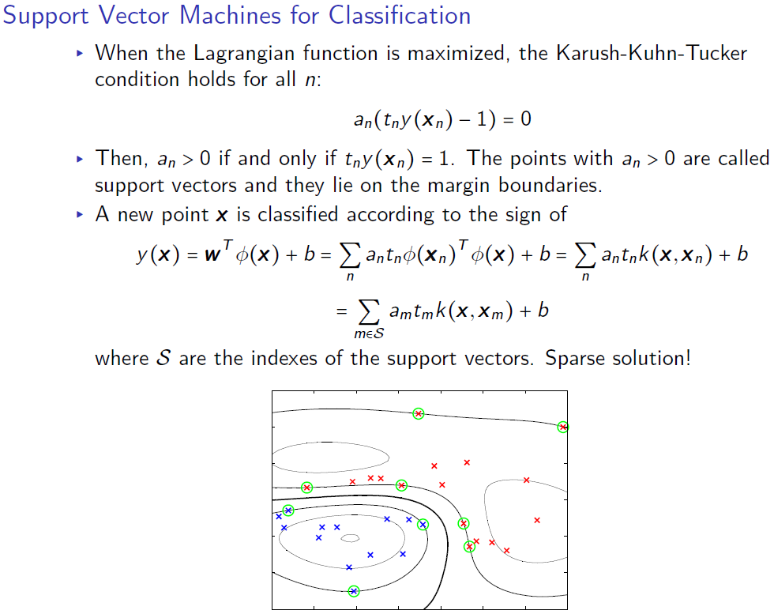
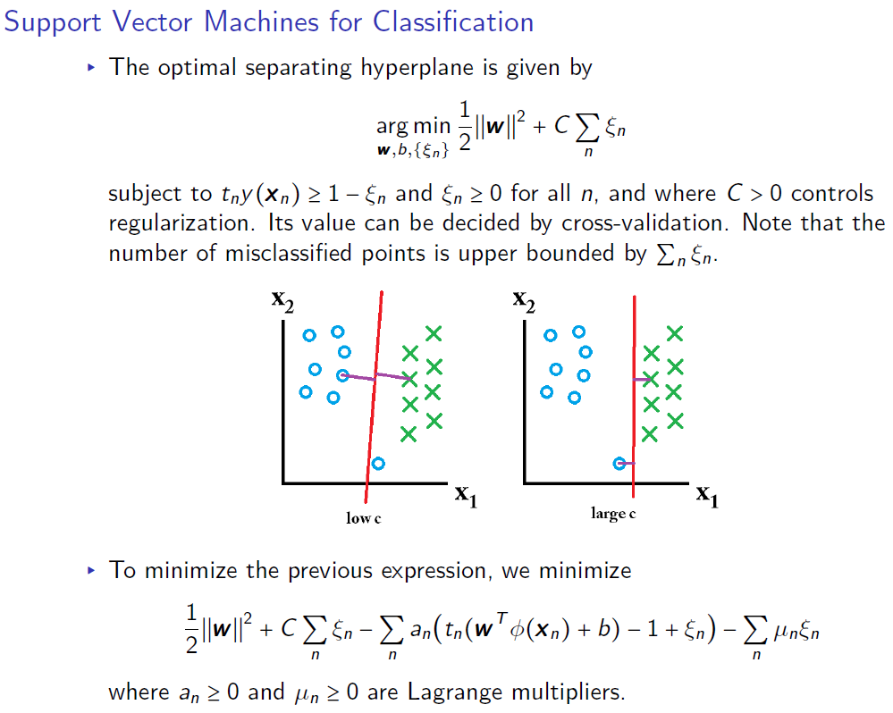

```{r setup, include=FALSE}
knitr::opts_chunk$set(echo = TRUE)
```

# Simple Tasks

## Library
```{r, message=FALSE}

library("ggplot2") # plots
library("tree") # decision tree
library("caret") # summary and confusion table
library("kknn") # kknn
library("readxl") # reading excel
library("MASS") # Step AIC
library("jtools") # summ function
library("dplyr") # pipelining
library("glmnet") # lasso and ridge
library("mgcv") # spline
library("kernlab") # SVM
library("mboost") # ensemble ADA boost
library("randomForest") # randomforest
library("pamr") # Nearest shrunken
library("boot") # bootstrap
library("fastICA") # fastICA
library("MASS") # LDA
library("neuralnet") # Neural Network
library("e1071") # Naive Bayes

# colours (colour blind friendly)
cbPalette <- c("#999999", "#E69F00", "#56B4E9", "#009E73", "#F0E442", "#0072B2", 
               "#D55E00", "#CC79A7")
```

## Reading Excel
```{r}
data <- readxl::read_excel("spambase.xlsx", sheet= "spambase_data")
data$Spam <- as.factor(data$Spam)
```


## Spliting the Datasets

### Divide into train/test

```{r}
data <- readxl::read_excel("spambase.xlsx", sheet= "spambase_data")
data$Spam <- as.factor(data$Spam)
# 50-50 split
n=nrow(data)
set.seed(12345)
id=sample(1:n, floor(n*0.5))
train=data[id,]
test=data[-id,]
```

### Train/test/validation
```{r}
data <- readxl::read_excel("spambase.xlsx", sheet= "spambase_data")
data$Spam <- as.factor(data$Spam)
# 50-25-25 split
n=nrow(data)
set.seed(12345) 
id=sample(1:n, floor(n*0.5)) 
train=data[id,] 

id1=setdiff(1:n, id)
set.seed(12345) 
id2=sample(id1, floor(n*0.25)) 
valid=data[id2,]

id3=setdiff(id1,id2)
test=data[id3,] 
```

## Custom code for Cross-Validation
```{r, warning=FALSE}
#Randomly shuffle the data
new_data <- data[sample(nrow(data)),]

#Create N equally size folds
new_data$folds <- sample(rep(1:10, each = nrow(new_data)/10))

result <- NULL
#Perform N fold cross validation
for(i in 1:length(unique(new_data$folds))){
  testData <- new_data[new_data$folds != i,]
  trainData <- new_data[new_data$folds == i,]
  
  #Use the test and train data partitions however you desire, run model code here

  best_model <- glm(formula = Spam ~., family = binomial, data = trainData)
  predicted_value <- predict(best_model, testData, type = "response") 
  pred_class <- ifelse(predicted_value > 0.50, 1, 0)
  temp <- 1 - (sum(ifelse(pred_class == testData$Spam,1,0))/nrow(testData))
  temp <- cbind(temp, i)
  colnames(temp) <- c("test_error", "fold")
  result <- rbind(result, temp)
  }


```

## Misclassification error calculation
```{r}
missclass=function(X,X1){
  n=length(X)
  return(1-sum(diag(table(X,X1)))/n)
}

#missclass(data2$class, predict(m3, type="class")$class)

```

## Assume that mortality y is Poisson distributed, where Y!=1*2*..n . Write an R code computing the minus-loglikelihood of Mortality values for a given lambda. Compute the minus log-likelihood values for lambda=10,110,210,...,2910 and produce a plot showing the dependence of the minus log-likelihood on the value of lambda. Define the optimal value of lambda by means of visual inspection

```{r}
# Loading the data set.
temp_data = read.csv("Influenza.csv")

# Poisson probability function.
prob_y = function(y, lambda){
py = -lambda + (y * log(lambda)) - sum(log(1:y))
return(py)
}

# Negative log likelihood.
neg_llike = function(Y, lambda){
llike = 0
for (y in Y){
llike = llike + prob_y(y, lambda)
}
return(- llike)
}

# Plotting the lambda grids.
lambdas = seq(10, 2910, 10)
nllike_lambdas = c()

for (lambda in lambdas){
nllike_lambdas = c(nllike_lambdas, neg_llike(temp_data$Mortality, lambda))
}
# Plotting the stuff.
ggplot() +
geom_line(aes(x=lambdas, y=nllike_lambdas))

# Selecting the lambda that maximizes the
# loglikelihood or that minimizes the negative
# loglikelihood.
min_id = which.min(nllike_lambdas)
best_lambda = lambdas[min_id]
print("The lambda that maximizes the loglikelihood is:")
## [1] "The lambda that maximizes the loglikelihood is:"
print(best_lambda)

```


## Backpropogation Neural Network - Implement the backpropagation algorithm for fitting the parameters of a NN for regression. The NN has one input unit, 10 hidden units, and one output unit. Use the tanh activation function. Recall that you have an example on Bishop's book as well as on the course slides. Feel free to use stochastic or batch gradient descent. Please use only basic R functions in your solution, e.g. sum, tanh.
```{r, eval=FALSE}
set.seed(1234567890)
Var = runif(50,0,10)
trva = data.frame(Var, Sin = sin(Var))
tr = trva[1:25,] # training data
va = trva[26:50,] # validation data

w_j = runif(10, -1, 1)
b_j = runif(10, -1, 1)
w_k = runif(10, -1, 1)
b_k = runif(1, -1, 1)

l_rate = 1/nrow(tr)^2
n_ite = 5000
error = rep(0, n_ite)
error_va = rep(0, n_ite)

for(i in 1:n_ite) {
  for(n in 1:nrow(tr)) {
    z_j = tanh(w_j * tr[n,]$Var + b_j)
    y_k = sum(w_k * z_j) + b_k
    
    error[i] = error[i] + (y_k + tr[n,]$Sin)^2
  }
  
  for(n in 1:nrow(va)) {
    z_j = tanh(w_j * va[n,]$Var + b_j)
    y_k = sum(w_k * z_j) + b_k
    
    error_va[i] = error_va[i] + (y_k + va[n,]$Sin)^2
  }
  
  cat("i: ", i , ", error: ", error[i]/2, ", error_va: ", error_va[i]/2, "\n")
  flush.console()
  
  for(n in 1:nrow(tr)) {
    z_j = tanh(w_j * tr[n,]$Var + b_j)
    y_k = sum(w_k * z_j) + b_k
    
    d_k = y_k - tr[n,]$Sin
    d_j = (1 - z_j^2) * w_k * d_k
    partial_w_k = d_k * z_j
    partial_b_k = d_k
    partial_w_j = d_j * tr[n,]$Var
    partial_b_j = d_j
    
    w_k = w_k - l_rate * partial_w_k
    b_k = b_k - l_rate * partial_b_k
    w_j = w_j - l_rate * partial_w_j
    b_j = b_j - l_rate * partial_b_j
    
  }
}

w_j
b_j
w_k
b_k

plot(error/2, ylim = c(0, 5))
points(error_va/2, col = "red")

# prediction on training data

pred = matrix(nrow = nrow(tr), ncol = 2)

for(n in 1:nrow(tr)) {
  z_j = tanh(w_j * tr[n,]$Var + b_j)
  y_k = sum(w_k * z_j) + b_k
  pred[n,] = c(tr[n,]$Var, y_k)
}

plot(pred)
points(tr, col = "red")

# prediction on validation data

pred = matrix(nrow = nrow(va), ncol = 2)

for(n in 1:nrow(va)) {
  z_j = tanh(w_j * va[n,]$Var + b_j)
  y_k = sum(w_k * z_j) + b_k
  pred[n,] = c(va[n,]$Var, y_k)
}

plot(pred)
points(va, col = "red")
```


# Regression

## Logistics Regression with Decision Boundary
```{r}

crab_data <- read.csv("australian-crabs.csv")

logistic_model <- glm(formula = species ~ CW + BD, family = binomial, data = crab_data)
summary(logistic_model)
crab_data$predicted_species_logisitic_prob <- predict(logistic_model, 
                                                      newdata = crab_data, type = "response")

crab_data$predicted_species_logisitic <- ifelse(crab_data$predicted_species_logisitic_prob > 0.50, 
                                                "Orange", "Blue")

conf_logistics <- table(crab_data$species, crab_data$predicted_species_logisitic)
names(dimnames(conf_logistics)) <- c("Actual", "Predicted")
caret::confusionMatrix(conf_logistics)

slope <- coef(logistic_model)[2]/(-coef(logistic_model)[3])
intercept <- coef(logistic_model)[1]/(-coef(logistic_model)[3]) 

ggplot(data=crab_data, aes(x=CW, y=BD, colour = species)) +
  geom_point() +
  geom_abline(intercept = intercept , slope = slope, color = "black") +
  ggtitle("Plot of CW vs. BD with decision boundary")

```

## Logistic Regression

```{r, warning=FALSE}
best_model <- glm(formula = Spam ~., family = binomial, data = train)
#summary(best_model)

train$prediction_prob <- predict(best_model, newdata = train, type = "response")
train$prediction_class_50 <- ifelse(train$prediction_prob > 0.50, 1, 0)

test$prediction_prob <- predict(best_model, newdata = test, type = "response")
test$prediction_class_50 <- ifelse(test$prediction_prob > 0.50, 1, 0)

conf_train <- table(train$Spam, train$prediction_class_50)
names(dimnames(conf_train)) <- c("Actual Train", "Predicted Train")
caret::confusionMatrix(conf_train)
```


### Choosing the best cutoff for test
```{r}
cutoffs <- seq(from = 0.05, to = 0.95, by = 0.05)
accuracy <- NULL

for (i in seq_along(cutoffs)){
    prediction <- ifelse(test$prediction_prob >= cutoffs[i], 1, 0) #Predicting for cut-off

    accuracy <- c(accuracy,length(which(test$Spam == prediction))/length(prediction)*100)}

cutoff_data <- as.data.frame(cbind(cutoffs, accuracy))

ggplot(data = cutoff_data, aes(x = cutoffs, y = accuracy)) + 
  geom_line() + 
  ggtitle("Cutoff vs. Accuracy for Test Dataset")

```

## KKNN
```{r}
knn_model30 <- train.kknn(Spam ~., data = train, kmax = 30)

test$knn_prediction_class <- predict(knn_model30, test)

conf_test2 <- table(test$Spam, test$knn_prediction_class)
names(dimnames(conf_test2)) <- c("Actual Test", "Predicted Test")
confusionMatrix(conf_test2)
```

## Step AIC
```{r warning=FALSE}
tecator_data <- readxl::read_excel("tecator.xlsx", sheet = "data")
tecator_data <- tecator_data[,2:NCOL(tecator_data)] # removing sample column


min.model1 = lm(Fat ~ 1, data=tecator_data[,-1])
biggest1 <- formula(lm(Fat ~.,  data=tecator_data[,-1]))

step.model1 <- stepAIC(min.model1, direction ='forward', scope=biggest1, trace = FALSE)
summ(step.model1)
```

## Ridge Regression
```{r}

y <- tecator_data %>% select(Fat) %>% data.matrix()
x <- tecator_data %>% select(-c(Fat)) %>% data.matrix()

lambda <- 10^seq(10, -2, length = 100)

ridge_fit <- glmnet(x, y, alpha = 0, family = "gaussian", lambda = lambda)
plot(ridge_fit, xvar = "lambda", label = TRUE, 
     main = "Plot showing shrinkage of coefficents with rise in log of lambda")


## Change of coefficent with respect to lambda
result <- NULL
for(i in lambda){
temp <- t(coef(ridge_fit, i)) %>% as.matrix()
temp <- cbind(temp, lambda = i)
result <- rbind(temp, result)
}
result <- result %>% as.data.frame() %>% arrange(lambda)
#head(result,10)

```

## Lasso Regression
```{r}
lambda <- 10^seq(10, -2, length = 100)

lasso_fit <- glmnet(x, y, alpha = 1, family = "gaussian", lambda = lambda)
plot(lasso_fit, xvar = "lambda", label = TRUE, 
     main = "Plot showing shrinkage of coefficents with rise in log of lambda")

```

## Lasso Regression using Cross Validation
```{r}
#find the best lambda from our list via cross-validation


data <- read.csv("Influenza.csv")
data_scaled <- data %>% select(-c("Mortality")) %>% 
  scale() %>% cbind(Mortality = data$Mortality) %>% as.data.frame()

### 50-50 split
n=nrow(data_scaled)
set.seed(12345)
id=sample(1:n, floor(n*0.5))
train=data_scaled[id,]
test=data_scaled[-id,]


lambda <- 10^seq(10, -2, length = 100)

X <- train %>% select(-c("Mortality")) %>% as.matrix()
Y <- train %>% select(c("Mortality")) %>% as.matrix()
X_test <- test %>% select(-c("Mortality")) %>% as.matrix()
Y_test <- test %>% select(c("Mortality")) %>% as.vector()


lambda_lasso <- 10^seq(10, -2, length = 100)
lambda_lasso[101] <- 0
lasso_cv <- cv.glmnet(X,Y, alpha=1, lambda = lambda_lasso, type.measure="mse")

#coef(lasso_cv, lambda = lasso_cv$lambda.min)

## lambda.min and lambda.se the difference is as follows
## lambda.min gives the lambda value for absolute min error
## while lambda.se gives lambda value for a very regularized model with error within one std error of lambda.min

min_lambda <- lasso_cv$lambda.min

## Retaining the best model and predicting

### best model
best_lasso <- glmnet(X, Y, alpha = 1, family = "poisson", lambda = min_lambda)


### printing the mse
Y_test$predict_y <- predict(best_lasso, newx = X_test, type = "response")
Y_test$MSE <- (Y_test$predict_y - Y_test$Mortality)^2

### alpha value
cat("The beta from the model are:") 
best_lasso$beta

# or coef(best_lasso)

cat("The alpha value is: ", best_lasso$a0, "while the exp value of alpha is: ", exp(best_lasso$a0))
cat("The mean squared error is:", mean(Y_test$MSE))

  
### Change of coefficent with respect to lambda
result_lasso <- NULL
for(i in 1:length(lambda_lasso)){
temp <- lasso_cv$cvm[i] %>% as.matrix()
temp <- cbind(CVM_error = temp, lambda = lasso_cv$lambda[i])
result_lasso <- rbind(temp, result_lasso)
}

#head(result_lasso,10)
```

## Neural Network
```{r}

# Doing as told by the exam instructions.
set.seed(1234567890)

Var = runif(50, 0, 3)
tr = data.frame(Var, Sin=sin(Var))
Var = runif(50, 3, 9)
te = data.frame(Var, Sin=sin(Var))

# Random initialization of the weights in the interval [-1, 1].
winit = runif(10, -1, 1)

# Training the neural network on the train set.
nn = neuralnet(Sin ~ Var, data=tr, hidden=c(3), startweights=winit)

# Getting the predictions, compute is depracted, never use it
yhat_test = predict(object = nn, newdata = te)

# Plotting the plotty mc plot face.
p = ggplot2::ggplot() +
    ggplot2::geom_point(ggplot2::aes(x=te$Var, y=te$Sin, color="Test data")) +
    ggplot2::geom_point(ggplot2::aes(x=tr$Var, y=tr$Sin, color="Train Values")) +
    ggplot2::geom_point(ggplot2::aes(x=te$Var, y=yhat_test, color="Predicted Values"))
print(p)

```

### Train a neural network to learn the trigonometric sine function. To do so, sample 50 points uniformly at random in the interval [0, 10]. Apply the sine function to each point. The resulting pairs are the data available to you. Use 25 of the 50 points for training and the rest for validation. The validation set is used for early stop of the gradient descent. Consider threshold values i*0.01 with i = 1,2,...,10. Initialize the weights of the neural network to random values in the interval [???1, 1]. Consider two NN architectures: A single hidden layer of 10 units, and two hidden layers with 3 units each. Choose the most appropriate NN architecture and threshold value. Motivate your choice. Feel free to reuse the code of the corresponding lab.

```{r}


set.seed(12345)
x <- sample(seq(0,10,0.001),50)
y <- sin(x)
sin_data <- cbind(x,y)
sin_data <- as.data.frame(sin_data)
colnames(sin_data) <- c("x", "y")

train <- sin_data[1:25,]
valid <- sin_data[26:50,]

run_weights = runif(n=10, min=-1, max = 1)

final <- NULL
for(i in 1:10){
model_1_hidden <- neuralnet(y~x, data=train, hidden=c(10), startweights = run_weights, threshold = i * 0.001)
model_2_hidden <- neuralnet(y~x, data=train, hidden=c(3,3), startweights = run_weights, threshold = i * 0.001)

# predicted_value
predicted_y_model1 <- predict(model_1_hidden, newdata = valid)
predicted_y_model2 <- predict(model_2_hidden, newdata = valid)
mse_model1 <- sum(predicted_y_model1 - valid$y)^2
mse_model2 <- sum(predicted_y_model2 - valid$y)^2
temp <- cbind(mse_model1, mse_model2, i)
final <- rbind(temp, final)
}

colnames(final) <- c("MSE_model1", "MSE_model2", "Iteration")
final <- as.data.frame(final)

ggplot(data=final, aes(x=as.factor(Iteration))) + 
  geom_point(aes(y = MSE_model1 ,color="red")) +
  geom_point(aes(y = MSE_model2 ,color="blue")) +
  ggtitle("Plot of thershold vs. model")
  

# from the dataset seens, the best model is model1 and thershold is 6 * 0.001

best_model <- neuralnet(y~x, data=train, hidden=c(10), startweights = run_weights, threshold = 6 * 0.001)
valid$predicted_y <- predict(best_model, newdata = valid)

ggplot(data=valid) +
  geom_line(aes(x=x, y=y, color="True Y")) +
  geom_point(aes(x=x, y=predicted_y, color="Predicted Y")) +
  ggtitle("plot of predicted vs. originals")

```


# Classification

## LASSO

```{r}

n=NROW(iris)
set.seed(12345)
id=sample(1:n, floor(n*1/3))
train=iris[id,]
id1=setdiff(1:n, id)
set.seed(12345)
id2=sample(id1, floor(n*1/3))
valid=iris[id2,]
id3=setdiff(id1,id2)
test=iris[id3,]

y <- train %>% select(Species) %>% data.matrix()
x <- train %>% select(-c(Species)) %>% data.matrix()

y_valid <- valid %>% select(Species) %>% data.matrix()
x_valid <- valid %>% select(-c(Species)) %>% data.matrix()

lambda <- seq(from=0, to=1, by=0.1)
lasso_fit <- cv.glmnet(x, y, alpha = 1, family = "multinomial", lambda = lambda, type.measure = "class")
plot(lasso_fit, xvar = "lambda", label = TRUE,
main = "Plot showing shrinkage of coefficents with rise in log of lambda")

min_lambda <- lasso_fit$lambda.min

best_model <- glmnet(x,y,alpha = 1, family = "multinomial", lambda = min_lambda)
  
predicted <- predict(best_model, newx = x_valid, type=c("class"))
new_predicted <- cbind(predicted, y_valid) %>% as.data.frame()
colnames(new_predicted) <- c("Predicted_class", "Actual_class")

lasso_confusion <- table(new_predicted$Predicted_class, new_predicted$Actual_class)
names(dimnames(lasso_confusion)) <- c("Predicted Validation", "Actual Validation")
caret::confusionMatrix(lasso_confusion)


```

## Naive Bayes, using default threshold
```{r}
set.seed(12345)
credit_data <- readxl::read_excel("creditscoring.xls", sheet = "credit")
credit_data$good_bad <- as.factor(credit_data$good_bad)

n=NROW(credit_data)
set.seed(12345) 
id=sample(1:n, floor(n*0.5)) 
train=credit_data[id,] 

id1=setdiff(1:n, id)
set.seed(12345) 
id2=sample(id1, floor(n*0.25)) 
valid=credit_data[id2,]

id3=setdiff(id1,id2)
test=credit_data[id3,]

#Fitting the Naive Bayes model
credit_naive_model = e1071::naiveBayes(good_bad ~., data=train)

#Prediction on the dataset
predict_naive_train = predict(credit_naive_model, newdata=train, type = "class")
predict_naive_test = predict(credit_naive_model, newdata=test, type = "class")

conf_naive_train <- table(train$good_bad, predict_naive_train)
names(dimnames(conf_naive_train)) <- c("Actual Train", "Predicted Train")
caret::confusionMatrix(conf_naive_train)
```

## Naive Bayes varying threshold and ROC curve
```{r}

# model
credit_naive_model = e1071::naiveBayes(good_bad ~., data=train)

# predicting class, getting probability
predict_naive_test_prob <- predict(credit_naive_model, newdata=test, type = "raw")

# data mugging
probability_data_naive <- as.data.frame(cbind(predict_naive_test_prob, 
                                              as.character(test$good_bad), "naivebayes"))

colnames(probability_data_naive) <- c("prob_bad", "prob_good", 
                                         "actual_test_class", "model")

# final dataset
probability_data_naive$prob_good <- as.numeric(as.character(probability_data_naive$prob_good))


naive_list <- NULL
final <- NULL

for(threshold in seq(from = 0.05, to = 0.95, by = 0.05)){
 probability_data_naive$predicted_class <- ifelse(probability_data_naive$prob_good > threshold, 
                                                  "good", "bad")
  
  df2 <- probability_data_naive[,c("model", "actual_test_class", "predicted_class")]
  df2$threshold <- threshold
  df2$match <- ifelse(df2$actual_test_class == df2$predicted_class, 1, 0)
  
  final <- rbind(df2, final)
}

# Creating the FRP and TRP for each model and threshold  
final$temp <- 1

final_summary <- final %>% 
group_by(model, threshold) %>% 
summarise(total_positive = sum(temp[actual_test_class == "good"]),
          total_negative = sum(temp[actual_test_class == "bad"]),
          correct_positive = sum(temp[actual_test_class == "good" & predicted_class == "good"]),
          false_positive = sum(temp[actual_test_class == "bad" & predicted_class == "good"])) %>% 
  mutate(TPR = correct_positive/total_positive, FPR = false_positive/total_negative)

ggplot(data = final_summary, aes(x = FPR, y=TPR)) + geom_line(aes(colour = model)) + 
  geom_abline(intercept = 0.0, slope = 1) +
  ggtitle("ROC curve for the Naive Bayes")

```


## Decision trees (tree lib)

```{r}
set.seed(12345)

data <- read.csv("crx.csv", header = TRUE)
data$Class <- as.factor(data$Class)

# 50-50 split
n=nrow(data)
id=sample(1:n, floor(n*0.8))
train=data[id,]
test=data[-id,]

tree_deviance <- tree::tree(Class~., data=train, split = c("deviance"))
tree_gini <- tree::tree(Class~., data=train, split = c("gini"))

# Visualize the decision tree with rpart.plot
summary(tree_deviance)

# predicting on the test dataset to get the misclassification rate.
predict_tree_deviance <- predict(tree_deviance, newdata = test, type = "class")
predict_tree_gini <- predict(tree_deviance, newdata = test, type = "class")

conf_tree_deviance <- table(test$Class, predict_tree_deviance)
names(dimnames(conf_tree_deviance)) <- c("Actual Test", "Predicted Test")
caret::confusionMatrix(conf_tree_deviance)

# plot of the tree
plot(tree_deviance)
text(tree_deviance)

```

## Trees using rpart
```{r}
library(rpart.plot)
library(rpart)

set.seed(12345)


decision_tree_rpart <- rpart::rpart(data = train, formula = Class~., method = "class")
rpart.plot::rpart.plot(decision_tree_rpart, main= "Original decision tree")
```

### Pruning trees using cross validation
```{r}
library(ggplot2)

set.seed(12345)
cv_tree <- cv.tree(tree_deviance, FUN = prune.tree, K = 10)
df_result <- as.data.frame(cbind(size = cv_tree$size, dev = cv_tree$dev))
# puring the tree for leaf size of 3
best_tree <- prune.tree(tree_deviance, best = 2)
plot(best_tree, main="Pruned Tree for the given dataset")
text(best_tree)

ggplot(df_result, aes(x = size, y = dev)) + geom_point() + geom_line() + ggtitle("Plot of deviance vs. size")

```

### Prune the tree using error
```{r}
set.seed(12345)
tree_deviance <- tree::tree(Class~., data=train, split = c("deviance"))

tree_prune_train <- prune.tree(tree_deviance, method = c("deviance"))
tree_prune_valid <- prune.tree(tree_deviance, newdata = test ,method = c("deviance"))

result_train <- cbind(tree_prune_train$size,
tree_prune_train$dev, "Train")

result_valid <- cbind(tree_prune_valid$size,
tree_prune_valid$dev, "Valid")

result <- as.data.frame(rbind(result_valid, result_train))
colnames(result) <- c("Leaf", "Deviance", "Type")
result$Leaf <- as.numeric(as.character(result$Leaf))
result$Deviance <- as.numeric(as.character(result$Deviance))

# plot of deviance vs. number of leafs
ggplot(data = result, aes(x = Leaf, y = Deviance, colour = Type)) +
geom_point() + geom_line() +
ggtitle("Plot of Deviance vs. Tree Depth")
```

## GAM Model or Spline
```{r}
set.seed(12345)

# using family = binomial for classfication
gam_model <- mgcv::gam(data=train, formula = Class~s(A3)+A9, family=binomial)
summary(gam_model)
plot(gam_model)

# predicted the class, type="response" gives the probability, while if supported type="class" gives the predicted class
test$Predicted_Class_probability <- predict(object = gam_model, newdata=test, type = "response")
test$Predicted_Class <- ifelse(test$Predicted_Class_probability > 0.5, 1, 0)
```
Model Equation is given by Class = A9 + f(A3), where f is a smoothing function in our case determined by REML.

### Use the following error function to compute the test error for the GAM and tree models, given by the below equation. Where Y is the actual class and Pi is the probability of predicted class being 1

$$E = \sum_i Y_i \cdot log(p_i) + (1-Y_i) \cdot log(1-P_i)  $$


```{r}
# Error-rate
error_rate = sum(as.numeric(test$Class) * log(test$Predicted_Class_probability) + (1 - as.numeric(test$Class)) * log(1-test$Predicted_Class_probability))

error_rate

```

## Support Vector Machine (SVM)
```{r}

# width is the sigma here. kernel rbfdot is gaussian. vanilladot is linear
data(spam)
spam$type <- as.factor(spam$type)

## create test and training set
n=nrow(spam)
id=sample(1:n, floor(n*0.8))
spamtrain=spam[id,]
spamtest=spam[-id,]


model_0.05 <- kernlab::ksvm(type~., data=spamtrain, kernel="rbfdot", kpar=list(sigma=0.05), C=0.5)
#model_0.05

conf_model_0.05 <- table(spamtrain[,58], predict(model_0.05, spamtrain[,-58]))
names(dimnames(conf_model_0.05)) <- c("Actual Test", "Predicted Test")
caret::confusionMatrix(conf_model_0.05)
```

## ADA boost or Ensemble
```{r}
data(spam)
## create test and training set
n=nrow(spam)
id=sample(1:n, floor(n*0.8))
spamtrain=spam[id,]
spamtest=spam[-id,]

ada_model <- mboost::blackboost(type~., data = spamtrain, family = AdaExp(), 
                                control=boost_control(mstop=15))
test_ada_model_predict <- predict(ada_model, newdata = spamtest, type = c("class"))
```

## Random Forest
```{r}
forest_model <- randomForest(type~., data = spamtrain, ntree = 15)
test_forest_model_predict <- predict(forest_model, newdata = spamtest, type = c("class"))
```

### Comparing ADA boost and Randomforest
```{r, warning=FALSE}
# using warnings = FALSE

final_result <- NULL

for(i in seq(from = 10, to = 100, by = 10)){
ada_model <- mboost::blackboost(type~.,
data = spamtrain,
family = AdaExp(),
control=boost_control(mstop=i))

forest_model <- randomForest(type~., data = spamtrain, ntree = i)

prediction_function <- function(model, data){
predicted <- predict(model, newdata = data, type = c("class"))
predict_correct <- ifelse(data$type == predicted, 1, 0)
score <- sum(predict_correct)/NROW(data)
return(score)
}

train_ada_model_predict <- predict(ada_model, newdata = spamtrain, type = c("class"))
test_ada_model_predict <- predict(ada_model, newdata = spamtest, type = c("class"))
train_forest_model_predict <- predict(forest_model, newdata = spamtrain, type = c("class"))
test_forest_model_predict <- predict(forest_model, newdata = spamtest, type = c("class"))

test_predict_correct <- ifelse(spamtest$type == test_forest_model_predict, 1, 0)
train_predict_correct <- ifelse(spamtest$type == train_forest_model_predict, 1, 0)

train_ada_score <- prediction_function(ada_model, spamtrain)
test_ada_score <- prediction_function(ada_model, spamtest)
train_forest_score <- prediction_function(forest_model, spamtrain)
test_forest_score <- prediction_function(forest_model, spamtest)

iteration_result <- data.frame(number_of_trees = i,
accuracy = c(train_ada_score,
test_ada_score,
train_forest_score,
test_forest_score),
type = c("train", "test", "train", "test"),
model = c("ADA", "ADA", "Forest", "Forest"))
final_result <- rbind(iteration_result, final_result)
}

final_result$error_rate_percentage <- 100*(1 - final_result$accuracy)

ggplot(data = final_result, aes(x = number_of_trees,
y = error_rate_percentage,
group = type, color = type)) +
geom_point() +
geom_line() +
ggtitle("Error Rate vs. increase in trees") + 
facet_grid(rows = vars(model))


```

## Nearest Shrunken Centroid (NSC)

```{r, message=FALSE, warning=FALSE, results=FALSE}

data <- read.csv(file = "data.csv", sep = ";", header = TRUE)
n=NROW(data)
data$Conference <- as.factor(data$Conference)


# Remember to scale the data, its cruical for this algorithm, like so scale_data = scale(data)

set.seed(12345) 
id=sample(1:n, floor(n*0.7)) 
train=data[id,] 
test = data[-id,]

rownames(train)=1:nrow(train)
x=t(train[,-4703])
y=train[[4703]]

rownames(test)=1:nrow(test)
x_test=t(test[,-4703])
y_test=test[[4703]]

mydata = list(x=x,y=as.factor(y),geneid=as.character(1:nrow(x)), genenames=rownames(x))
mydata_test = list(x=x_test,y=as.factor(y_test),geneid=as.character(1:nrow(x)), genenames=rownames(x))
model=pamr.train(mydata,threshold=seq(0, 4, 0.1))

cvmodel=pamr.cv(model, mydata)

# The value at which loglikehood is max, we can use this or use the threshold for which error is least
cvmodel$threshold[which.max(cvmodel$loglik)]


important_gen <- as.data.frame(pamr.listgenes(model, mydata, threshold = 1.3))
predicted_scc_test <- pamr.predict(model, newx = x_test, threshold = 1.3)
```

### Plots
```{r, fig.height=9}

# use {r, fig.height=9} for better plots
pamr.plotcv(cvmodel)
pamr.plotcen(model, mydata, threshold = 1.3)
```

### Important features
```{r}
## List the significant genes
NROW(important_gen)


temp <- colnames(data) %>% as.data.frame()
colnames(temp) <- "col_name"
temp$index <- row.names(temp)

df <- merge(x = important_gen, y = temp, by.x = "id", by.y = "index", all.x = TRUE)
df <- df[order(df[,3], decreasing = TRUE ),]

knitr::kable(head(df[,4],10), caption = "Important feaures selected by Nearest Shrunken Centroids ")

```

### Confusion table
```{r}
conf_scc <- table(y_test, predicted_scc_test)
names(dimnames(conf_scc)) <- c("Actual Test", "Predicted Srunken Centroid Test")
result_scc <- caret::confusionMatrix(conf_scc)
caret::confusionMatrix(conf_scc)

```

## Elastic Net
```{r}
x = train[,-4703] %>% as.matrix()
y = train[,4703]

x_test = test[,-4703] %>% as.matrix()
y_test = test[,4703]

cvfit = cv.glmnet(x=x, y=y, alpha = 0.5, family =   "binomial")
predicted_elastic_test <- predict.cv.glmnet(cvfit, newx = x_test, s = "lambda.min", type = "class")
tmp_coeffs <- coef(cvfit, s = "lambda.min")
elastic_variable <- data.frame(name = tmp_coeffs@Dimnames[[1]][tmp_coeffs@i + 1], coefficient = tmp_coeffs@x)
knitr::kable(elastic_variable, caption = "Contributing features in the elastic model")

conf_elastic_net <- table(y_test, predicted_elastic_test)
names(dimnames(conf_elastic_net)) <- c("Actual Test", "Predicted ElasticNet Test")
result_elastic_net <- caret::confusionMatrix(conf_elastic_net)
caret::confusionMatrix(conf_elastic_net)
```

## Linear discriminant analysis (LDA)
```{r}

# Load the data
data <- iris
# Split the data into training (80%) and test set (20%)
n=NROW(data)
set.seed(12345)
id=sample(1:n, floor(n*0.5))
train=data[id,]
test=data[-id,]

model <- MASS::lda(Species~., data = train)
model

plot(model)

predictions <- model %>% predict(test)
names(predictions)

lda.data <- cbind(train, predict(model)$x)
#plot(data2$frames,data2$duration, col=predict(m3)$class)

ggplot(lda.data, aes(LD1, LD2)) + geom_point(aes(color = Species))

```


# Bootstrap and Big data

## Principle Component Analysis
### Components
```{r}
rm(list=ls())

set.seed(12345)
NIR_data <- read.csv2("NIRSpectra.csv")

## scaling is necessary else the column with high range will dominate, using prcomp(scale=TRUE)
pca_data =  select(NIR_data,-c(Viscosity))
pca_result = prcomp(pca_data)

contribution <- summary(pca_result)$importance
knitr::kable(contribution[,1:5], 
             caption = "Contribution of PCA axis towards varience explaination")

eigenvalues = pca_result$sdev^2

# plotting proportion of variation for principal components
plotData = as.data.frame(cbind(pc = 1:3,
variationProportion = eigenvalues[1:3]/sum(eigenvalues),
cummulative = cumsum(eigenvalues[1:3]/sum(eigenvalues))))

ggplot(data = plotData) +
geom_col(aes(x = pc, y = variationProportion), width = 0.3, fill = "grey70") +
geom_line(data = plotData,
aes(x = pc, y = cummulative)) +
geom_text(aes(x = pc, y = cummulative, label = round(cummulative, 3)), size = 4,
position = "identity", vjust = 1.5) +
theme_bw() +
ggtitle("Proportion of variation for principal components")

# pca components and the viscocity
pca_result_data = cbind(first_component = pca_result$x[,1],
                                second_component = pca_result$x[,2]) %>% as.data.frame()

# plotting the data variation and the viscocity
ggplot(data = pca_result_data, aes(x = first_component, y = second_component)) +
  geom_point() + ggtitle("Score Plot of PCA components")


# showing the score of PCA component
factoextra::fviz_pca_var(pca_result,
             col.var = "contrib", # Color by contributions to the PC
             gradient.cols = c("#00AFBB", "#E7B800", "#FC4E07"),
             repel = TRUE     # Avoid text overlapping
             )

```

### Trace plots of PCA
```{r}
set.seed(12345)

# creating extra columns
aload <- abs(pca_result$rotation[,1:2])
components <- sweep(aload, 2, colSums(aload), "/")
components <- as.data.frame(components)
components$feature_name <- rownames(components)
components$feature_index <- 1:nrow(components)

ggplot(data = components, aes(x = feature_index, y = PC1)) + 
  geom_point() + 
  ggtitle("Traceplot of feature index vs. PC1")

ggplot(data = components, aes(x = feature_index, y = PC2)) + 
  geom_point() + 
  ggtitle("Traceplot of feature index vs. PC2")

knitr::kable(components[1:10,], 
             caption = "Contribution of Features towards the Principle Components")

```

## FastICA
```{r}

library(fastICA)

set.seed(12345)

# X -> pre-processed data matrix
# K -> pre-whitening matrix that projects data onto the first n.compprincipal components.
# W -> estimated un-mixing matrix (see definition in details)
# A -> estimated mixing matrix
# S -> estimated source matrix

X <- as.matrix(pca_data)

ICA_extraction <- fastICA(X, 2, alg.typ = "parallel", fun = "logcosh", alpha = 1,
method = "R", row.norm = FALSE, maxit = 200,
tol = 0.0001, verbose = TRUE)

W_prime <- ICA_extraction$K %*% ICA_extraction$W

#trace plots
plot(W_prime[,1], main = "Trace plot of W` Matrix")
#trace plots
plot(W_prime[,2], main = "Trace plot of W` Matrix")

# pca components and the viscocity
ICA_result_data = cbind(first_component = ICA_extraction$S[,1],
                        second_component = ICA_extraction$S[,2],
                        Viscosity = NIR_data$Viscosity) %>% as.data.frame()

# plotting the data variation
ggplot(data = ICA_result_data, aes(x = first_component, y = second_component)) +
  geom_point() + ggtitle("Score Plot for ICA components")

```


## Implement Benjamini-Hochberg method
```{r}
# function to compute the BH method on a dataframe
data <- read.csv("Influenza.csv")
new_data <- data %>% filter(Year > 1994 & Year < 1997)

x <- new_data %>% select(-c("Year")) 
y <- new_data %>% select(c("Year"))
y <- factor(y$Year)

#initialzing the dataframe
p_values <- data.frame(feature = '',P_value = 0,stringsAsFactors = FALSE)

for(i in 1:ncol(x)){
  res = t.test(x[,i]~y, data = new_data, alternative="two.sided", conf.level = 0.95)
  p_values[i,] <- c(colnames(x)[i],res$p.value)
}

manual_BH_df = function(data, fpr) {
  data2 <- data %>% 
    mutate(BH=p.adjust(P_value, "BH")) %>%
    arrange(P_value) %>%
    mutate(j = rank(P_value), m = n()) %>%
    mutate(BHmanual_base = j/m) %>%
    mutate(BHmanual_alpha = 0.15 * j / m,
           BHsignif_alpha = BHmanual_alpha <= fpr)
  
  return(data2)
}

manual_BH_df(data=p_values, fpr=0.05)


# alternative
data <- read.csv(file = "data.csv", sep = ";", header = TRUE)
data$Conference <- as.factor(data$Conference)
set.seed(12345) 
y <- as.factor(data[,4703])
x <- as.matrix(data[,-4703])
p_values <- data.frame(feature = '',P_value = 0,stringsAsFactors = FALSE)
for(i in 1:ncol(x)){
res = t.test(x[,i]~y, data = data,
alternative="two.sided"
,conf.level = 0.95)
p_values[i,] <- c(colnames(x)[i],res$p.value)
}
p_values$P_value <- as.numeric(p_values$P_value)
p <- p.adjust(p_values$P_value, method = 'BH')
length(p[which(p > 0.05)])
out <- p_values[which(p <= 0.05),]
out <- out[order(out$P_value),]
rownames(out) <- NULL
out
```

## Confidence band using Bootstrap
```{r}
library(boot)
set.seed(12345)
state_data <- read.csv2("state.csv")

# computing bootstrap samples
bootstrap <- function(data, indices){
  data <- state_data[indices,]
  
  model <- tree(data = data, 
       EX~MET, 
       control = tree.control(nobs=NROW(data),
                              minsize = 8))
  
  model_purned <- prune.tree(model, best = 3)
  final_fit_boot <- predict(model_purned, newdata = state_data)
  return(final_fit_boot)
}

res <- boot(state_data, bootstrap, R=1000) #make bootstrap
e <- envelope(res, level = 0.95) 
state_tree_regression <- tree(data = state_data, EX~MET, 
                              control = tree.control(nobs=NROW(state_data), 
                                                     minsize = 8))

# puring the tree for leaf size of 3
state_cv_tree_purned <- prune.tree(state_tree_regression, best = 3)
predict_for_ci <- predict(state_cv_tree_purned, state_data)
data_for_ci <- cbind(upper_bound = e$point[1,], 
                     lower_bound = e$point[2,],
                     EX = state_data$EX,
                     MET = state_data$MET,
                     predicted_value = predict_for_ci) %>% as.data.frame()

#plot cofidence bands

ggplot(data=data_for_ci, aes(x = MET, y = EX)) + 
  geom_point(aes(x = MET,y=EX)) +
  geom_line(aes(x = MET, y=predicted_value), colour="blue") + 
  geom_ribbon(aes(x = MET, ymin=lower_bound, ymax=upper_bound),alpha = 0.3) +
  ggtitle("EX value along with 95% Confidence band")
```

## Prediction band using Bootstrap
```{r}
set.seed(12345)
state_tree_regression <- tree(data = state_data, EX~MET, 
                              control = tree.control(nobs=NROW(state_data), 
                                                     minsize = 8))


mle=prune.tree(state_tree_regression, best = 3)

rng=function(data, mle) {
  data1=data.frame(EX=data$EX, MET=data$MET)
  n=length(data$EX)
  pred <- predict(mle, newdata = data1)
  residual <- data1$EX - pred
#generate new Price
  data1$EX=rnorm(n, pred, sd(residual))
  return(data1)
}

# computing bootstrap samples
conf.fun <- function(data){
  model <- tree(data = data, 
       EX~MET, 
       control = tree.control(nobs=NROW(data),
                              minsize = 8))
  
  model_purned <- prune.tree(model, best = 3)
  final_fit_boot <- predict(model_purned, newdata = state_data)
  return(final_fit_boot)
}


# computing bootstrap samples
pred.fun <- function(data){
  model <- tree(data = data, 
       EX~MET, 
       control = tree.control(nobs=NROW(data),
                              minsize = 8))
  
  model_purned <- prune.tree(model, best = 3)
  final_fit_boot <- predict(model_purned, newdata = state_data)
  final_fit <- rnorm(n = length(final_fit_boot),  mean = final_fit_boot, sd=sd(residuals(mle)))
  return(final_fit)
}


conf_para = boot(state_data, statistic=conf.fun, R=1000, mle=mle, ran.gen=rng, sim="parametric")
pred_para = boot(state_data, statistic=pred.fun, R=1000, mle=mle, ran.gen=rng, sim="parametric")

e1 <- envelope(conf_para, level = 0.95) 
e2 <- envelope(pred_para, level = 0.95) 


# puring the tree for leaf size of 3
state_cv_tree_purned <- prune.tree(state_tree_regression, best = 3)
predict_for_ci <- predict(state_cv_tree_purned, state_data)


data_for_ci_para <- cbind(upper_bound = e1$point[1,], 
                     lower_bound = e1$point[2,],
                     upper_bound_pred = e2$point[1,], 
                     lower_bound_pred = e2$point[2,],
                     EX = state_data$EX,
                     MET = state_data$MET,
                     predicted_value = predict_for_ci) %>% as.data.frame()

ggplot(data=data_for_ci_para, aes(x = MET, y = EX)) + 
  geom_point(aes(x = MET,y=EX)) +
  geom_line(aes(x = MET, y=predicted_value), colour="blue") + 
  geom_ribbon(aes(x = MET, ymin=lower_bound, ymax=upper_bound),alpha = 0.3) +
  geom_ribbon(aes(x = MET, ymin=lower_bound_pred, ymax=upper_bound_pred), alpha = 0.3) +
  ggtitle("EX value along with 95% Confidence(dark grey) and Prediction band")
```

# Kernal Estimation

## Kernel Smoothing Regression
```{r}
rm(list=ls())
set.seed(1234567890)
stations <- read.csv("stations.csv")
temps <- read.csv("temps50k.csv")
st <- merge(stations,temps,by="station_number")
rm(temps, stations)

st <- st[1:2000,]


kernel_method <- function(df, date, loc_long, loc_lat, h1, h2, h3) {

set.seed(1234567890)
start <- as.POSIXct(date)
interval <- 60
end <- start + as.difftime(1, units="days")
time_seq <- seq(from=start, by=interval*120, to=end)
time_seq <- as.data.frame(time_seq)
colnames(time_seq) <- "new_date_time"
time_seq$time_index <- rownames(time_seq)

df_new <- merge.data.frame(df,time_seq,all=TRUE)
rm(df)

df_new$new_date <- as.Date(df_new$new_date_time)
df_new$new_time <- format(df_new$new_date_time,"%H:%M:%S")
df_new$loc_long <- loc_long
df_new$loc_lat <-  loc_lat


df_new$h_distance <-  abs(geosphere::distHaversine(p1 = df_new[,c("loc_long", "loc_lat")], 
                                        p2 = df_new[,c("longitude", "latitude")]))

df_new$h_date <- as.numeric(abs(difftime(df_new$new_date, df_new$date, units = c("days"))))

df_new$h_time <- as.numeric(abs(difftime(strptime(paste(df_new$new_date, 
                                                      df_new$new_time),"%Y-%m-%d%H:%M:%S"),
                                         strptime(paste(df_new$new_date, df_new$time),
                                   "%Y-%m-%d %H:%M:%S"),
                          units = c("hour"))))


df_new$date_time <- paste(df_new$date, df_new$time)
df_new$hd_dist <- as.numeric(difftime(df_new$new_date_time,
                          df_new$date_time,
                          units = c("hour")))

## removing any negative dates and time
df_new$posterior_flag <- as.factor(ifelse(df_new$h_distance > 0 & df_new$hd_dist > 0, "retain", "drop"))


## calculating kernel distance and choosing guassian kernel
df_new$h_distance_kernel <- exp(-(df_new$h_distance/h1)^2)
df_new$h_date_kernel <- exp(-(df_new$h_date/h2)^2)
df_new$h_time_kernel <- exp(-(df_new$h_time/h3)^2)
df_new$total_additive_dist <- (df_new$h_distance_kernel + df_new$h_date_kernel + df_new$h_time_kernel)
df_new$total_mul_dist <- (df_new$h_distance_kernel * df_new$h_date_kernel * df_new$h_time_kernel)

df_new$additive_num <- ifelse(df_new$posterior_flag == "retain", 
                              df_new$h_distance_kernel*df_new$air_temperature +
                                df_new$h_date_kernel*df_new$air_temperature + 
                                df_new$h_time_kernel*df_new$air_temperature,0)

df_new$mul_num <- ifelse(df_new$posterior_flag == "retain", 
                         (df_new$h_distance_kernel) *
                                (df_new$h_date_kernel) * 
                                (df_new$h_time_kernel*df_new$air_temperature),0)

df_new$additive_den <- ifelse(df_new$posterior_flag == "retain", df_new$total_additive_dist, 0)
df_new$mul_den <- ifelse(df_new$posterior_flag == "retain", df_new$total_mul_dist, 0)

time = unique(time_seq$time_index)
result <- NULL

for(i in time){
temp <- df_new[df_new$time_index == i,]
additive_temp <- sum(temp$additive_num)/sum(temp$additive_den)
mult_temp <- sum(temp$mul_num)/sum(temp$mul_den)

temp <- cbind(additive_temp, mult_temp, i)
result <- rbind(temp,result)
}

result <- as.data.frame(result) 
result <- merge(x =result, y = time_seq, by.x = "i", by.y = "time_index", all.x = TRUE)
result$additive_temp <- as.numeric(as.character(result$additive_temp))
result$mult_temp <- as.numeric(as.character(result$mult_temp))

p1 <- ggplot(data=result, aes(x=new_date_time)) + 
  geom_point(aes(y = additive_temp)) +
  geom_point(aes(y = mult_temp)) +
  geom_line(aes(y = additive_temp, color = "Additive")) + 
  geom_line(aes(y = mult_temp, color = "Multiplicative")) + 
  scale_color_manual(values=c("#E69F00", "#56B4E9")) +
  ylab("predicted temperature") +
  theme_bw() +
  ggtitle("Predicted Temperature using Kernels")

final <- list(p1)
return(final)
}


kernel_method(df=st, date = "2000-05-08", loc_long = 17.6935,
loc_lat = 59.9953, h1 = 30000, h2 = 2, h3 = 5)


```

## Onlearning SVM

```{r, eval=FALSE}
set.seed(1234567890)
spam <- read.csv2("spambase.csv")
ind <- sample(1:nrow(spam))
spam <- spam[ind,c(1:48,58)]
h <- 1
beta <- 0
M <- 50
N <- 500 # number of training points

gaussian_k <- function(x, h) { # It is fine if students use exp(-x**2)/h instead
  return (exp(-(x**2)/(2*h*h)))
}

SVM <- function(sv,i) { #SVM on point i with support vectors sv
  yi <- 0
  for(m in 1:length(sv)) {
    xixm <- rbind(spam[i,-49],spam[sv[m],-49]) # do not use the true label when computing the distance
    tm <- 2 * spam[sv[m],49] - 1 # because the true labels must be -1/+1 and spambase has 0/1
    yi <- yi + tm * gaussian_k(dist(xixm, method="euclidean"), h)
  }
  return (yi)
}

errors <- 1
errorrate <- vector(length = N)
errorrate[1] <- 1
sv <- c(1)
for(i in 2:N) {
  yi <- SVM(sv,i)
  ti <- 2 * spam[i,49] - 1
  
  if(ti * yi < 0) {
    errors <- errors + 1
  }
  errorrate[i] <- errors/i
  
   cat(".") # iteration ", i, "error rate ", errorrate[i], ti * yi, "sv ", length(sv), "\n")
   flush.console()
  
  if(ti * yi <= beta) {
    sv <- c(sv, i)
    
    if (length(sv) > M) {
      for(m in 1:length(sv)) { # remove the support vector that gets classified best without itself
        sv2 <- sv[-m]
        ym2 <- SVM(sv2,sv[m])
        tm <- 2 * spam[sv[m],49] - 1

        if(m==1) {
          max <- tm * ym2
          ind <- 1
        }
        else {
          if(tm * ym2 > max) {
            max <- tm * ym2
            ind <- m
          }
        }
      }
      sv <- sv[-ind]
      
      # cat("removing ", ind, max, "\n")
      # flush.console()
    }
  }
}
plot(errorrate[seq(from=1, to=N, by=10)], ylim=c(0.2,0.4), type="o")
M
beta
length(sv)
errorrate[N]

```


## EM algorithm

### Multivariate Gaussian distributions

You are asked to implement the EM algorithm for mixtures of multivariate Gaussian distributions. You should use the following equations in the 

E-step:

$$ p(z_{nk}|x_n, \mu, \pi) = \frac{\pi_k f(x_n|\mu_k)}{\sum_k \pi_k f(x_n|\mu_k) }$$

M-step:

$$ \pi_k^{ML} = \frac{\sum_n p(z_{nk}|x_n, \mu, \pi)}{N} $$
$$ \mu_k^{ML} = \frac{\sum_n x_n p(z_{nk}|x_n, \mu, \pi)}{\sum_n p(z_{nk}|x_n, \mu, \pi)}$$

$$ \sum_k^{ML} = \frac{\sum_n (x_n-\mu_k^{ML}) (x_n-\mu_k^{ML})^{ML} p(z_{nk}|x_n, \mu, \pi)}{\sum_n p(z_{nk}|x_n, \mu, \pi)} $$

where f is the density function of a Gaussian distribution, which is implemented by the function dmvnorm in the R package mvtnorm. You can reuse your solution for the corresponding lab assignment. Use the following code for sampling the learning data and initializing the parameters. Note that the learning data consists of 300 points sampled from a mixture model with three equally likely components, and each component is a bivariate Gaussian distribution.

```{r}
library(mvtnorm)

# Doing as told by the exam instructions.
set.seed(1234567890)

# Max number of EM iterations.
max_it = 100 
# min change in log likelihood between two consecutive EM iterations.
min_change = 0.1 

# Number of training points.
N = 300

# Number of dimensions.
D = 2

# Training data.
x = matrix(nrow=N, ncol=D)

# Sampling the training data.
# First component.
mu1 = c(0, 0)
Sigma1 = matrix(c(5,3,3,5), D, D)
dat1 = rmvnorm(n=100, mu1, Sigma1)

# Second component.
mu2 = c(5, 7)
Sigma2 = matrix(c(5,-3,-3,5), D, D)
dat2 = rmvnorm(n=100, mu2, Sigma2)

# Third component.
mu3 = c(8, 3)
Sigma3 = matrix(c(3,2,2,3), D, D)
dat3 = rmvnorm(n=100, mu3, Sigma3)

# Populating the data set.
x[1:100, ] = dat1
x[101:200, ] = dat2
x[201:300, ] = dat3

true_pi = c(1/3, 1/3, 1/3)

# Plot of the data.
plot(dat1,xlim=c(-10,15),ylim=c(-10,15))
points(dat2,col="red")
points(dat3,col="blue")

# Initialization of the parameters of the model.
# Number of guessed components.
K = 3

# Fractional component assignments. AKA latent variable.
z = matrix(nrow=N, ncol=K)

# Mixing coefficients.
pi = vector(length = K)

# Conditional means.
mu = matrix(nrow=K, ncol=D)

# Conditional variances.
Sigma = array(dim=c(D, D, K))

# Variable that stores the log likelihood.
llik = c()

# Random initialization of the parameters.
pi = runif(K, 0, 1)
pi = pi / sum(pi)

for (k in 1:K)
{
 mu[k, ] = runif(D, 0, 5)
 Sigma[, , k] = c(1,0,0,1)
}

get_me_the_F = function(x, mu, Sigma)
{
  mvn_f = matrix(nrow=nrow(x), ncol=3)
  
  for (i in 1:nrow(x))
  {
    for (j in 1:3)
    {
      mvn_f[i, j] = dmvnorm(x[i, ], mu[j, ], Sigma[ , , j])
    }
  }
  
  return(mvn_f)
}

######################################
# IMPLEMENTATION OF THE EM ALGORITHM #
######################################

for (i in 1:max_it)
{
  ##########
  # E STEP #
  ##########
  
  # Multivariate normal density calculation.
  mvn_f = get_me_the_F(x, mu, Sigma)
  
  # Calculating the posterior.
  numerator_pos = mvn_f * matrix(pi, nrow=nrow(x), ncol=3, byrow=TRUE)
  denominator_pos = rowSums(numerator_pos)
  posterior = numerator_pos / denominator_pos
  
  ##############################
  # LOOKING IF WE NEED TO STOP #
  ##############################
  llik_i = sum(log(denominator_pos))
  llik = c(llik, llik_i)
  
  if (i >= 2)
  {
    if (llik[i] - llik[i - 1] < min_change)
    {
      break
    }
  }
  
  #########
  # M STEP#
  #########
  
  # Updating pi.
  numerator_pi = colSums(posterior)
  pi = numerator_pi / N
  
  # Updating mu.
  mu = (t(posterior) %*% x) / numerator_pi
  
  # Updating each sigma.
  for (k in 1:K)
  {
    shifted_x =(x - matrix(mu[k, ], nrow=N, ncol=2, byrow=TRUE))
    Sigma[ , , k] = (t(shifted_x) %*% (shifted_x * posterior[, k])) / numerator_pi[k]
  }
  
  
}
```

### plot

Below we can see that the likelihood increases with the number of iterations. We can also see that the parameters are some what close, even though they are not perfectly the same. This might be due to randomness and local optima. Although its pretty clear that the parameters tend to have the same values as the true variables.

```{r}
p = ggplot2::ggplot() +
    ggplot2::geom_line(ggplot2::aes(x=1:length(llik), y=llik)) +
    ggplot2::labs(x="Iterations", y="Log Likelihood")

print(p)

# Showing that the true values are close to the estimated.
print("TRUE PI VALUES")
print(c(1/3, 1/3, 1/3))

print("ESTIMATED PI VALUES")
print(pi)

print("TRUE MU VALUES")
print(mu1)
print(mu2)
print(mu3)

print("ESTIMATED MU VALUES")
print(mu)

print("TRUE SIGMA VALUES")
print(Sigma1)
print(Sigma2)
print(Sigma3)

print("ESTIMATED SIGMA VALUEs")
print(Sigma)
```

### Multivariate Bernoulli distributions
EM is an iterative expectation maximumation technique. The way this works is for a given mixed distribution we guess the components of the data. This is done by first guessing the number of components and then randomly initializing the parameters of the said distribution (Mean, Varience).

Sometimes the data do not follow any known probability distribution but a mixture of known distributions such as:

$$p(x) = \sum_{k=1}^{K} p(k).p(x|k) $$

where p(x|k) are called mixture components and p(k) are called mixing coefficients:
where p(k) is denoted by 
$$ \pi_{k} $$
With the following conditions
$$ 0\le\pi_{k}\le1 $$
and 
$$ \sum_{k} \pi_{k} = 1 $$

We are also given that the mixture model follows a Bernoulli distribution, for bernoulli we know that

$$Bern(x|\mu_{k}) = \prod_{i} \mu^{x_{i}}_{ki} . ( 1 - \mu_{ki} )^{(1-x_{i})} $$
The EM algorithm for an Bernoulli mixed model is:

Set pi and mu to some initial values
Repeat until pi and mu do not change
E-step: Compute p(z|x) for all k and n
M-step: Set pi^k to pi^k(ML) from likehood estimate, do the same to mu


M step: 
$$p(z_{nk}|x_n,\mu,\pi) = Z = \frac{\pi_k p(x_n|\mu_k)}{\sum_k p(x_n|\mu_k)}$$

E step:

$$\pi^{ML}_k = \frac{\sum_N p(z_{nk}|x_n,\mu,\pi)}{N} $$


$$ \mu^{ML}_{ki}= \frac{\sum_n x_{ni} p(z_{nk}|x_n,\mu,\pi)}{\sum_n p(z_{nk}|x_n,\mu,\pi)}  $$


The maximum likehood of E step is:

$$ \log_ep(X|\mu,\pi) = \sum^{N}_{n=1} \log_e \sum^{K}_{k=1}.\pi_{k}.p(x_n|\mu_k) $$

### Code

To compare the results for K = 2,3,4, the em_loop-function provides a graphical analysis for every iteration. The function includes comments which explain what I did at which step to create the EM algorithm. The function will be finally run with K = 2,3,4.

```{r}
em_loop = function(K) {
# Initializing data
set.seed(1234567890)
max_it = 100 # max number of EM iterations
min_change = 0.1 # min change in log likelihood between two consecutive EM iterations
N = 1000 # number of training points
D = 10 # number of dimensions
x = matrix(nrow=N, ncol = D) # training data
true_pi = vector(length = K) # true mixing coefficients
true_mu = matrix(nrow = K, ncol = D) # true conditional distributions
true_pi = c(rep(1/K, K))
if (K == 2) {
true_mu[1,] = c(0.5,0.6,0.4,0.7,0.3,0.8,0.2,0.9,0.1,1)
true_mu[2,] = c(0.5,0.4,0.6,0.3,0.7,0.2,0.8,0.1,0.9,0)
plot(true_mu[1,], type = "o", xlab = "dimension", col = "blue",
ylim = c(0,1), main = "True")
points(true_mu[2,], type="o", xlab = "dimension", col = "red",
main = "True")
} else if (K == 3) {
true_mu[1,] = c(0.5,0.6,0.4,0.7,0.3,0.8,0.2,0.9,0.1,1)
true_mu[2,] = c(0.5,0.4,0.6,0.3,0.7,0.2,0.8,0.1,0.9,0)
true_mu[3,] = c(0.5,0.5,0.5,0.5,0.5,0.5,0.5,0.5,0.5,0.5)
plot(true_mu[1,], type = "o", xlab = "dimension", col = "blue", ylim=c(0,1),
main = "True")
points(true_mu[2,], type = "o", xlab = "dimension", col = "red",
main = "True")
points(true_mu[3,], type = "o", xlab = "dimension", col = "green",
main = "True")
} else {
true_mu[1,] = c(0.5,0.6,0.4,0.7,0.3,0.8,0.2,0.9,0.1,1)
true_mu[2,] = c(0.5,0.4,0.6,0.3,0.7,0.2,0.8,0.1,0.9,0)
true_mu[3,] = c(0.5,0.5,0.5,0.5,0.5,0.5,0.5,0.5,0.5,0.5)
true_mu[4,] = c(0.3,0.5,0.5,0.7,0.5,0.5,0.5,0.5,0.4,0.5)
plot(true_mu[1,], type = "o", xlab = "dimension", col = "blue",
ylim = c(0,1), main = "True")
points(true_mu[2,], type = "o", xlab = "dimension", col = "red",
main = "True")
points(true_mu[3,], type = "o", xlab = "dimension", col = "green",
main = "True")
points(true_mu[4,], type = "o", xlab = "dimension", col = "yellow",
main = "True")
}
z = matrix(nrow = N, ncol = K) # fractional component assignments
pi = vector(length = K) # mixing coefficients
mu = matrix(nrow = K, ncol = D) # conditional distributions
llik = vector(length = max_it) # log likelihood of the EM iterations
# Producing the training data
for(n in 1:N) {
k = sample(1:K, 1, prob=true_pi)
for(d in 1:D) {
x[n,d] = rbinom(1, 1, true_mu[k,d])
}
}
# Random initialization of the paramters
pi = runif(K, 0.49, 0.51)
pi = pi / sum(pi)
for(k in 1:K) {
mu[k,] = runif(D, 0.49, 0.51)
}
#EM algorithm
for(it in 1:max_it) {
# Plotting mu
# Defining plot title
title = paste0("Iteration", it)
if (K == 2) {
plot(mu[1,], type = "o", xlab = "dimension", col = "blue", ylim = c(0,1), main = title)
points(mu[2,], type = "o", xlab = "dimension", col = "red", main = title)
} else if (K == 3) {
plot(mu[1,], type = "o", xlab = "dimension", col = "blue", ylim = c(0,1), main = title)
points(mu[2,], type = "o", xlab = "dimension", col = "red", main = title)
points(mu[3,], type = "o", xlab = "dimension", col = "green", main = title)
} else {
plot(mu[1,], type = "o", xlab = "dimension", col = "blue", ylim = c(0,1), main = title)
points(mu[2,], type = "o", xlab = "dimension", col = "red", main = title)
points(mu[3,], type = "o", xlab = "dimension", col = "green", main = title)
points(mu[4,], type = "o", xlab = "dimension", col = "yellow", main = title)
}
Sys.sleep(0.5)
# E-step: Computation of the fractional component assignments
for (n in 1:N) {
# Creating empty matrix (column 1:K = p_x_given_k; column K+1 = p(x|all k)
p_x = matrix(data = c(rep(1,K), 0), nrow = 1, ncol = K+1)
# Calculating p(x|k) and p(x|all k)
for (k in 1:K) {
# Calculating p(x|k)
for (d in 1:D) {
p_x[1,k] = p_x[1,k] * (mu[k,d]^x[n,d]) * (1-mu[k,d])^(1-x[n,d])
}
p_x[1,k] = p_x[1,k] * pi[k] # weighting with pi[k]
# Calculating p(x|all k) (denominator)
p_x[1,K+1] = p_x[1,K+1] + p_x[1,k]
}
# Calculating z for n and all k
for (k in 1:K) {
z[n,k] = p_x[1,k] / p_x[1,K+1]
}
}
# Log likelihood computation
for (n in 1:N) {
for (k in 1:K) {
log_term = 0
for (d in 1:D) {
log_term = log_term + x[n,d] * log(mu[k,d]) + (1-x[n,d]) * log(1-mu[k,d])
}
llik[it] = llik[it] + z[n,k] * (log(pi[k]) + log_term)
}
}
cat("iteration: ", it, "log likelihood: ", llik[it], "\n")
flush.console()
# Stop if the log likelihood has not changed significantly
if (it != 1) {
if (abs(llik[it] - llik[it-1]) < min_change) {
break
}
}
# M-step: ML parameter estimation from the data and fractional component assignments
# Updating pi
for (k in 1:K) {
pi[k] = sum(z[,k])/N
}
# Updating mu
for (k in 1:K) {
mu[k,] = 0
for (n in 1:N) {
	mu[k,] = mu[k,] + x[n,] * z[n,k]
}
mu[k,] = mu[k,] / sum(z[,k])
}
}
# Printing pi, mu and development of log likelihood at the end
return(list(
pi = pi,
mu = mu,
logLikelihoodDevelopment = plot(llik[1:it],
type = "o",
main = "Development of the log likelihood",
xlab = "iteration",
ylab = "log likelihood")
))
}

```
 
Running  K=2
```{r, out.width='40%', fig.align = "center", eval=FALSE }
em_loop(2)
```


## Kernel Notes
```{r}


knitr::include_graphics('./Kernel7.PNG')
```
## SVM Notes
```{r}

knitr::include_graphics('./SVM2.PNG')




```


