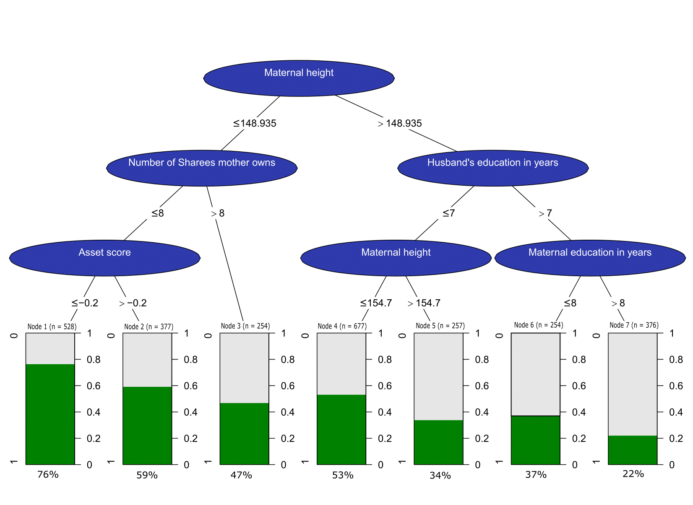

```{r setup, include=FALSE}
knitr::opts_chunk$set(echo = FALSE)
```

## Lab 1 Assignment 2

```{r, include=FALSE, message=FALSE}
library(readr)
library(data.table)
library(ggplot2)
library(dplyr)
library(gridExtra)
library(plotly)
library(shiny)
```

### 1 Reading input
```{r}

data_senic <- read_table2("SENIC.txt", col_names = FALSE)

setnames(data_senic, old = c("X1", "X2", "X3", "X4", "X5", "X6", "X7", "X8", "X9", "X10", "X11", "X12"), 
                     new = c("ID", "length_of_stay", "avg_age", "avg_risk", "culturing_ratio", "chest_xray_ratio",
                           "avg_beds", "school_affil", "region", "avg_daily_census", "avg_nurses", "facility_per"))

# Fixing the datatypes

data_senic$school_affil <- factor(data_senic$school_affil, levels = c(1, 2),labels = c("Yes", "No"))
data_senic$region <- factor(data_senic$region, levels = c(1, 2, 3, 4),labels = c("NE", "NC", "S", "W"))
```

### 2. Function to calculate the oultiers
```{r, include=TRUE}

quant_cal <- function(df, col.name) {

  Q1 <- quantile(df[[col.name]], .25)
  Q3 <- quantile(df[[col.name]], .75)
  
  outlier.end <- which(df[[col.name]] > Q3+1.5*(Q3-Q1))
  outlier.start <- which(df[[col.name]] < Q1-1.5*(Q3-Q1))
  return (c(outlier.end, outlier.start))
}
print("Created function to calculate outliers")
```

### 3. Plotting density plot of infection risk vs. outlier
```{r}

data_senic_numeric <- data_senic[,c("ID", "length_of_stay", "avg_age", "avg_risk", "culturing_ratio", "chest_xray_ratio", "avg_beds", "avg_daily_census", "avg_nurses", "facility_per")]

ploting_helper <-  function(variable, bw){
  data_filtered = as.data.frame(data_senic_numeric[[variable]])
  colnames(data_filtered) <- eval(variable)
  outlier_data <- as.data.frame(data_filtered[quant_cal(data_senic_numeric, eval(variable)),])
  colnames(outlier_data) <- eval(variable) 
  x <- ggplot(data=data_filtered, aes_string(x=eval(variable))) + geom_density(bw=bw) + 
    geom_point(data = outlier_data, aes(y = 0, x = outlier_data[,1]), shape=18, size=2)
  return(x)}

ploting_helper("avg_age", 0.5)
```

Analysis: We see that the number of outliers are fairly small, however this visualization is not very insightful

### 4. Plotting Density Plots for all numeric columns with outliers shown as diamonds
```{r}

p1 <- ploting_helper("length_of_stay", 0.5)  
p2 <- ploting_helper("avg_age", 0.5)  
p3 <- ploting_helper("avg_risk", 0.5)  
p4 <- ploting_helper("culturing_ratio", 0.5)  
p5 <- ploting_helper("chest_xray_ratio", 0.5)  
p6 <- ploting_helper("avg_beds", 0.5)  
p7 <- ploting_helper("avg_daily_census", 0.5)  
p8 <- ploting_helper("avg_nurses", 0.5)  
 

p9 <- ggplot(data=data_senic_numeric, aes(x=facility_per)) + geom_density() # contains no outliers

# final output
grid.arrange(p1, p2, p3, p4, p5, p6, p7, p8, p9) # facility_per does not contain any outlier

```

Analysis: Most parameters are skewed towards right, while only age and risk are close to normally distributed


### 5. Plot of infection risk vs. number of beds
```{r}

ggplot(data = data_senic, aes(x = avg_nurses, y = avg_risk)) + geom_point(aes(color = avg_beds))
```

Analysis: We see trend between number of nurses and risk, as the number of nurses increases risk decrease but this only happens when the average nurse >200, this may be due to the fact that medical facilities with higher risks are higher in number than low risk hospital.
The risk of this colour profile is its hard to distinguish between the levels of beds.


### 6. Converting from ggplot2 to plotly
```{r}

ggplotly(ploting_helper("avg_risk", 0.5)) %>% layout(title = "Density Plot of Infection Risk")
```

Analysis: The ability to pan and zoom are now present.


### 7. Pipelining the plotly function

```{r}

outlier_data <- data_senic_numeric[quant_cal(data_senic_numeric, "avg_risk"),]
  

data_senic %>% select(avg_risk) %>% plot_ly(x = ~avg_risk, type = "histogram") %>% 
  add_markers(x = outlier_data$avg_risk, y = 0, showlegend = FALSE, marker = list(color = "red", symbol = c('diamond'))) %>% layout(title = "Histogram of Infection Risk")

```

### 8. Shiny app uses previous funtions
```{r}

library(shiny)
library(ggplot2)
library(gridExtra)

SENIC <- read.table("SENIC.txt")
colnames(SENIC) = c("ID","Length_of_stay","Age","Infection_risk"
                    ,"Culturing_ratio","Chest_Xrey_ratio","Number_of_Beds",
                    "Medical_school_affiliation","Region","Average_daily_census",
                    "Number_of_nurses","Facilities_and_services")

data_senic <- read_table2("SENIC.txt", col_names = FALSE)

setnames(data_senic, old = c("X1", "X2", "X3", "X4", "X5", "X6", "X7", "X8", "X9", "X10", "X11", "X12"), 
                     new = c("ID", "length_of_stay", "avg_age", "avg_risk", "culturing_ratio", "chest_xray_ratio",
                           "avg_beds", "school_affil", "region", "avg_daily_census", "avg_nurses", "facility_per"))

# Fixing the datatypes

data_senic$school_affil <- factor(data_senic$school_affil, levels = c(1, 2),labels = c("Yes", "No"))
data_senic$region <- factor(data_senic$region, levels = c(1, 2, 3, 4),labels = c("NE", "NC", "S", "W"))

#function to find data in the range
Q1Q3 <- function(x,col){
  Q1 <- quantile(x[,col])[2]
  Q3 <- quantile(x[,col])[4]
  output <- x[which((x[,col] <=(Q3 + 1.5*(Q3-Q1)) )&(x[,col] >= (Q1 - 1.5*(Q3-Q1)) )),col]
  output
}
#function to find out of range data
outliers <- function(x,col){
  Q1 <- quantile(x[,col])[2]
  Q3 <- quantile(x[,col])[4]
  output <- x[which((x[,col] > (Q3 + 1.5*(Q3-Q1)) )|(x[,col] < (Q1 - 1.5*(Q3-Q1)) )),col]
  output
}

#start of ui and sever part
ui <- fluidPage(
  titlePanel(div("Density function dashboard for senic data",
                 style="background-color:aliceblue;text-align:center;
                 font-family:Calibri;height:35px;border-radius:6px;")),
  sidebarLayout(
    sidebarPanel(sliderInput(inputId = "si"
                             ,label = "choose the number of bins for density function"
                             ,min = 0.01
                             ,max = 10
                             ,value = 1
                             )
                ,br()
                ,checkboxGroupInput(inputId = "cb"
                                    ,label = "Choose_the_variable"
                                    ,choices = c("Length_of_stay","Age","Infection_risk"
                                               ,"Culturing_ratio","Chest_Xrey_ratio","Number_of_Beds",
                                               "Average_daily_census",
                                               "Number_of_nurses","Facilities_and_services")
                                    ,selected = c("Length_of_stay","Age","Infection_risk")
                                    
                                    )
                )
    
    ,mainPanel(plotOutput("outplot"))
    
  )
)

server <- function(input,output){
  
  output$outplot <- renderPlot(
    {
    
      #start of function to create plot-----------
      FUN <- function(col){
        if(sum(outliers(SENIC,col))==0)
        {
          df <- data.frame(Q1Q3(SENIC,col))
          colnames(df) = col
          ggplot(data = df)+
            stat_density(data = df,mapping = aes_string(x = colnames(df)), adjust = input$si,color="tan2",fill="tan2",alpha=0.5)
          
        } else {
          df <- data.frame(Q1Q3(SENIC,col))
          colnames(df) = col
          of <- data.frame(outliers(SENIC,col))
          colnames(of) = col 
          ggplot(data = df)+
            stat_density(data = df,mapping = aes_string(x = colnames(df))
                         ,adjust = input$si,color="tan2"
                         ,fill="tan2",alpha=0.5) +
            geom_point(data = of,mapping = aes_string(x = colnames(of),y = numeric(length =length(of)))
                       , color = "blue",shape="diamond")
          
        }
      }
      #-----------------------------end of function
      
      
      #create output grid
      grid.arrange(grobs = lapply(X = input$cb,FUN = FUN),ncol = 3)
      
    }
    
  )
  
}

shinyApp(ui = ui,server = server)

```
The bandwidth of 0.4 seems to be optimal size

### Assignment 1


### Appendix

```{r, echo=TRUE, eval= FALSE}
library(readr)
library(data.table)
library(ggplot2)
library(dplyr)
library(gridExtra)
library(plotly)
library(shiny)

data_senic <- read_table2("SENIC.txt", col_names = FALSE)

setnames(data_senic, old = c("X1", "X2", "X3", "X4", "X5", "X6", "X7", "X8", "X9", "X10", "X11", "X12"), 
                     new = c("ID", "length_of_stay", "avg_age", "avg_risk", "culturing_ratio", "chest_xray_ratio",
                           "avg_beds", "school_affil", "region", "avg_daily_census", "avg_nurses", "facility_per"))

# Fixing the datatypes

data_senic$school_affil <- factor(data_senic$school_affil, levels = c(1, 2),labels = c("Yes", "No"))
data_senic$region <- factor(data_senic$region, levels = c(1, 2, 3, 4),labels = c("NE", "NC", "S", "W"))


# Function to calculate the outliers
quant_cal <- function(df, col.name) {

  Q1 <- quantile(df[[col.name]], .25)
  Q3 <- quantile(df[[col.name]], .75)
  
  outlier.end <- which(df[[col.name]] > Q3+1.5*(Q3-Q1))
  outlier.start <- which(df[[col.name]] < Q1-1.5*(Q3-Q1))
  return (c(outlier.end, outlier.start))
}

# Data manipulation, subsetting by columns
data_senic_numeric <- data_senic[,c("ID", "length_of_stay", "avg_age", "avg_risk", "culturing_ratio", "chest_xray_ratio", "avg_beds", "avg_daily_census", "avg_nurses", "facility_per")]

# Plotting helper
ploting_helper <-  function(variable, bw){
  data_filtered = as.data.frame(data_senic_numeric[[variable]])
  colnames(data_filtered) <- eval(variable)
  outlier_data <- as.data.frame(data_filtered[quant_cal(data_senic_numeric, eval(variable)),])
  colnames(outlier_data) <- eval(variable) 
  x <- ggplot(data=data_filtered, aes_string(x=eval(variable))) + geom_density(bw=bw) + 
    geom_point(data = outlier_data, aes(y = 0, x = outlier_data[,1]), shape=18, size=2)
  return(x)}

### 4. Plotting for all numeric columns

p1 <- ploting_helper("length_of_stay", 0.5)  
p2 <- ploting_helper("avg_age", 0.5)  
p3 <- ploting_helper("avg_risk", 0.5)  
p4 <- ploting_helper("culturing_ratio", 0.5)  
p5 <- ploting_helper("chest_xray_ratio", 0.5)  
p6 <- ploting_helper("avg_beds", 0.5)  
p7 <- ploting_helper("avg_daily_census", 0.5)  
p8 <- ploting_helper("avg_nurses", 0.5) 
p9 <- ggplot(data=data_senic_numeric, aes(x=facility_per)) + geom_density() # contains no outliers

# final output
grid.arrange(p1, p2, p3, p4, p5, p6, p7, p8, p9)

# 5. Plot of infection risk vs. number of beds
ggplot(data = data_senic, aes(x = avg_nurses, y = avg_risk)) + geom_point(aes(color = avg_beds))

# 6. Converting from ggplot2 to plotly

ggplotly(ploting_helper("avg_risk", 0.5)) %>% layout(title = "Density Plot of Infection Risk")

### 7. Pipelining the plotly function

outlier_data <- data_senic_numeric[quant_cal(data_senic_numeric, "avg_risk"),]
  
data_senic %>% select(avg_risk) %>% plot_ly(x = ~avg_risk, type = "histogram") %>% 
  add_markers(x = outlier_data$avg_risk, y = 0, showlegend = FALSE, marker = list(color = "red", symbol = c('diamond'))) %>% layout(title = "Histogram of Infection Risk")

### 8. Shiny app uses previous funtions

library(shiny)
library(ggplot2)
library(gridExtra)

SENIC <- read.table("SENIC.txt")
colnames(SENIC) = c("ID","Length_of_stay","Age","Infection_risk"
                    ,"Culturing_ratio","Chest_Xrey_ratio","Number_of_Beds",
                    "Medical_school_affiliation","Region","Average_daily_census",
                    "Number_of_nurses","Facilities_and_services")

data_senic <- read_table2("SENIC.txt", col_names = FALSE)

setnames(data_senic, old = c("X1", "X2", "X3", "X4", "X5", "X6", "X7", "X8", "X9", "X10", "X11", "X12"), 
                     new = c("ID", "length_of_stay", "avg_age", "avg_risk", "culturing_ratio", "chest_xray_ratio",
                           "avg_beds", "school_affil", "region", "avg_daily_census", "avg_nurses", "facility_per"))

# Fixing the datatypes

data_senic$school_affil <- factor(data_senic$school_affil, levels = c(1, 2),labels = c("Yes", "No"))
data_senic$region <- factor(data_senic$region, levels = c(1, 2, 3, 4),labels = c("NE", "NC", "S", "W"))

#function to find data in the range
Q1Q3 <- function(x,col){
  Q1 <- quantile(x[,col])[2]
  Q3 <- quantile(x[,col])[4]
  output <- x[which((x[,col] <=(Q3 + 1.5*(Q3-Q1)) )&(x[,col] >= (Q1 - 1.5*(Q3-Q1)) )),col]
  output
}
#function to find out of range data
outliers <- function(x,col){
  Q1 <- quantile(x[,col])[2]
  Q3 <- quantile(x[,col])[4]
  output <- x[which((x[,col] > (Q3 + 1.5*(Q3-Q1)) )|(x[,col] < (Q1 - 1.5*(Q3-Q1)) )),col]
  output
}

#start of ui and sever part
ui <- fluidPage(
  titlePanel(div("Density function dashboard for senic data",
                 style="background-color:aliceblue;text-align:center;
                 font-family:Calibri;height:35px;border-radius:6px;")),
  sidebarLayout(
    sidebarPanel(sliderInput(inputId = "si"
                             ,label = "choose the number of bins for density function"
                             ,min = 0.01
                             ,max = 10
                             ,value = 1
                             )
                ,br()
                ,checkboxGroupInput(inputId = "cb"
                                    ,label = "Choose_the_variable"
                                    ,choices = c("Length_of_stay","Age","Infection_risk"
                                               ,"Culturing_ratio","Chest_Xrey_ratio","Number_of_Beds",
                                               "Average_daily_census",
                                               "Number_of_nurses","Facilities_and_services")
                                    ,selected = c("Length_of_stay","Age","Infection_risk")
                                    
                                    )
                )
    
    ,mainPanel(plotOutput("outplot"))
    
  )
)

server <- function(input,output){
  
  output$outplot <- renderPlot(
    {
    
      #start of function to create plot-----------
      FUN <- function(col){
        if(sum(outliers(SENIC,col))==0)
        {
          df <- data.frame(Q1Q3(SENIC,col))
          colnames(df) = col
          ggplot(data = df)+
            stat_density(data = df,mapping = aes_string(x = colnames(df)), adjust = input$si,color="tan2",fill="tan2",alpha=0.5)
          
        } else {
          df <- data.frame(Q1Q3(SENIC,col))
          colnames(df) = col
          of <- data.frame(outliers(SENIC,col))
          colnames(of) = col 
          ggplot(data = df)+
            stat_density(data = df,mapping = aes_string(x = colnames(df))
                         ,adjust = input$si,color="tan2"
                         ,fill="tan2",alpha=0.5) +
            geom_point(data = of,mapping = aes_string(x = colnames(of),y = numeric(length =length(of)))
                       , color = "blue",shape="diamond")
          
        }
      }
      #-----------------------------end of function
      
      
      #create output grid
      grid.arrange(grobs = lapply(X = input$cb,FUN = FUN),ncol = 3)
      
    }
    
  )
  
}

shinyApp(ui = ui,server = server)

```