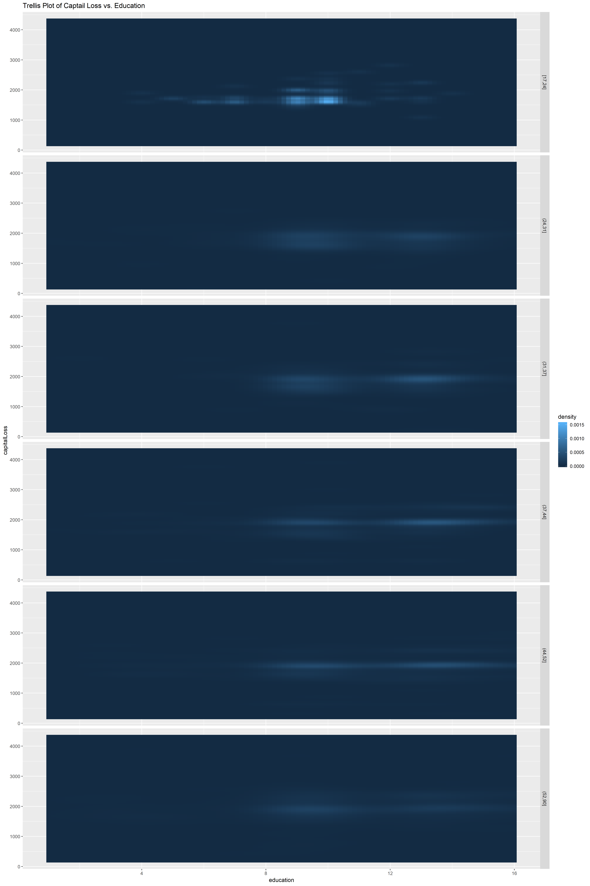

```{r setup, include=FALSE}
knitr::opts_chunk$set(echo = FALSE)
```

## Loading library

```{r, include=FALSE, message=FALSE}
library(data.table)
library(dplyr)
library(scales)
library(plotly)
library(ggplot2)
library(seriation)
library(GGally)

set.seed(42)
```

### 1. Reading input and filter column by index
```{r, echo=TRUE}
knitr::opts_chunk$set(echo = TRUE)
price_data <- read.delim("prices-and-earnings.txt")
price_data <- price_data[,c(1,2,5,6,7,9,10,16,17,18,19)]
```

### 2. Heatmap of data without reorder
```{r}
rownames(price_data) <- price_data$City
price_data_scale <- scale(price_data[,-1])
rownames(price_data_scale) <- price_data$City

plot_ly(x=colnames(price_data_scale), y=rownames(price_data_scale), 
        z=price_data_scale, type="heatmap", colors =colorRamp(c("yellow", "red"))) %>% layout(title = "Heatmap of price dataset")
```

Analysis: No its not possible to see clusters, very hard to even see an outlier.

### 3. Distance matrix computation and ordering by Hierarchical Clustering

```{r}

price_row_dist <- dist(x=price_data_scale, method = "euclidean", diag = TRUE)
price_col_dist <- dist(x=t(price_data_scale), method = "euclidean", diag = TRUE)
price_row_cor <- cor(x=t(price_data_scale))
price_col_cor <- cor(x=price_data_scale)
price_row_cor <- 1- price_row_cor
price_col_cor <- 1- price_col_cor

order1 <- seriate(price_row_dist, "OLO")
order2 <- seriate(price_col_dist, "OLO")
ord1 <- get_order(order1)
ord2 <- get_order(order2)

order1_cor <- seriate(as.dist(price_row_cor), "OLO")
order2_cor <- seriate(as.dist(price_col_cor), "OLO")
ord1_cor <- get_order(order1_cor)
ord2_cor <- get_order(order2_cor)

reordmatr <- price_data_scale[rev(ord1),ord2]
reordmatr_cor <- price_data_scale[rev(ord1_cor),ord2_cor]

plot_ly(x=colnames(reordmatr), y=rownames(reordmatr), 
        z=reordmatr, type="heatmap", colors =colorRamp(c("yellow", "red"))) %>% layout(title = "Heatmap of price dataset ordered using Optimal leaf ordering")

plot_ly(x=colnames(reordmatr_cor), y=rownames(reordmatr_cor), 
        z=reordmatr_cor, type="heatmap", colors =colorRamp(c("yellow", "red"))) %>% layout(title = "Heatmap of correlations of price dataset")
```

Analysis: Both are graphs are similar to each other. We can see a cluster in the digonals of both the plots however, for the the one that uses the correlation as a distance matrix seems like some observations could be paired together. For example, in the second plot, the rows corresponding to `Manila`, `Caracas`, `Jakarta`, `Bogota` and others, could be grouped together due to their high values corresponding to the first 5 variables. This allows implies there are two clusters.

While in the case of the euclidean distance, it's possible to see at least 4 clusters. These clusters are more well defined and less mixed up like the ones seen on the correlation distance matrix heatmap. 


### 4. Distance matrix computation and ordering by Traveling Sales Man
```{r}
order1_tsp <- seriate(price_row_dist, "TSP")
order2_tsp <- seriate(price_col_dist, "TSP")
ord1_tsp <- get_order(order1_tsp)
ord2_tsp <- get_order(order2_tsp)
reordmatr <- price_data_scale[rev(ord1_tsp),ord2_tsp]

plot_ly(x=colnames(reordmatr), y=rownames(reordmatr), 
        z=reordmatr, type="heatmap", colors =colorRamp(c("yellow", "red"))) %>% layout(title = "Heatmap of price dataset ordered using Traveling Sales Man")

## Comparing the optimization
criterion(dist(price_data_scale[rev(ord1_tsp)], method = "euclidean"), method = c("Gradient_raw", "Path_length"))
criterion(dist(price_data_scale[rev(ord1)], method = "euclidean"), method = c("Gradient_raw", "Path_length"))
```

Analysis: The Traveling Sales Person solver was the best at minimizing the `Path Length` (loss function) while the HC performed better at maximizing the 'Gradient Measure' (merit function).

### 5. Parallel Coordinate Plots
```{r}

setnames(price_data, old = c("Food.Costs...", "iPhone.4S.hr.", "Clothing.Index", "Hours.Worked", 
                             "Wage.Net", "Vacation.Days", "Big.Mac.min.", "Bread.kg.in.min.", 
                             "Rice.kg.in.min.", "Goods.and.Services..."), 
         new=c("FoodCosts", "iPhone4S", "ClothingIndex", "Hours", "NetWage", "VacationDays", 
               "BigMac", "Bread", "Rice", "GoodsServices"))

price_data[,-1] %>% plot_ly(type = 'parcoords', 
                             dimensions = list(
                               list(label = "Food Costs", values = ~FoodCosts),
                               list(label = "iPhone 4S", values = ~iPhone4S),
                               list(label = "Clothing Index", values = ~ClothingIndex),
                               list(label = "Hours Worked", values = ~Hours),
                               list(label = "Wage Net", values = ~NetWage),
                               list(label = "Vacation Days", values = ~VacationDays),
                               list(label = "Big Mac", values = ~BigMac),
                               list(label = "Bread", values = ~Bread),
                               list(label = "Rice", values = ~Rice),
                               list(label = "Goods Services", values = ~GoodsServices)))

#coloring lines
data=price_data[,-1]
data$BigMac_cluster=ifelse(data$BigMac <= 21, 1, 0)
obj <- ggparcoord(data, scale="uniminmax", groupColumn = "BigMac_cluster")

ggplotly(obj)
```

Analysis: Using iPhone4S, BigMac, Netwage and Foodcost clusters can be formed. We can see that split on the variable BigMac, there are two distinct clusters, one where BigMac < 21 and BigMac > 21. There appears to be no outlier considering the variables that we have formed the cluster on (BigMac, NetWage, FoodCost, iPhone4S).

Outside the variables there is an outlier which can be seen `Food.Costs` with a value of almost 2. This observation corresponds to the city of `Caracas`. This city is the capital of Venezuela currently under hyper inflation.

### 6. Radar Chart Plots
```{r}

reordmatr <- as.data.frame(reordmatr)
reordmatr$City = rownames(reordmatr)

reordmatr_transformed <- reordmatr%>%tidyr::gather(variable, value, -City, factor_key=T)%>%arrange(City)

first_col_order <- rownames(reordmatr)
second_col_order <- unique(reordmatr_transformed$variable)

reordmatr_transformed$City <- factor(reordmatr_transformed$City , levels = first_col_order)
reordmatr_transformed$variable <- factor(reordmatr_transformed$variable , levels = second_col_order)

reordmatr_transformed <- reordmatr_transformed[order(reordmatr_transformed$City, reordmatr_transformed$variable),]

radar_plot <- reordmatr_transformed %>% ggplot(aes(x=variable, y=value, group=City)) + geom_polygon(fill="blue") + coord_polar() + theme_bw() + facet_wrap(~ City) + theme(axis.text.x = element_text(size = 5))
 
ggsave("radar_plot.png", width = 40, height = 60, units = "cm")
```

```{r pressure, echo=FALSE, out.width = '100%'}
knitr::include_graphics("radar_plot.png")
```

Analysis: Berlin, Madrid and Barcelona is one of the cluster. Mumbai, Delhi and Cario is the second cluster. The outliers are the following: Barcelona in first cluster and Mumbai in second cluster.

### 7. Best tools for Analysis
Analysis: Radar plot was the most effective. Its easy to see clusters and pattern and compare two very classes very well as well as picking outliers.

## Assignment 2

### 1. Scatter and Trellis Plot Hours Per Week versus Age
```{r, echo=TRUE}
knitr::opts_chunk$set(echo = TRUE)
adult_data <- read.csv("adult.csv", header = FALSE)
colnames(adult_data) <- c("age", "workclass", "fnlwgt", "educationType", "education", "marital", "occupation", "relationship", "race", "sex", "capitalGain", "capitalLoss", "hours", "nativeCountry", "incomeLevel")

# Scatter Plot
ggplot(data = adult_data, aes(x=age, y=hours, colour = incomeLevel)) + geom_point() + ggtitle("Hours per Week vs. Age")

# Trellis Plot
ggplot(data = adult_data, aes(x=age, y=hours, color = incomeLevel)) + geom_point()+ facet_grid(incomeLevel~.) + ggtitle("Hours per Week vs. Age")
```

Analysis: People earning less than 50K tend to work for longer hours and longer age. This information was difficult to see in the scatter plot 

### 2. Density and Trellis Plot of Age
```{r}
ggplot(adult_data, aes(age, colour = incomeLevel, fill = incomeLevel)) + geom_density(alpha = 0.1) + ggtitle("Denisty Plot of Age")

ggplot(data = adult_data, aes(x=age, color = incomeLevel, fill = incomeLevel)) + geom_density(alpha = 0.1) + facet_grid(marital~.) + ggtitle("Trellis Plot of Age vs. Marital Status")
```

Analysis: Rich people are older than poor people. Also we can see that there is more variance in poor people.
As we see from divorced people, married-civ-spouse, separated, widowed graphs have the almost same distribution of the age by income level.  
Low level income people who are never married tend to be young which is expected, because people who have low level income are usually younger and they don't tend to be married early in life.

Married people that are elder tend to have low level income than the younger ones. In the same graph we can see that younger or elder people do not have much difference between incomes.

### 3. 3D scatter plot and Trellis Plot of Education-num vs Age vs Captial Loss
```{r}
adult_data %>% filter(capitalLoss > 0) %>% plot_ly(x = ~education, y = ~age, z = ~capitalLoss) %>% add_markers() %>% layout(scene = list(xaxis = list(title = 'Education'), yaxis = list(title = 'Age'), zaxis = list(title = 'CapitalLoss')))
```

```{r}
adult_data$age_discreet <- cut_number(adult_data$age, 6)

raster_3d <- adult_data %>% filter(capitalLoss > 0) %>% ggplot(aes(x=education, y=capitalLoss)) + stat_density_2d(aes(fill = ..density..), geom = "raster", contour = FALSE) + facet_grid(age_discreet~.) + ggtitle("Trellis Plot of Captail Loss vs. Education")

ggsave("raster_3d.png", width = 40, height = 60, units = "cm")
```

```{r raster, echo=FALSE, out.width = '100%'}

```

Analysis: The 3D scatter plot is difficult to analyse due to density of data around similar values. In the raster type 2D density we definetly see outliers/clusters, which is the most prominent in the age group of 17-24, around captailloss of 1500.

### 4. Trellis Plot  of Capital Loss versus Education-num
```{r}
# Trellis Plot

adult_data$age_discreet <- cut_number(adult_data$age, 4)

ggplot(data = adult_data, aes(x=education, y=capitalLoss, color = capitalLoss)) + 
  geom_point() + facet_grid(age_discreet~.) + 
  ggtitle("Education vs. Capital Loss")

Agerange <-lattice::equal.count(adult_data$age, number=4, overlap=0.10) #overlap is 10% 

L<-matrix(unlist(levels(Agerange)), ncol=2, byrow = T)

L1<-data.frame(Lower=L[,1],Upper=L[,2], Interval=factor(1:nrow(L)))

index=c()
Class=c()
for(i in 1:nrow(L)){
  Cl=paste("[", L1$Lower[i], ",", L1$Upper[i], "]", sep="")
  ind=which(adult_data$age>=L1$Lower[i] &adult_data$age<=L1$Upper[i])
  index=c(index,ind)
  Class=c(Class, rep(Cl, length(ind)))
}

df4<-adult_data[index,]
df4$Class<-as.factor(Class)


ggplot(data = df4, aes(x=education, y=capitalLoss, color = capitalLoss)) + 
  geom_point() + facet_grid(Class~.) + 
  ggtitle("Education vs. Capital Loss using Shingles")
```

Analysis: We can see more smooth transition between bins of age that are divided by shingles, that is to say that shingles is a way of categorical to continous convertor, this is the advantage of using shingles. 

The main disadvantage -> Shingles can create/destroy some patterns which are not visible otherwise. For example in the 4th bin without shingles, it is visible that the points are more concentrated while in the one with shingles, the data seems more spread out.

### Apendix
```{r, ref.label=knitr::all_labels(),echo=TRUE,eval=FALSE}
```
