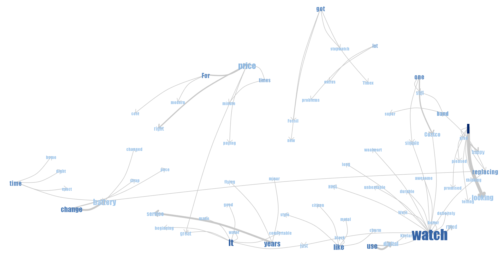
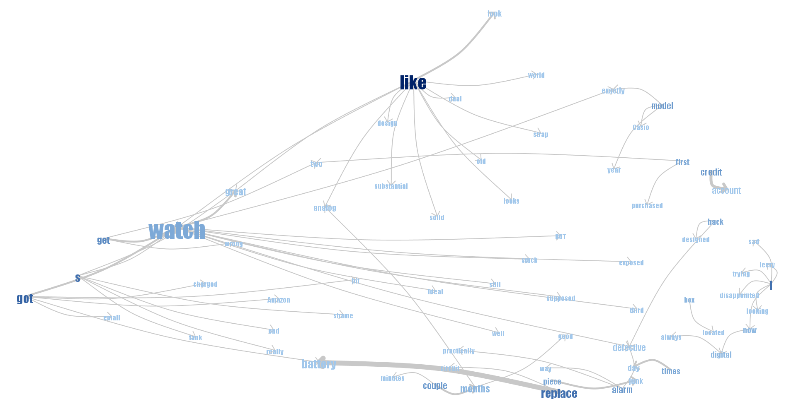

```{r setup, include=FALSE, warning=FALSE}
knitr::opts_chunk$set(echo = FALSE)
```

## Loading library

```{r, include=FALSE, message=FALSE}
library(data.table)
library(dplyr)
library(plotly)
library(ggplot2)
library(GGally)
library(crosstalk)
library(tidyr)
library(NLP)
library(tm)
library(RColorBrewer)
library(wordcloud)

set.seed(42)
```
### Assignment 1
```{r}
data_1<-read.table("Five.txt",header=F, sep='\n') #Read file
data_1$doc_id=1:nrow(data_1) ## using rownames will do
colnames(data_1)[1]<-"text"

#Here we interpret each line in the document as separate document
mycorpus_1 <- Corpus(DataframeSource(data_1)) #Creating corpus (collection of text data_1)
mycorpus_1 <- tm_map(mycorpus_1, removePunctuation)
mycorpus_1 <- tm_map(mycorpus_1, function(x) removeWords(x, stopwords("english")))
tdm_1 <- TermDocumentMatrix(mycorpus_1) #Creating term-document matrix
m_1 <- as.matrix(tdm_1)

#here we merge all rows
v_1 <- sort(rowSums(m_1),decreasing=TRUE) #Sum up the frequencies of each word
d_1 <- data.frame(word = names(v_1),freq=v_1) #Create one column=names, second=frequences
pal_1 <- brewer.pal(6,"Dark2")
pal_1 <- pal_1[-(1:2)] #Create palette of colors
wordcloud(d_1$word,d_1$freq, scale=c(8,.3),min.freq=2,max.words=100, random.order=F, rot.per=.15, colors=pal_1, vfont=c("sans serif","plain"))

data_2<-read.table("OneTwo.txt",header=F, sep='\n') #Read file
data_2$doc_id=1:nrow(data_2)
colnames(data_2)[1]<-"text"

#Here we interpret each line in the document as separate document
mycorpus_2 <- Corpus(DataframeSource(data_2)) #Creating corpus (collection of text data_1)
mycorpus_2 <- tm_map(mycorpus_2, removePunctuation)
mycorpus_2 <- tm_map(mycorpus_2, function(x) removeWords(x, stopwords("english")))
tdm_2 <- TermDocumentMatrix(mycorpus_2) #Creating term-document matrix
m_2 <- as.matrix(tdm_2)

#here we merge all rows
v_2 <- sort(rowSums(m_2),decreasing=TRUE) #Sum up the frequencies of each word
d_2 <- data.frame(word = names(v_2),freq=v_2) #Create one column=names, second=frequences
pal_2 <- brewer.pal(6,"Dark2")
pal_2 <- pal_2[-(1:2)] #Create palette of colors
wordcloud(d_2$word,d_2$freq, scale=c(8,.3),min.freq=2,max.words=100, random.order=F, rot.per=.15, colors=pal_2, vfont=c("sans serif","plain"))
```





Analysis: The people who are happy with the watch talk about the durability, low price, easy to read, the nice looks and the fact that they go well with any clothing/occasion.

Characteristics commonly mentioned: Appearence, Quality, Cost, Display features- Analog and Digital display, Luminousity


The people who are unhappy about these are complaining about the battery and issues of the watch not working soon such as alaram, Chronometer and buttons being defective. 

However the brand was common in both good and bad reviews.

### Assignment 2

```{r, echo=FALSE}
knitr::opts_chunk$set(echo = TRUE)
olive_data <- read.csv("olive.csv")
olive_data <- olive_data[,-1]
olive_data$Region <- factor(olive_data$Region, levels = c(1,2,3))
shared_olive <- SharedData$new(olive_data)

```

### 1. Interactive Scatter Plot eicosenoic against linoleic
```{r}
scatter_olive <- shared_olive %>% plot_ly() %>% add_markers(x = ~eicosenoic
                                                  ,y = ~linoleic, color = I("blue"))

scatter_olive
```

### 2. Linking bar chart to Scatter Plot eicosenoic against linoleic
```{r}

bar_olive <- shared_olive %>% plot_ly(x = ~Region) %>% add_histogram(color = I("blue")) %>% layout(barmode = 'overlay')

bscols(widths = c(3,NA), filter_slider(id = "FS",label = "values of stearic",sharedData = shared_olive, column = ~stearic)
,subplot(scatter_olive, bar_olive) %>% highlight(on = 'plotly_select'
                               ,off = 'plotly_deselect',persistent = FALSE 
                               ,dynamic = TRUE, color = c("red","blue","gold","green")
                               ,opacityDim = I(1)) %>% hide_legend() %>% layout(title = "Linked Scatter Plot of Eicosenoic against linoleic"))
```

Analysis: The interaction operators used here are: Level of details since the bar chart can be used to identify region. The additional relationship here is that the low values all belong to region 2 and 3.

### 3. eicosenoic against linoleic and arachidic against linolenic
```{r}
scatter1 <- shared_olive %>% plot_ly() %>% add_markers(x = ~eicosenoic
                                       ,y = ~linoleic, color = I("yellow")
                                       ,hoverinfo = 'text'
                                       ,text = ~paste0('eicosenoic: ',eicosenoic,'<br>'
                                                       ,'linoleic: ',linoleic)
                                       )

scatter2 <- shared_olive %>% plot_ly() %>% add_markers(x = ~arachidic
                                       ,y = ~linoleic, color = I("black")
                                       ,hoverinfo = 'text'
                                       ,text = ~paste0('arachidic: ',arachidic,'<br>'
                                                       ,'linoleic: ',linoleic)
                                       )

subplot(scatter1,scatter2,shareY = TRUE) %>% highlight(on = 'plotly_select',off = 'plotly_deselect'
                                         ,persistent = FALSE ,dynamic = TRUE
                                         ,opacityDim = I(1)
                                         ,color = c("red","blue","gold","green") 
                                         ) %>% layout(title = "Linked Scatter Plot of Eicosenoic against linoleic and arachidic against linolenic")
```
Analysis: Points that are also at the bottom of the Eicosenoic Vs. Linoleic plot which are the outliers. Also two points which are greater then 1400 in Linoleic scale are also outliers in both plots which are not grouped.


### 4. Parallel coordinate plot, a linked 3d-scatter plot and linked bar chart 
```{r, warning=FALSE}

parcoord <- olive_data %>% ggparcoord(columns = c(3:10),scale = 'uniminmax')
d_parcood <- plotly_data(ggplotly(parcoord)) %>% group_by(.ID)
sh_parcood <- SharedData$new(d_parcood, key = ~.ID, group = "olive")
parcoord4 <- sh_parcood %>% plot_ly(x = ~variable, y = ~value, color = I("slategray3")) %>% add_lines(
line = list(width = 0.4)) %>% add_markers(marker=list(size=0.3), text=~.ID, hoverinfo="text")

olive2=olive_data
olive2$.ID=1:nrow(olive_data)
d2<-SharedData$new(olive2, ~.ID, group="olive")
p2<-plot_ly(d2, x=~factor(Region) )%>%add_histogram()%>%layout(title = "Region",barmode="overlay")
```

```{r}

ButtonsX=list()
for (i in 3:10){
  ButtonsX[[i-2]]= list(method = "restyle",
                        args = list( "x", list(olive_data[[i]])),
                        label = colnames(olive_data)[i])
}
ButtonsY=list()
for (i in 3:10){
  ButtonsY[[i-2]]= list(method = "restyle",
                        args = list( "y", list(olive_data[[i]])),
                        label = colnames(olive_data)[i])
}
ButtonsZ=list()
for (i in 3:10){
  ButtonsZ[[i-2]]= list(method = "restyle",
                        args = list( "z", list(olive_data[[i]])),
                        label = colnames(olive_data)[i])
}


p3 <- plot_ly(d2, x = ~eicosenoic, y= ~linoleic, z = ~arachidic, alpha = 0.8) %>%
  add_markers() %>%
  layout(xaxis=list(title=""), yaxis=list(title=""), zaxis=list(title=""),
         title = "Select variable:",
         updatemenus = list(
           list(y=1.00, buttons = ButtonsX),
           list(y=0.85, buttons = ButtonsY),
           list(y=0.70, buttons = ButtonsZ)
         )  )

bscols(parcoord4%>%highlight(on="plotly_select", dynamic=T, persistent = T, opacityDim = I(1))%>%
         hide_legend(),
       p3%>%highlight(on="plotly_click", dynamic=T, persistent = T)%>%hide_legend(),
       p2%>%highlight(on="plotly_click", dynamic=T, persistent = T)%>%hide_legend())

```

### 5. Analysis of 4.


The interaction operators used are:

Selection operator- Attribute space, Connection operator- Data value space, Navigation operator- Screen space, Reconfiguring operator- Data value space, Encoding operator- Data value space

We chose the region by brushing and connected observations were showed on parallel coordinate plot. Re configuring operator is used when we are selecting variables for the 3D scatter plot.

Strategy for better analysis: Coloring by region, this allows to understand the hierarchical clusters in the data. Multiple Linked scatter plots (per region) are excellent to see outliers and allow to see for correleations above different variables. Finally using these both using them on a 3D scatter plot seems to provide an excellent insight.

Applying that statergy leads to the following: Region 1 can be discovered easily by higher level of Eicosenoic.
Levels of Oleic can be used to discover Region 3. Region two is the remains points

### Apendix
```{r, ref.label=knitr::all_labels(),echo=TRUE,eval=FALSE}
```
