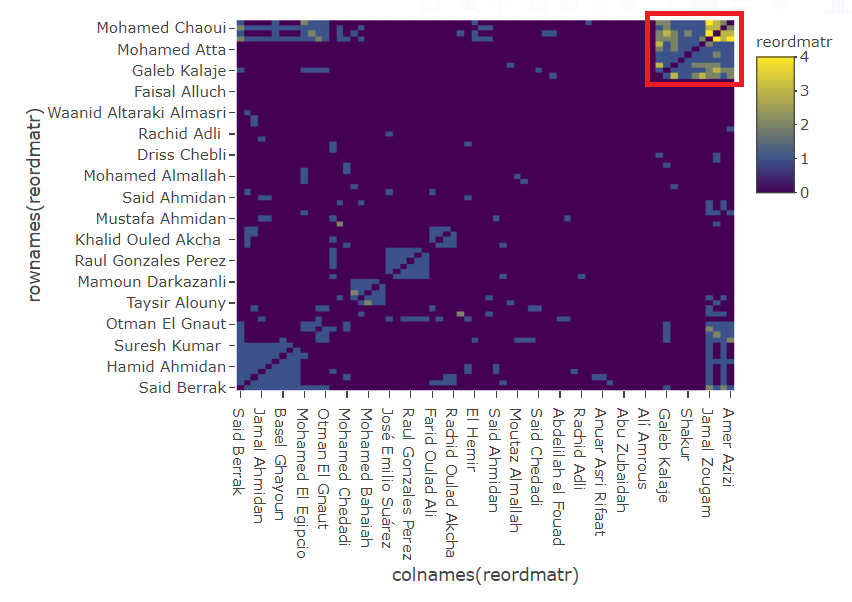

```{r setup, include=FALSE}
knitr::opts_chunk$set(echo = TRUE)

```

<!-- Whitespace -->
<div style="margin-bottom:100px;">
</div>

### Contributions

During the lab, Hariprasath focused on assignment 2 and Lakshidaa focused on assignment 1. After the lab, both of us collaborated to complete the remaining tasks and to clarify each other's doubts. Then we discussed together and answered the questions related to analysis and interpretation of the plots.

```{r message=FALSE, warning=FALSE, echo=FALSE}
# Loading required R packages
library(plotly)
library(dplyr)
library(tourr)
library(reshape)
library(ggraph)
library(igraph)
library(visNetwork)
library(seriation)

#------------------------------------------------------------------------------

```

# Assignment 1: Network visualization of terrorist connections

```{r, echo=FALSE}
# Assignment 1: Network visualization of terrorist connections

# Reading data
links <- read.table("trainData.dat", as.is=T)
nodes <- as.data.frame(read.table("trainMeta.dat", as.is=T))

```

## Task 1.1

A graph which uses the strength of links variable with its nodes colored based on the Bombing Group. The size of the nodes is proportional to the number of connections between the nodes. The layout used optimizes repulsion forces and all nodes that are connected to a currently selected node by a path of length one are highlighted.

```{r, echo=FALSE}
# Task 1.1

colnames(links) <- c("from","to","strength")
links <- links[order(links$from, links$to),]
nodes$id <- 1:70
rownames(links) <- NULL

colnames(nodes)[2] <- "BombingGrp"

#Size of links based on "strength of links"
links$width <- links$strength*3

#Nodes colored based on Bombing Group
nodes$label <- nodes$V1
nodes$group <- nodes$BombingGrp

#Size of nodes proportional to the number of connections
graph <- graph.data.frame(links, directed = F)
strength_value <- strength(graph)
nodes$value <- strength_value[match(nodes$id, names(strength_value))]

```

```{r}
visNetwork(nodes, links) %>% 
  visLegend() %>% 
  visLayout(randomSeed = 8) %>% 
  visPhysics(solver="repulsion") %>% 
  visOptions(highlightNearest = list(enabled = T, degree = 1, hover = T))

```

In this network, the following clusters can be seen :

- Mohamed Belfatmi, Mohamed Atta, Abu Musad Alsakaoui, Said Bahaji, Shakur and Ramzi Binalshibh.
- Suresh Kumar, Jamal Ahmidan, Vinay Kholy and Hamid Ahmidan.
- Farid Oulad Ali, Rachid Oulad Akcha and Mohamed Oulad Akcha.
- Mohamed Bahaiah, Anwar Adnan Ahmad and Mamoun Darkazanli.
- El Gitanillo, Ivan Granados, Emilio Llamo and Antonio Toro.

## Task 1.2

The plot highlights all nodes that are connected to the selected node by a path of length one or two.

```{r, echo=FALSE}
#------------------------------------------------------------------------------

# Task 1.2

```
```{r}
visNetwork(nodes, links) %>% 
  visLegend() %>% 
  visLayout(randomSeed = 12) %>% 
  visPhysics(solver="repulsion") %>% 
  visOptions(highlightNearest = list(enabled = T, degree = 2, hover = T))

```

Jamal Zougam (figure 1.2.1) is found to be the individual with the best opportunity to spread information in the network. He took part in the 2004 Madrid train bombings. 

#### Figure 1.2.1: 


Jamal Zougam was responsible for the Madrid bombings in 2007. He has been linked to Islamist terrorist activities in Spain, France, Norway and their native Morocco over the past nine years. Zougam was introduced to Abu Qutada by Barakat Yarkas on one of his visits to London. In 2001, it was an identified fact that Zougam was connected to international links. His half brother is Mohamed Chaoui, who is seen to be the second best from the graph to spread information in the network. They ran a mobile telephone shop in Madrid when 10 rucksack bombs exploded in the trains. A mobile phone which was converted to a detonator was found in a rucksack which did not explode. The investigators linked it to their shop. It was also noted that Zougam was linked with the Casablanca bombings. He also met with members of Salafia Jihadia, the Moroccan militant group accused of carrying out the attacks, in 2001.
 
## Task 1.3

Clusters obtained by optimizing edge betweenness and visualizing the resulting network. 

```{r, echo=FALSE}
#------------------------------------------------------------------------------

# Task 1.3

for(i in 1:nrow(links)){
  links$from_name[i] <- nodes$V1[links$from[i]]
  links$to_name[i] <- nodes$V1[links$to[i]]
}

links <- links[,c("from_name","to_name","from","to","strength","width")]
nodes1 <- nodes
net <- graph_from_data_frame(d=links, vertices=nodes, directed=F)
ceb <- cluster_edge_betweenness(net) 
nodes1$group <- ceb$membership

```
```{r}
visNetwork(nodes1,links) %>% 
  visIgraphLayout() %>% 
  visOptions(highlightNearest = list(enabled = T, degree = 2, hover = T))

```

All the clusters identified from step 1 were more easily identified in the following graph.

Apart from the already identified clusters, the following clusters could also be identifed from this graph :
- Mohamed Chaoui, Jamal Zougam, OM. Othman Abu Qutada, Said Berrak, Abdeluahid Berrak
- El Gitanillo, Emilio Llamo, Raul Gonzales Perez, Antonio Toro, Ivan Granados, Jose Emilio Surez

## Task 1.4

Using adjacency matrix representation to perform a permutation by Hierarchical Clustering (HC) seriation method and visualizing the graph as a heatmap.

```{r, echo=FALSE}
#------------------------------------------------------------------------------

# Task 1.4

netm <- get.adjacency(net, attr="strength", sparse=F)
colnames(netm) <- V(net)$name
rownames(netm) <- V(net)$name

rowdist<-dist(netm)

order1<-seriate(rowdist, "HC")
ord1<-get_order(order1)

reordmatr<-netm[ord1,ord1]

```
```{r}
plot_ly(z=~reordmatr, x=~colnames(reordmatr), 
        y=~rownames(reordmatr), type="heatmap")

```

The most pronounced cluster is the one highlighted with a red border in the following image :

#### Figure 1.4.1: 


The most prominent cluster obtained here was similar to the clusters identified in step 3 but was not identified in step 1. But, it is more easier to identify the cluster in the heatmap as it appears well separated and distinct. The most connected people within this cluster appear to be Mohamed Chaoui, Jamal Zougam, Amer Azizi and Imad Eddin Barakat.

# Assignment 2: Animations of time series data

```{r, echo=FALSE}
#------------------------------------------------------------------------------

# Assignment 2: Animations of time series data

# Reading data from CSV
oc_data = read.csv2("Oilcoal.csv")

# Pre-processing the data
oc_data$X = NULL
# oc_data$Coal = gsub(",", "", oc_data$Coal)
# oc_data$Oil = gsub(",", "", oc_data$Oil)
# oc_data$Marker.size = gsub(",", ".", oc_data$Marker.size)
# 
# oc_data$Coal = as.numeric(oc_data$Coal)
# oc_data$Oil = as.numeric(oc_data$Oil)
# oc_data$Marker.size = as.numeric(oc_data$Marker.size)

```

```{r}
head(oc_data)

```

# Task 2.1

```{r, echo=FALSE}
#------------------------------------------------------------------------------

# Task 2.1

```

```{r, warning=FALSE, message=FALSE}
plot_ly(oc_data, x= ~Oil, y= ~Coal, frame = ~Year, color = ~Country) %>% 
  add_markers(size = ~Marker.size, marker = list(sizemin = 5)) %>% 
  animation_opts(500, easing = "cubic", redraw = F) %>% 
  layout(title = "Animated Bubble Chart - Coal vs Oil (in million tonnes)")

```

**List several noteworthy features of the investigated animation.**

We observed the following noteworthy features in the animated bubble chart:

* Initially, US had the highest coal and oil consumption among all countries. But, starting from 1986, China's coal consumption increased above the level of US.
* In 1974 and 1975, most countries had a decrease in oil consumption.
* During the period 1979-1983, many countries again had a decrease in oil consumption.
* In the 2000s, China seems to have a very drastic increase in coal consumption.
* India's coal and oil consumption appears to be growing gradually.

# Task 2.2

```{r, echo=FALSE}
#------------------------------------------------------------------------------

# Task 2.2

```

```{r, warning=FALSE, message=FALSE}
# France/Germany

country_1 = "France"
country_2 = "Germany"

plot_ly(oc_data[oc_data$Country == country_1 | oc_data$Country == country_2,], 
        x = ~Oil, y = ~Coal, frame = ~Year, color = ~Country) %>%
  add_markers(size = ~Marker.size, marker = list(sizemin = 5)) %>% 
  animation_opts(500, easing = "cubic", redraw = F) %>% 
  layout(title = "Animated Bubble Chart - Coal vs Oil (in million tonnes)")

```

France and Germany seem to have the most similar motion patterns overall. Germany appears to have higher coal consumption than France but their motion patterns are similar.

Some of the sudden changes observed in the motion of France and Germany are:

* **In 1974 and 1975, Germany and France had a drop in oil consumption.** This could have been because of the oil crisis that occurred in 1973. The members of the  Organization of Arab Petroleum Exporting Countries had started an oil embargo which affected countries worldwide and led to an increase in oil prices as well.
* **Between 1980 and 1983, Germany and France had drastic decrease in oil consumption.** These are possibly the after effects of the 1970s oil crisis. The demand for oil reduced in the 1980s in many countries and there was a surplus of oil available.
* **In 1990s, Germany reduced their coal consumption by a large amount.** This could be the time period when Germany started shifting from coal to other renewable sources like wind energy.


# Task 2.3

```{r, echo=FALSE}
#------------------------------------------------------------------------------

# Task 2.3

oc_data$oil_prop = 100* oc_data$Oil / (oc_data$Oil + oc_data$Coal)
oc_data_zero = oc_data
oc_data_zero$oil_prop = 0
oc_line_anim_data = rbind(oc_data, oc_data_zero)

```

```{r, warning=FALSE, message=FALSE}
plot_ly(oc_line_anim_data, x = ~oil_prop, y = ~Country, frame = ~Year) %>% 
  add_lines(split = ~Country, line = list(width = 10)) %>% 
  animation_opts(500, easing = "cubic", redraw = F) %>% 
  layout(title = "Animated Bar Chart - Percentage Fuel Consumption of Oil")

```

**Analysis:**

* China had the lowest fuel consumption related to oil overall. Brazil had the highest fuel consumption related to oil overall.
* Generally, the fuel consumption related to oil grows gradually until 1974 and since then there are some fluctuations for all the countries.
* Over the years, France has reached a very high value of fuel consumption related to oil and close to Brazil.

**Advantages:**

* We can easily compare the values between the countries as it is more easier to perceive and compare the values from bars compared to position of dots.
* It is easier to observe events where multiple countries show simultaneous increase/decrease.
* It is easy to observe the direction of motion of the bars and hence it is easier to compare the current value with the value of the immediately previous year.

**Disadvantages:**

* From the animation of the bars, it is difficult to observe the trends in the values over a larger time period. 
* While it is easy to compare the values between different countries, it is difficult to compare with previous values of the same country (not including the immediately previous value)


# Task 2.4

```{r, echo=FALSE}
#------------------------------------------------------------------------------

# Task 2.4

```

```{r, warning=FALSE, message=FALSE}
plot_ly(oc_line_anim_data, x = ~oil_prop, y = ~Country, frame = ~Year) %>% 
  add_lines(split = ~Country, line = list(width = 10)) %>% 
  animation_opts(500, easing = "elastic", redraw = F) %>% 
  layout(title = "Animated Bar Chart - Percentage Fuel Consumption of Oil")

```

**Advantage: **
The data that we have is only year-wise. While using a linear transition, the bar is moved slowly between the values and suggests a gradual increase in the data. Also, we spend more time observing the intermediate values. But actually, our data is discrete. Using an elastic easing, we can move faster between the values and we are able to observe the actual value in the year for a longer time. This might improve our perception of the actual values.

**Disadvantage: **
Since the motion of the bars feel more discrete, it is slightly tougher to observe trends of increase/decrease in the values. 

# Task 2.5

```{r, echo=FALSE, message=FALSE, warning=FALSE, results="hide"}
#------------------------------------------------------------------------------

# Task 2.5

#A modified code from plotly's website

oc_tour_data = cast(oc_data[,1:3], Year ~ Country, value = "Coal")

mat <- rescale(oc_tour_data)
set.seed(12345)
#tour <- new_tour(mat, grand_tour(), NULL)
tour<- new_tour(mat, guided_tour(cmass), NULL)

steps <- c(0, rep(1/15, 200))
Projs<-lapply(steps, function(step_size){  
  step <- tour(step_size)
  if(is.null(step)) {
    .GlobalEnv$tour<- new_tour(mat, guided_tour(cmass), NULL)
    step <- tour(step_size)
  }
  step
})

# projection of each observation
tour_dat <- function(i) {
  step <- Projs[[i]]
  proj <- center(mat %*% step$proj)
  data.frame(x = proj[,1], y = proj[,2], state = rownames(mat))
}

# projection of each variable's axis
proj_dat <- function(i) {
  step <- Projs[[i]]
  data.frame(
    x = step$proj[,1], y = step$proj[,2], variable = colnames(mat)
  )
}

stepz <- cumsum(steps)

# tidy version of tour data

tour_dats <- lapply(1:length(steps), tour_dat)
tour_datz <- Map(function(x, y) cbind(x, step = y), tour_dats, stepz)
tour_dat <- dplyr::bind_rows(tour_datz)

# tidy version of tour projection data
proj_dats <- lapply(1:length(steps), proj_dat)
proj_datz <- Map(function(x, y) cbind(x, step = y), proj_dats, stepz)
proj_dat <- dplyr::bind_rows(proj_datz)

ax <- list(
  title = "", showticklabels = FALSE,
  zeroline = FALSE, showgrid = FALSE,
  range = c(-1.1, 1.1)
)

# for nicely formatted slider labels
options(digits = 3)
tour_dat <- highlight_key(tour_dat, ~state, group = "A")

# step = 7.67

```

```{r, warning=FALSE, message=FALSE}
tour <- proj_dat %>%
  plot_ly(x = ~x, y = ~y, frame = ~step, color = I("black")) %>%
  add_segments(xend = 0, yend = 0, color = I("gray80")) %>%
  add_text(text = ~variable) %>%
  add_markers(data = tour_dat, text = ~state, ids = ~state, hoverinfo = "text") %>%
  layout(xaxis = ax, yaxis = ax, title = "Guided 2D tour visualizing coal consumption of countries")

tour

```

#### Figure 2.5.1: 


In figure 2.5.1, we observe the projection which is the most compact and has well separated clusters. This occurs at a step value of 10.1. 

#### Figure 2.5.2: 


**Clusters: **

In figure 2.5.2, the different clusters are marked in this projection. 

* Cluster 1: 1965-1975
* Cluster 2: 1976-1984
* Cluster 3: 1985-2001
* Cluster 4: 2002-2009

Yes, it appears like the clusters clearly correspond to different year ranges.

The variable which has the largest contribution to the projection can be identified by comparing the lengths of the different axes in the projection. The axes which has the longest length is the largest contributor to the projection. Based on this strategy, we can see that Brazil is the largest contributor to this projection.

We can observe similar structure in the following time series plot as well. We see the big jump which happened between 1983-1985. This feature can be observed in the projection as well, where it occurs along the axis for Brazil.

```{r}
# Time series plot - Brazil
plot_ly(oc_tour_data)%>%
  add_markers(x=~Year, y=~Brazil, name="Brazil") %>%
  layout(title = "Time series plot of Brazil's coal consumption")

```

# Appendix
```{r, ref.label=knitr::all_labels(), echo=TRUE, eval=FALSE}
```

