```{r setup, include=FALSE}
knitr::opts_chunk$set(echo = TRUE)

```

<!-- Whitespace -->
<div style="margin-bottom:100px;">
</div>

### Contributions

During the lab, Hariprasath focused on assignment 2 and Lakshidaa focused on assignment 1. After the lab, both of us collaborated to complete the remaining tasks and to clarify each other's doubts. Then we discussed together and answered the questions related to analysis and interpretation of the plots.

```{r message=FALSE, warning=FALSE, echo=FALSE}
# Loading required R packages
library(plotly)
library(crosstalk)
library(ggplot2)
library(GGally)
library(tm)
library(wordcloud)
library(RColorBrewer)
library(htmltools)

#------------------------------------------------------------------------------

```

# Assignment 1: Text Visualization of Amazon reviews

```{r, warning=FALSE, error=FALSE}
positive_data<-read.table("Five.txt",header=F, sep='\n') 
negative_data<-read.table("OneTwo.txt",header=F, sep='\n') 

```

## Task 1

### Word cloud for file Five.txt

```{r, echo=FALSE}
#------------------------------------------------------------------------------

# Task 1.1

```
```{r, warning=FALSE, error=FALSE, out.width="100%"}
set.seed(1)
par(mfrow=c(1,2))
#Word cloud for positive reviews
positive_data$doc_id=1:nrow(positive_data)
colnames(positive_data)[1]<-"text"

#Here we interpret each line in the document as separate document
mycorpus <- Corpus(DataframeSource(positive_data)) #Creating corpus (collection of text data)
mycorpus <- tm_map(mycorpus, removePunctuation)
mycorpus <- tm_map(mycorpus, function(x) removeWords(x, stopwords("english")))
tdm <- TermDocumentMatrix(mycorpus) #Creating term-document matrix
m <- as.matrix(tdm)

#here we merge all rows
v1 <- sort(rowSums(m),decreasing=TRUE) #Sum up the frequencies of each word
v2 <- v1[-1]

d1 <- data.frame(word = names(v1),freq=v1) #Create one column=names, second=frequences
pal1 <- brewer.pal(8,"Dark2")
pal1 <- pal1[-(1:2)] #Create palette of colors
wordcloud(d1$word,d1$freq, scale=c(5,.3),min.freq=2,max.words=100, random.order=F, rot.per=.15, colors=pal1, vfont=c("sans serif","plain"))

d2 <- data.frame(word = names(v2),freq=v2) #Create one column=names, second=frequences
pal2 <- brewer.pal(8,"Dark2")
pal2 <- pal2[-(1:2)] #Create palette of colors
wordcloud(d2$word,d2$freq, scale=c(2,.3),min.freq=2,max.words=100, random.order=F, rot.per=.15, colors=pal2, vfont=c("sans serif","plain"))

```

From this world cloud, it can be seen that the word "watch" is the most commonly used word in the Five.txt file. Since this is an obvious information considering that the reviews are about watches, we created another word cloud eliminating "watch" for better analysis of the Five.txt's main terms of discussion. The second most commonly used word is "one". The next most commonly used words in this word cloud are "time", "great", "years", "price", "casio", "looks", "nice", "good" and "digital". 

The higher occurence of positive words like "nice" and "good" shows that the reviews in Five.txt were more positive and satisfied with the watch that they bought. People could have spoken about how nice it looks and how great the watch is. From the word cloud, it can also be seen that some people also discussed about the price of the watch and certain properties of the watch like digital, analog and battery. 

### Word cloud for file OneTwo.txt

```{r, warning=FALSE, out.width="100%"}
set.seed(1)
par(mfrow=c(1,2))
#Word cloud for negative reviews
negative_data$doc_id=1:nrow(negative_data)
colnames(negative_data)[1]<-"text"

#Here we interpret each line in the document as separate document
mycorpus <- Corpus(DataframeSource(negative_data)) #Creating corpus (collection of text data)
mycorpus <- tm_map(mycorpus, removePunctuation)
mycorpus <- tm_map(mycorpus, function(x) removeWords(x, stopwords("english")))
tdm <- TermDocumentMatrix(mycorpus) #Creating term-document matrix
m <- as.matrix(tdm)

#here we merge all rows
v1 <- sort(rowSums(m),decreasing=TRUE) #Sum up the frequencies of each word
v2 <- v1[-1]

d1 <- data.frame(word = names(v1),freq=v1) #Create one column=names, second=frequences
pal1 <- brewer.pal(8,"Dark2")
pal1 <- pal1[-(1:2)] #Create palette of colors
wordcloud(d1$word,d1$freq, scale=c(5,.3),min.freq=2,max.words=100, random.order=F, rot.per=.15, colors=pal1, vfont=c("sans serif","plain"))

d2 <- data.frame(word = names(v2),freq=v2) #Create one column=names, second=frequences
pal2 <- brewer.pal(8,"Dark2")
pal2 <- pal2[-(1:2)] #Create palette of colors
wordcloud(d2$word,d2$freq, scale=c(2,.3),min.freq=2,max.words=100, random.order=F, rot.per=.15, colors=pal2, vfont=c("sans serif","plain"))
```

Similarly, in this word cloud as well, we analyzed after removing the term "watch" which is the most common. The next most commonly used terms are "amazon", "casio", "time", "digital", "analog", "back", "replace", "great" and "well". It is possible that many people talked about the time displayed by the watch. Also, we see occurences of "replace", "defective", "return", "back", "amazon". These suggest that there might have been issues related to amazon's delivery of the product or people wanting to return the product.

## Task 2

Phrase-nets have been created for the two files Five.txt and OneTwo.txt based on connector words.

#### For Five.txt, the following phrase-nets are used for analysis of the positive reviews from users :

**Phrase-net for Five.txt with conjunctions "am, is, are, was, were"**
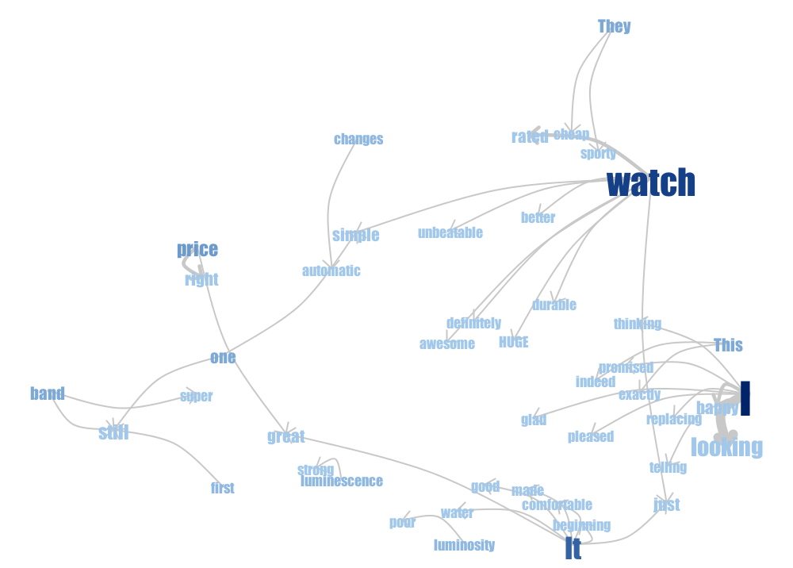

------

**Phrase-net for Five.txt with conjunctions "a, the"**
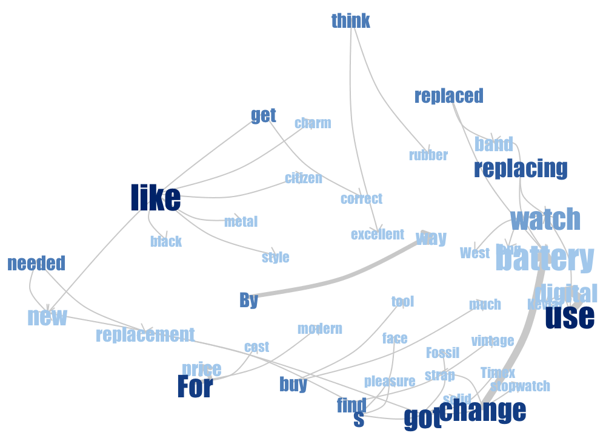

------

**Phrase-net for Five.txt with conjunctions "at"**
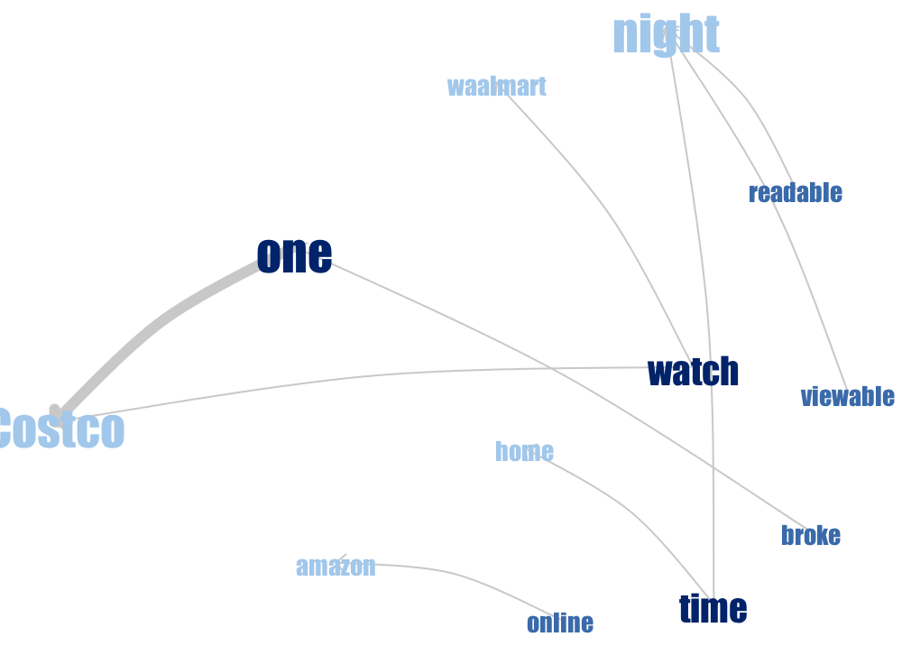

------

**Phrase-net for Five.txt with conjunctions "of"**
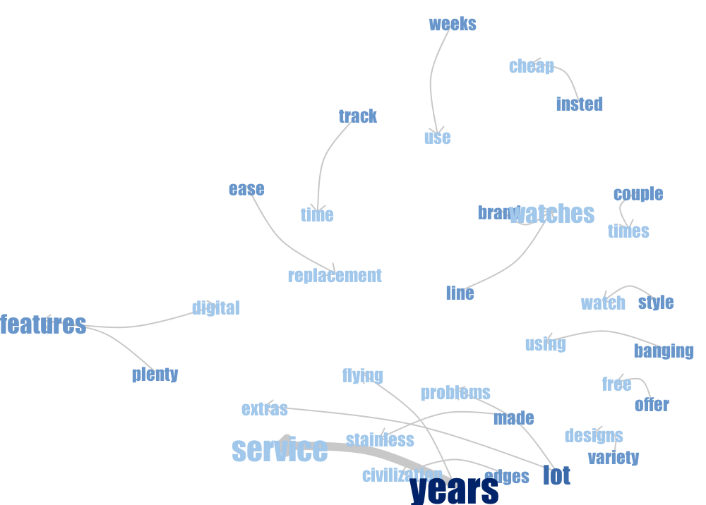

------

#### For OneTwo.txt, the following phrase-nets are used for analysis of the negative reviews from users :

**Phrase-net for OneTwo.txt with conjunctions "am, is, are, was, were"**
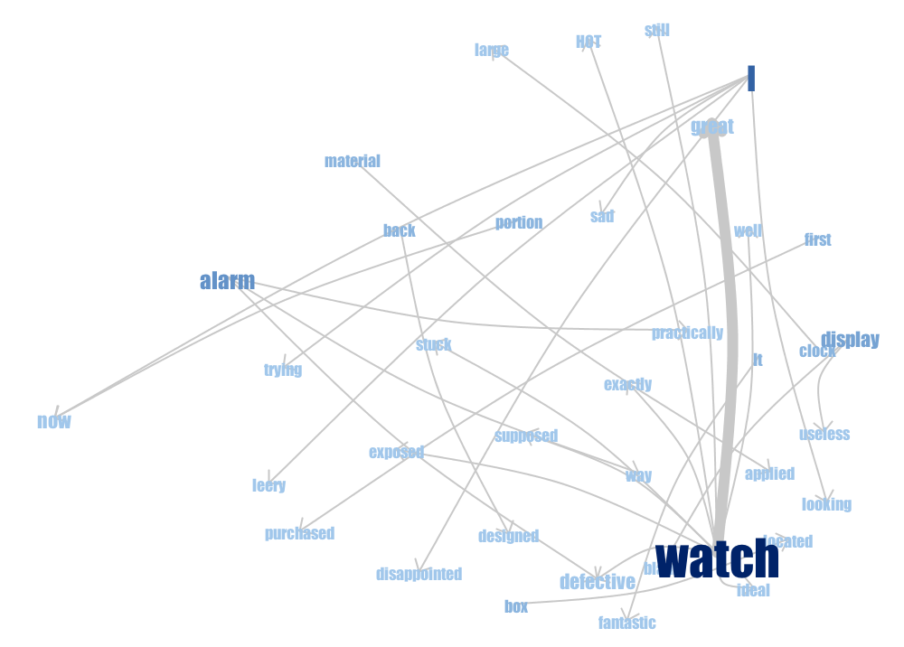

------

**Phrase-net for OneTwo.txt with conjunctions "a, the"**
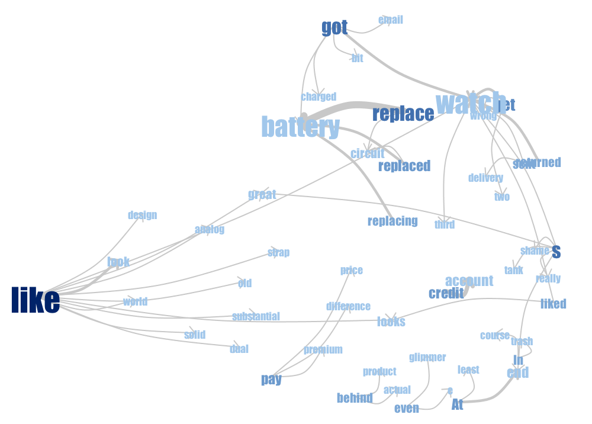


------

**Phrase-net for OneTwo.txt with conjunctions "at"**
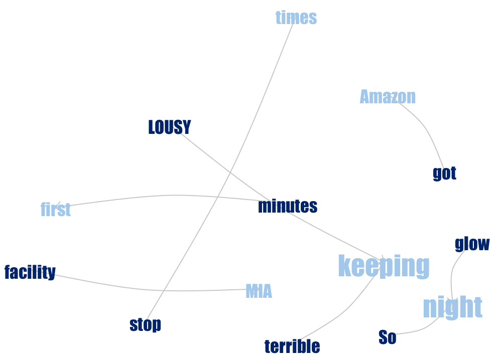


------

**Phrase-net for OneTwo.txt with conjunctions "of"**
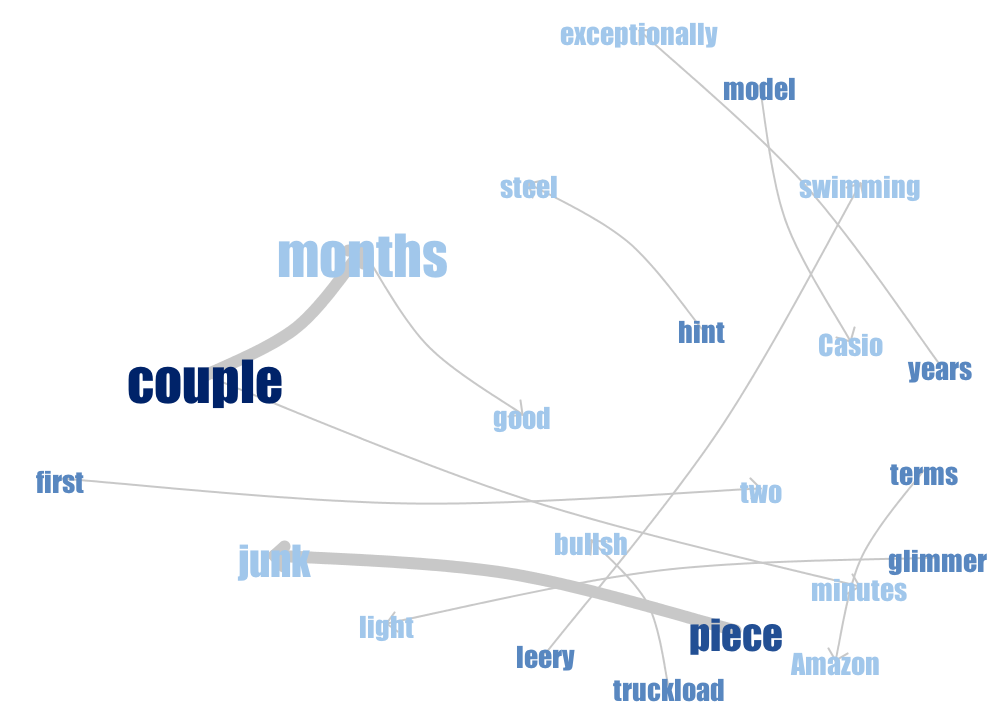

------

We analyzed the phrase nets and then checked some of the prominent words to see the context in which they occurred. 
Based on the analysis done on these graphs, the following questions can be answered :

**1) Which properties of this watch are mentioned mostly often?**

The properties that are mentioned often about this watch are that it is **great, huge, right for the price, has a low battery life and stops functioning a lot**. There are some contradicting reviews about the **luminosity of the watch**. Some people rate it as poor but there are others who rate it good and also that it is easily readable at night. People are happy about the **variety of designs** and like that it is **made of metal**. We can also see that it is a **digital watch, water resistant and has black color option**. 


**2) What are satisfied customers talking about?**

Satisfied customers are mostly talking about how great the watch is, how comfortable it is, its durability, its adaptiveness to various situations (in the case of swimming), perfect for the price, has plenty of digital features, can be viewable at night and also that it looks good. People used a lot of positive terms like excellent/awesome/unbeatable/etc. Some people compared the watch with other brands like Fossil and Citizen. There are lots of complaints about battery issues and replacements. However, a lot of people also praise the years of service and the ease of replacements. It appears like some of the reviewers also bought the watch at Costco.


**3) What are unsatisfied customers talking about?**

The unsatisfied customers are mostly talking about the watch's terrible battery life, how it is good only for a couple of months, its random non-functionality, its fluctuating speed of functioning and how often they replace its battery and circuit. People complain about receiving defective pieces and returning the product back. Many people initially state that the watch is great but go on to state more negatives about the watch. So, it seems like people have a good first impression but after experiencing major issues, their opinion changes a lot.


**4) What are good and bad properties of the watch mentioned by both groups?**

GOOD PROPERTIES :
Great looks, right for the price, comfortable, simple, clear LCD display, is of a big size, water resistant and can be worn while swimming, made of metal, years of service, ease of replacement. 

BAD PROPERTIES :
Bad battery life and requiring replacements, stops working frequently, poor luminosity, useless display.


**5) Can you understand watch characteristics (like type of display, features of the watches) by observing these graphs?**

Yes, it is possible to understand the display and features of the watch by observing the graphs. Some of the features that we could observe are:

* Clear LCD display
* Huge size
* Water resistant
* Digital display
* Made of metal
* Alarm
* Stop watch
* Dual time

----------------------------------------------------------------------------------------------------------

# Assignment 2: Interactive analysis of Italian olive oils

```{r, echo=FALSE}
#------------------------------------------------------------------------------

# Assignment 2: Interactive analysis of Italian olive oils

```
```{r}
# Data reading
olive_data = read.csv("olive.csv")

olive_data$Region_category <- "Sardinia Island"
olive_data[olive_data$Region == 1, c("Region_category")] <- "North"
olive_data[olive_data$Region == 2, c("Region_category")] <- "South"

head(olive_data, 3)

```

# Task 2.1

```{r, echo=FALSE}
#------------------------------------------------------------------------------

# Task 2.1

```

```{r, warning=FALSE, message=FALSE}
plot_ly(olive_data) %>% 
  add_markers(x = ~linoleic, y = ~eicosenoic) %>%
  layout(title = "Scatterplot: Eicosenoic vs Linoleic")

```

There are a group of observations at the bottom of the plot which have unusually low values of eicosenoic. On inspecting these observations by hovering on them, we notice that they correspond to `eicosenoic` values of **1, 2 and 3**. However, they appear to be well spread out for the range of `linoleic` values (510 - 1470).

<hr/>

# Task 2.2

```{r, echo=FALSE}
#------------------------------------------------------------------------------

# Task 2.2

```
```{r, warning=FALSE, message=FALSE}
ct_olive_2 = SharedData$new(olive_data)

scatter_eico_lino = plot_ly(ct_olive_2, x = ~linoleic, y = ~eicosenoic) %>%
  add_markers(color = I("black"))

bar_region <-plot_ly(ct_olive_2, x = ~Region_category) %>% 
  add_histogram() %>% layout(barmode = "overlay")

plots = subplot(scatter_eico_lino, bar_region, titleX = TRUE, titleY = TRUE) %>%
  highlight(on = "plotly_select", dynamic = T, persistent = T, opacityDim = I(1)) %>% 
  hide_legend() %>%
  layout(title = "Scatterplot: Eicosenoic vs Linoleic, Histogram: Region")

bscols(widths = c(12), list(tags$h2("Analysis of variable relationships"),
                            tags$h4("(Eicosenoic, Linoleic, Region, Stearic)"),
                            filter_slider("stearic", "Stearic", ct_olive_2, ~stearic), plots))

```


#### Figure 2.2.1: Unusually low values of eicosenoic
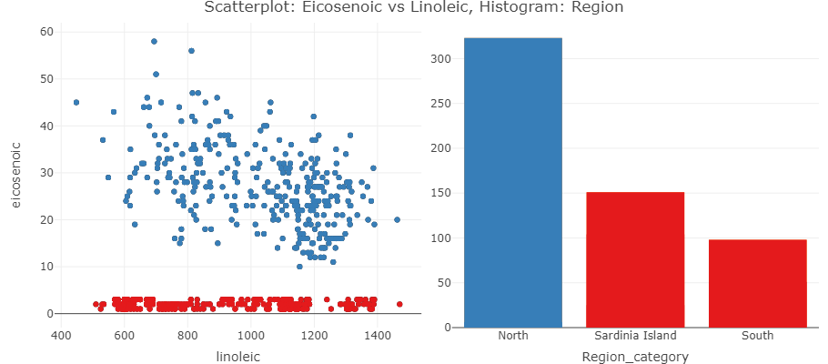


#### Figure 2.2.2: 
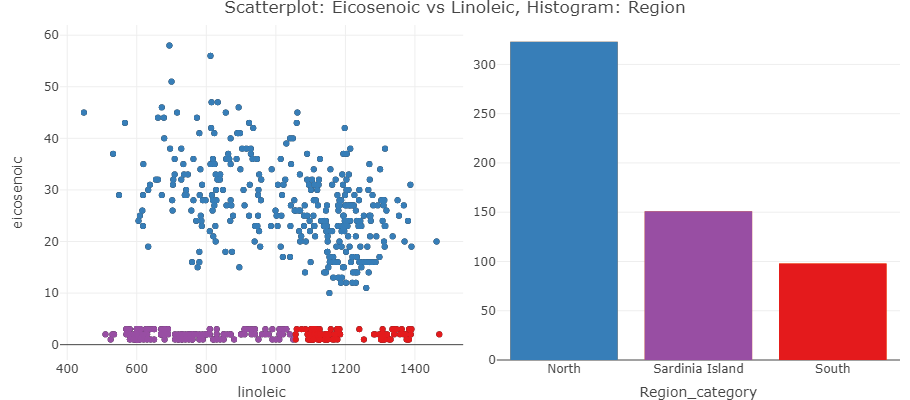

-----

#### Figure 2.2.3: 


#### Figure 2.2.4: 


**Question: Identify the regions that correspond unusually low values of eicosenoic.** 

From figure 2.2.1, after highlighting the unusually low values of eicosenoic, we see that these observations belong to the regions - **South and Sardinia Island**. 

On further highlighting each region with a different color, we see that there is a clear distinction among the unusually low values of eicosenoic with respect to region (Figure 2.2.2). The lower range of values of eicosenoic (<=1050) belong to Sardinia Island and the higher range of values of eicosenoic (>1050) belong to South region. 

**Question: Use the slider and describe what additional relationships in the data can be found by using it.**

From figures 2.2.3 and 2.2.4, we observe that the observations from the South region disappear when the stearic value is greater than 273 or lesser than 199. Hence, we can infer that the south region has a stearic range of 199 to 273. 

On closely observing the figures 2.2.3 and 2.2.4 and adjusting the sliders, we observe that many observations which had eicosenoic values greater than 1000 have disappeared when the stearic slider is set to "274 to 375". Similarly, when the slider is set to "152 to 198", many of the observations with eicosenoic values less than 1000 seem to disappear. This could suggest that some inverse relationship exists between eicosenoic and stearic.

**Question: Report which interaction operators were used in this step.**

The interaction operators used in this step are:

1. Navigation operator (zoom, panning along x/y axis)
2. Selection operator (Highlighting of observations from scatterplot/histogram)
3. Connection operator (linked plots and persistent brushing)
4. Filtering operator (filter sliderfor `stearic`)
5. Encoding operator (changing highighting color)

<hr/>

# Task 2.3

```{r, echo=FALSE}
#------------------------------------------------------------------------------

# Task 2.3

```
```{r, warning=FALSE, message=FALSE}
ct_olive_3 = SharedData$new(olive_data)

sctr_eico_lino = plot_ly(ct_olive_3, x = ~linoleic, y = ~eicosenoic) %>%
  add_markers(color = I("black"))

sctr_arac_lino = plot_ly(ct_olive_3, x = ~linolenic, y = ~arachidic) %>%
  add_markers(color = I("black"))

subplot(sctr_eico_lino, sctr_arac_lino, titleX = TRUE, titleY = TRUE) %>%
  highlight(on = "plotly_select", dynamic = T, persistent = T, opacityDim = I(1)) %>% 
  hide_legend() %>%
  layout(title = "Scatterplots: Eicosenoic vs Linoleic, Arachidic vs Linolenic")

```

#### Figure 2.3.1: 
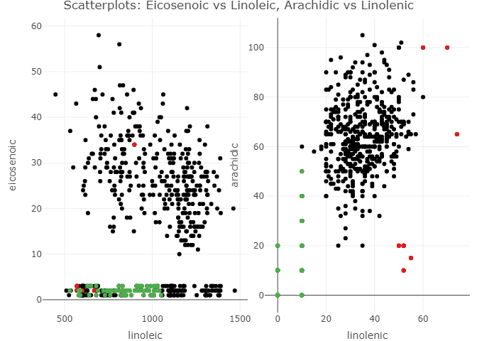


**Question: Which outliers in (arachidic, linolenic) are also outliers in (eicosenoic, linoleic)?**

**Are outliers grouped in some way? Use brushing to demonstrate your findings.**

On analyzing some of the outliers in arachidic vs linolenic, we observe some interesting patterns. In the arachidic vs linolenic scatterplot, the observations appear to be concentrated in the central region defined by arachidic values 40-90 and linolenic values 20-50. We highlihted observations which exist relatively farther from this cluster in the centre (Figure 2.3.1). 

The observations marked in red could be considered as outliers. In the eicosenoic vs linolenic scatterplot, except one observation all others correspond to the cluster of observations with unusually low eicosenoic values and appear to have lower values of linolenic as well. 

The observations marked in green are actually overplotted (overlapping in the arachidic vs linoleic scatterplot) and correspond to many more observations and hence, cannot be considered as outliers. We observe that all these observations belong to the cluster of observations with low eicosenoic values. From our previous analysis in figure 2.2.2, we also see that these observations belong to the region - Sardinia Island. So, we can conclude that a high proportion of observations from Sardinia Island have unusual values which are exact multiples of 10 for arachidic (0, 10, 20, 30, 40, 50, 60) and linolenic (0, 10).

<hr/>

# Task 2.4

```{r, echo=FALSE}
#------------------------------------------------------------------------------

# Task 2.4

```
```{r, warning=FALSE, error=FALSE, message=FALSE}

var_order = c("palmitic", "palmitoleic", "linoleic", "stearic", 
              "oleic", "linolenic", "arachidic", "eicosenoic")

par_plot = ggparcoord(olive_data[var_order], columns = 1:8)

plot_data = plotly_data(ggplotly(par_plot)) %>% group_by(.ID)
ct_olive_4 = SharedData$new(plot_data, ~.ID, group = "olive")
par_coord_plot = plot_ly(ct_olive_4, x = ~variable, y = ~value) %>% 
  add_lines(line = list(width = 0.3))%>%
  add_markers(marker = list(size = 0.3),
              text = ~.ID, hoverinfo = "text") %>%
  layout(title = "Parallel Coordinate Plots")

ct_olive = SharedData$new(olive_data, group = "olive")

get_buttons = function(df, axis){
  buttons = list()
  i = 1
  for(col in colnames(df)){
    buttons[[i]] = list(method = "restyle",
                        args = list(axis, list(olive_data[[col]])),
                        label = paste(axis , ": ", col, sep=""))
    i = i + 1
  }
  
  return(buttons)
}

buttons_x = get_buttons(olive_data[, 4:11], "x")
buttons_y = get_buttons(olive_data[, 4:11], "y")
buttons_z = get_buttons(olive_data[, 4:11], "z")

annot = list(list(text = "X", x=-0.6, y = 0.78, xref = 'paper', yref = 'paper', showarrow = FALSE),
             list(text = "Y", x=-0.6, y = 0.55, xref = 'paper', yref = 'paper', showarrow = FALSE),
             list(text = "Z", x=-0.6, y = 0.34, xref = 'paper', yref = 'paper', showarrow = FALSE))

scatter_plot_3d = plot_ly(ct_olive, x = ~palmitic, y = ~palmitoleic, z = ~stearic) %>% 
  add_markers(marker = list(size=4), opacity = 0.5) %>%
  layout(scene = list(xaxis = list(title = "X"), 
                      yaxis = list(title = "Y"), 
                      zaxis = list(title = "Z")),
         title = "3D Scatterplot",
         # annotations = annot,
         updatemenus = list(
           list(y = 0.4, buttons = buttons_x, text = "X", active = 0),
           list(y = 0.6, buttons = buttons_y, text = "Y", active = 1),
           list(y = 0.8, buttons = buttons_z, text = "Z", active = 2)))

bar_chart = plot_ly(ct_olive, x = ~Region_category) %>% 
  add_histogram() %>% layout(title = "Histogram: Region", barmode = "overlay")

bscols(widths = c(12, 12,6,6), 
  tags$h2("Interactive plots to analyze relationships between variables"),
       par_coord_plot %>% 
         highlight(on = "plotly_select", dynamic = T, persistent = T, opacityDim = I(1)) %>%
         hide_legend(), 
       scatter_plot_3d %>% 
         highlight(on = "plotly_click", dynamic = T, persistent = T) %>% hide_legend(),
       bar_chart %>% 
         highlight(on = "plotly_click", dynamic = T, persistent = T) %>% hide_legend())

```

#### Figure 2.4.1: 
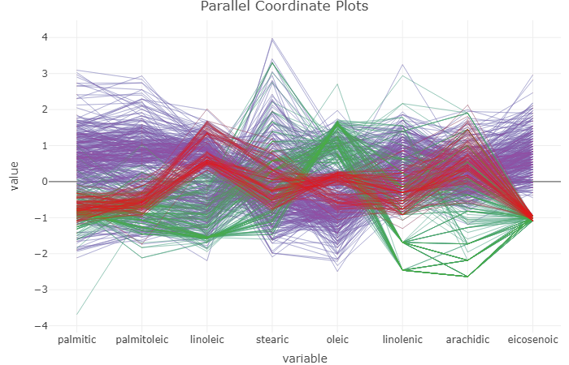


#### Figure 2.4.2: 


**Question: Use persistent brushing to mark each region by a different color. Observe the parallel coordinate plot and state which three variables (let's call them influential variables) seem to be mostly reasonable to pick up if one wants to differentiate between the regions. **

After setting different colors to different regions, we analyzed the parallel coordinate plots to find out 3 influential variables from the fugure 2.4.1. Eicosenoic can surely be used to differentiate between North region and non-North region accurately. Since this is accurate, we looked for other variables focusing on their ability to differentiate between South and Sardinia Island. Based on this criterion, we selected the variables - Linoleic and Oleic which appeared to be most disjoint. Hence, the 3 variables - Eicosenoic, Linoleic, Oleic seem to be most reasonable if one wants to differentitate between the regions.

**Question: Does the parallel coordinate plot demonstrate that there are clusters among the observations that belong to the same Region?**

After coloring the lines in the parallel coordinate plots with regions, it is easier to spot the trends followed by different clusters. But without the coloring, it was not possible to spot the clusters. Within the South region, we see that there are 2 clusters of trends which are observed based on linoleic, stearic and oleic values. There is one group which has higher linoleic and stearic values and lower oleic values as compared to the other group.

**Question: Select the three influential variables in the drop boxes and observe in the 3d-plot whether each Region corresponds to one cluster.**

After selecting the above mentioned influential variables in the dropdowns for the axis in the 3D scatterplot, we observe that the clusters corresponding to the regions are very clearly visible in the 3D space (Figure 2.4.2).

<hr/>

# Task 2.5

**Question: Think about which interaction operators are available in step 4 and what interaction operands they are be applied to. **

The interaction operators used in the above interactive plot and their interaction operands are:

1. Navigation operator (zooming, panning, viewing angle in 3D scatterplot) - applied to screen space and object space (for 3D scatterplot)
2. Selection operator (highlighting using click, bounding box and lasso) - applied to attribute space
3. Connection operator (persistent brushing) - applied to attribute space
4. Reconfiguring operator (changing axis mapping in 3D scatterplot) - applied to data structure space
5. Encoding operator (changing highlighting color) - applied to attribute space

**Question: Which additional interaction operators can be added to the visualization in step 4 to make it even more efficient/flexible?**

Filtering interaction operator can be added for each of the variables. From the parallel coordinate plots it is not possible to select specific values for variables and looks very cluttered. By using filters for variables, we can easily analyze them by breaking them down using different filter conditions. Also, it will be more easier to select the influential variables if we can actually set and check the specific filter conditions on those variables. 

A reconfiguring operator that allows us to reorder the variables in the parallel coordinate plots would be helpful. But, it is not implemented here as the plot was created using `ggplot` and converted using `ggplotly`. 

**Question: Based on the analysis in the previous steps, try to suggest a strategy (or, maybe, several strategies) that would use information about the level of acids to discover which regions different oils comes from.**

One strategy that can be used is based on the influential variables identified in the previous step. The details of this strategy are as follows:

* If `Eicosenoic >= 10`, then region is most likely to be North.
* If `Eicosenoic < 10 and Oleic < 7500 and Linoleic > 1100`, then the region is most likely to be South.
* If `Eicosenoic < 10 and Oleic >= 7500 and Linoleic <= 1100`, then the region is most likely to be Sardinia Island.

# Appendix
```{r, ref.label=knitr::all_labels(), echo=TRUE, eval=FALSE}
```